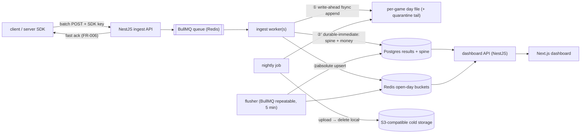

# Phase 00 — Foundation (Shared Design Base)

**Feature**: 001-analytics-platform · **Layer**: design (shared base under all story designs) · **Status**: Draft (2026-07-17)
**Consumed by**: every `## Design` section in `01…07`. Stories **reference** this spec; they never re-derive the backbone.
**Altitude**: logical model + relations only — entities, keys, cardinality, Redis key *patterns* + type choices + TTLs, worker op-ordering, contract shapes. **No DDL, no migrations, no NestJS code.**
**Grounding**: `../spec.md` (FR/SC), `../research.md` §B–§H (locked), `README.md` shared foundations, `../metrics/README.md` spine ledger.

---

## 1. Global entity model (logical ER)

### 1.1 The canonical event envelope (shared input contract — not a stored entity)

Every event, of every kind, enters as this one shape. No story redefines or renames a field:

```
game_id, user_id (+ anon_id), session_id, event_id, name,
kind ∈ {generic, economy, purchase, session},
client_event_time, client_sent_time, server_received_time,
props { … kind-specific payload + free-form context … }
```

- `game_id` is **server-derived from SDK-key auth**, never trusted from the body.
- `kind` defaults to `generic` when absent but `name` is present.
- Typed kinds (`economy`, `purchase`, `session`) carry their required payload **inside `props`**; each owning story's design states its required-field list and the drop-vs-quarantine rule (Foundation §4.4 gives the shared rule).
- The envelope is **transient**: it exists on the wire, in the BullMQ queue, and in the raw day-file. It is never stored in Postgres (FR-010).
- **Wire contract (Q9, locked 2026-07-17).** Batches carry an explicit integer wire version `v` (absent ⇒ `1`) and a mandatory `sdk {name, version}` descriptor; the front-door stamps the effective `v` onto every routed record and raw append (cold storage stays self-describing for rebuild tooling years later). Evolution is **additive-only within wire v1, permanently**: no envelope or typed-kind required field is ever removed, renamed, re-typed, or re-defined; new fields are optional-with-default; `kind` is an **open enum** (absent ⇒ `generic`, unchanged; an *unrecognized* kind **quarantines** — `unknown_kind` tally — never rejects the batch, never coerces to `generic`). Unknown top-level fields from a newer SDK are ignored-and-preserved (the raw append is verbatim); SDKs must never emit top-level fields outside this spec (free-form context belongs inside `props`). The ingest path is pinned **`/v1/events`**; a batch whose `v` exceeds what the server knows is still 2xx-acked and quarantined whole (an embedded SDK can do nothing useful with an error). **Wire v1 is accepted for the life of the platform** — any v2 would be a new path with a front-door normalizing adapter, never a flag day. *(Precedent: Segment `/v1` unchanged since ~2013; Sentry protocol 7 since 2013 with skip-and-retain forward-compat; OTLP add-only stability; GA4 Measurement Protocol 2xx-always. Decision record: §9.7.)*

### 1.2 Logical ER skeleton

Durable Postgres entities (results + minimal spine only), plus the two non-DB stores. Attribute lists are **key attributes only** — story designs add their remaining attributes; nobody adds per-user tables outside the spine family shown here.

```mermaid
erDiagram
    GAME {
        id      game_id PK
        text    name
        text    sdk_key "client-scope key(s), public by design; >= 1 active (rotation) → game scope"
        text    server_credential "server-scope credential(s), logically 1..N, hashed, show-once — the provenance source (§4.5, F-3 resolved)"
        json    config  "per-game knobs (each story's §6)"
    }
    USER_SPINE {
        id      game_id PK, FK
        id      user_id PK
        ts      first_seen "corrected first-session start (UTC epoch stored); logical day (§4.7) = cohort + Day-0 anchor (02.5 A)"
        bits    active_days_bitmap "1 bit per day-offset from first_seen; set-once"
    }
    PAYER_SPINE_EXT {
        id      game_id PK, FK
        id      user_id PK, FK
        date    first_purchase_day "write-once (logical day)"
        num     lifetime_spend_normalized "monotonic; updated inside the 05.5 atomic unit (Q3, 2026-07-17)"
        bool    has_unconverted_spend "true while a parked fx_unconverted purchase is unresolved → tier reads indeterminate, not deflated (whale-mis-tier fix, 2026-07-17)"
    }
    PAYER_PERIOD_SPEND {
        id      game_id PK, FK
        text    period PK
        id      user_id PK, FK
        num     spend_normalized "cumulative, verified prod only"
    }
    PURCHASE_IDEMPOTENCY {
        id      transaction_id PK "UNIQUE — the durable money dedup"
        id      original_transaction_id
        id      game_id FK
        id      user_id FK
        date    purchase_day
        num     price_local
        text    currency "kept beside normalized for unsealed re-normalization"
    }
    EVENT_CATALOG {
        id      game_id PK, FK
        text    event_name PK
        text    kind
        ts      first_seen
        ts      last_seen
        int     lifetime_count "approximate-OK"
        json    property_type_sets "key → observed-type SET"
    }
    EVENT_DAY_COUNT {
        id      game_id PK, FK
        text    event_name PK
        date    utc_day PK
        int     count
    }
    EXCEPTION_TALLY {
        id      game_id PK, FK
        date    utc_day PK
        text    reason PK "nameless|unparseable|capexceeded|quarantined_typed|sealed_late|time_fallback|negative_offset|no_spine_row|unknown_kind|fx_stale_rate_used|fx_unconverted|rate_limited"
        int     count
    }
    SESSION_DAY_RESULT {
        id      game_id PK, FK
        date    utc_day PK
        int     session_count "by start day"
        int     duration_sum_ms "split-attributed"
        int     sessions_touching
    }
    ACTIVE_USER_DAY {
        id      game_id PK, FK
        date    utc_day PK
        set     members "exact user_id set v1; HLL sketch = scale lever"
    }
    ECONOMY_FLOW_RESULT {
        id      game_id PK, FK
        text    currency PK
        date    utc_day PK
        text    provenance PK "client|server — credential-derived (§4.5)"
        text    reason PK
        text    flow_type PK "source|sink"
        num     amount_sum
    }
    BALANCE_SNAPSHOT {
        id      game_id PK, FK
        id      user_id PK, FK
        text    currency PK
        num     last_known_balance "upsert-latest; only if depth on"
        ts      as_of "LWW guard (corrected event-time)"
    }
    COHORT {
        id      game_id PK, FK
        date    cohort_date PK
        int     cohort_size
    }
    RETENTION_CELL {
        id      game_id PK, FK
        date    cohort_date PK, FK
        int     day_offset PK
        int     retained_users
    }
    MONETIZATION_CELL {
        id      game_id PK, FK
        text    product_id PK
        text    dim_combo PK "active dims; 'unknown' is first-class"
        date    utc_day PK
        int     purchase_count
        num     revenue_normalized
    }
    PAYER_DAY {
        id      game_id PK, FK
        date    utc_day PK
        set     payer_members "distinct payers that day"
        num     revenue_day_total
    }
    UPLOAD_BOOKKEEPING {
        id      game_id PK, FK
        date    utc_day PK
        ts      uploaded_at
        text    object_ref
    }
    RAW_DAY_FILE {
        file    per_game_per_day "local gzip → S3 → deleted; NEVER in Postgres"
    }

    GAME ||--o{ USER_SPINE : "has players"
    GAME ||--o{ EVENT_CATALOG : "discovers names"
    GAME ||--o{ EVENT_DAY_COUNT : ""
    GAME ||--o{ EXCEPTION_TALLY : ""
    GAME ||--o{ SESSION_DAY_RESULT : ""
    GAME ||--o{ ACTIVE_USER_DAY : ""
    GAME ||--o{ ECONOMY_FLOW_RESULT : ""
    GAME ||--o{ COHORT : ""
    GAME ||--o{ MONETIZATION_CELL : ""
    GAME ||--o{ PAYER_DAY : ""
    GAME ||--o{ UPLOAD_BOOKKEEPING : ""
    GAME ||--o{ RAW_DAY_FILE : "cold path, off-DB"
    USER_SPINE ||--o| PAYER_SPINE_EXT : "iff ever paid"
    USER_SPINE ||--o{ PURCHASE_IDEMPOTENCY : "made"
    USER_SPINE ||--o{ BALANCE_SNAPSHOT : "optional depth"
    PAYER_SPINE_EXT ||--o{ PAYER_PERIOD_SPEND : "per period"
    COHORT ||--o{ RETENTION_CELL : "one row per offset"
```



**Skeleton, not the full picture.** Story designs refine this where their Design sections flag it (03 adds the `ECONOMY_FLOW_SEGMENT_RESULT` sibling + `ECONOMY_SUPPLY_DAY` snapshot; 05 adds `product_id`/`refunded` to the idempotency row and a per-currency local breakdown on `MONETIZATION_CELL`). **The SDK + hardening phase (2026-07-17) added operational entities** off this skeleton: `GAME_SDK_KEY` / `GAME_SERVER_CREDENTIAL` (the 1..N realization of `GAME`'s credential scalars — phase 10, Q2), `OPERATOR_ACCOUNT` + `CONFIG_AUDIT` (phase 10), and `ERASURE_LEDGER` (00.5, Q7) — all registry/operational, none per-user-spine draws. **The adversarial-review hardening pass (2026-07-17) added two more operational entities:** `IDENTITY_EDGE` (`(game_id, anon_id, user_id, first_linked_at)` — the anon→user link captured but not merged, §4.6; operational, not a spine tier) and the class-N flush **`gen`** column on `MONETIZATION_CELL` / `PAYER_DAY` (§3.2.1). **Reversible infrastructure secrets** — `cold_storage_credentials`, `fx_table` material, and the per-game `ERASURE_LEDGER` hash key — are **never stored plaintext in `GAME.config`**; they are envelope-encrypted with a master key held **outside Postgres** (env var / Docker secret / file mount), decrypted only in-worker (00.5 §8, phase 10). `ER-full.md` is the complete assembled system ER.

### 1.3 The per-user spine — ONE family, three tiers

SC-007's "minimal per-user spine" is realized as **one coherent per-user model**, not seven per-user tables. Everything keyed by `user_id` in Postgres belongs to exactly one tier below; adding any other per-user durable structure requires a ledger change in `../metrics/README.md` first.

| Tier | Entity | Keyed per | Bound | Owner |
|---|---|---|---|---|
| **Core spine** (every user who has started a session — Q1, 02.5 §6) | `USER_SPINE` (`first_seen`, `active_days_bitmap`) | user | ~4–46 B/user | 04 (definition); 02 writes row + bits (02.5 A/B) |
| **Payer extension** (payers only, payers ≪ users) | `PAYER_SPINE_EXT` (+ `PAYER_PERIOD_SPEND`) | payer / payer×period | payer-bounded | 06 |
| **Opt-in touch** (config-gated) | `BALANCE_SNAPSHOT` | user×currency | only if `economy_depth_capture_mode` on | 03 |

`PURCHASE_IDEMPOTENCY` is **not** spine — it is a money uniqueness-key table (permitted alongside the spine by FR-010), and doubles as the payer-set source and the minimal purchase ref (local price + currency for unsealed re-normalization). **The money family is spine-independent (Q1 consequence, 2026-07-17):** `PURCHASE_IDEMPOTENCY` / `PAYER_SPINE_EXT` / `PAYER_PERIOD_SPEND` associate with `USER_SPINE` logically, never as an enforced parent dependency — a never-sessioned payer may exist with no spine row, and `first_purchase_day` may precede `first_seen` (bridge 02.5 §6).

**Projections, not truth:** `ACTIVE_USER_DAY`, `PAYER_DAY`, `RETENTION_CELL`, and `COHORT.cohort_size` are all **rebuildable projections of the spine + idempotency table** (a spine scan, never a raw re-scan). They are results, kept for read speed; the spine is the per-user truth. This is the recovery lever if a projection ever drifts (e.g. Redis loss between bit-set and counter flush).

### 1.4 Durable vs transient — the store split

| Store | Holds | Never holds |
|---|---|---|
| **Postgres** | results (day-grain cells), the spine family (§1.3), idempotency keys, catalog/tallies, game registry, upload bookkeeping | raw events, envelopes, per-event rows, session member-event logs |
| **Redis** | BullMQ queue, open-day hot buckets (§2), dedup markers, companion staging | anything that must survive loss (accepted loss: ≤ flush-cadence drift + open days) |
| **Local disk → S3** | per-game daily raw file + quarantine tail (write-ahead superset) | — (deleted locally after confirmed upload) |

---

## 2. Redis key-scheme conventions

### 2.1 Naming pattern

All keys follow one grammar (placeholders in `{…}`; literal segment names are short domain tags):

```
{game_id}:{domain}:{utc_day}[:{qualifier…}]     — day-scoped (open-day buckets)
{game_id}:{domain}[:{qualifier…}]               — day-less (dedup markers, staging, registries)
```

Domain tags are **owned** (one story writes a domain; others may read): `cnt` + `cat` (01), `sess` + `act` (02), `eco` + `bal` (03), `ret` (04), `mon` + `payer` + `rev` + `stage` (05), `dedup` (shared front-door, 01). Story designs use these tags; new tags must not collide.

### 2.2 Data-type palette

| Need | Type | Note |
|---|---|---|
| Counter families (counts, sums per cell) | **hash** (field = cell key within the day, value = running absolute number) | one hash per game×domain×day keeps key-count low and flush = `HGETALL` |
| Distinct membership / dedup | **set** (or SETNX string marker for per-item TTL) | exact in v1 |
| Top-N / ranking reads | **zset** | display-time only; never the stored truth |
| Distinct counts at scale | **HLL** (`PFADD`/`PFCOUNT`) | the named scale lever; allowed for user-count metrics, **never** for money or retention |
| Cross-worker staging (companion join) | **hash** per pending key, TTL'd | 05 only |

### 2.3 The open-day bucket lifecycle (shared rule)

Every incremental result cell belongs to **exactly one corrected-logical-day bucket** (§4.7) — the day whose seal governs its mutability (for retention cells, the *activity* day `cohort + offset`; for everything else, the event's corrected logical day).

```
OPEN    day D from its start until D_end + 48 h (the §G grace):
        cells live in the day's Redis hash(es); workers increment them;
        the flusher upserts absolute values every flush_interval (default 5 min).
SEAL    at D_end + 48 h: one final flush marks the Postgres cells final;
        the Redis bucket is left to expire (TTL = D_end + grace + ~24 h margin).
SEALED  the Postgres row is immutable; late events for D are quarantined
        to the raw file (§4.3) — never folded in, no Redis bucket recreated.
```

(`D_end` is the end of logical day `D`, §4.7 — the seal clock is shifted by `reporting_offset` uniformly with the day floor.)

- **TTL conventions:** dedup markers **24 h** fixed; open-day buckets **~72 h from day end** (seal + margin); companion staging **48 h**; queue lifetimes managed by BullMQ.
- **Reconciliation note (flagged):** the stack line "Redis hot counters ≤ 1 day" is read here as *"only open days are hot"* — the §G 48 h grace forces at most **3 concurrent open day-buckets** per game×domain (today + 2 grace days). Honoring both a 48 h-mutable day *and* an idempotent absolute-value flush requires the bucket to live until seal. This is a foundation-level interpretation, not a spec change; recorded as resolved-unless-challenged.
- **Rehydrate-on-miss (mandatory):** a worker incrementing a cell in a **missing** open-day bucket must first seed that bucket from the durable Postgres value (0 if none). This is what makes absolute-value flushes safe after a Redis loss — without it, a post-crash flush would clobber already-durable partial results with near-zero values.
- **Rehydrate double-seed race + half-seed visibility (normative — closes the ST1/ST2 adversarial finding).** Two hazards attend rehydrate-on-miss, both resolved:
  1. **Concurrent double-seed.** Two workers rehydrating the same missing bucket must not have one seed clobber the other's already-applied increments. Seed **per field with `HSETNX`** (set-if-absent): the first seed wins, the second no-ops, and both workers' subsequent `HINCRBY` apply on top of the single seed — no increment is lost. Membership sets (`act`/`payer`) seed via `SADD` of the durable members (union-idempotent → a double-seed is inherently harmless).
  2. **Flushing a half-seeded bucket.** The bucket carries a **`seeded` marker field**, written atomically as the **last** step of the rehydrate block (after every `HSETNX` seed and, for class-N buckets, the `gen` initialization). **The flush skips any dirty bucket whose `seeded` marker is absent** and retries it on the next sweep — so a flush never reads a partially-seeded bucket. The class-typed merge rules (§3.2.1) are defense-in-depth behind this marker: even a half-seeded read cannot corrupt the durable value under any class.
- **Observed-value cap + `other` overflow (shared convention).** Any key-space fed by client-supplied free-form values (event names — §H-4 catalog cap; economy currencies — 03; monetization client dimensions — 05) is bounded: the first N distinct observed values per game (per dimension) are kept first-class, the rest collapse to a literal **`other`** overflow bucket that is itself counted, and the cap is **forward-only** (a change never retro-collapses sealed cells). `other` (supplied-but-over-budget) is distinct from `unknown` (not supplied). This is the drop-and-count posture of Foundation §4.4 generalized to cardinality; each story sets its own default cap knob.

---

## 3. The pipeline backbone

One backbone; every kind rides it. Stories add kind-specific processing at step 7, never a different backbone.



### 3.1 Canonical worker op-ordering (normative)

For each dequeued event (workers process queue batches; order is per-event):

1. **Auth-scope + parse.** `game_id` from SDK-key auth. Unparseable body / empty `name` → **drop-and-tally** (`EXCEPTION_TALLY`); not appended to raw (it was never countable — the superset guarantee covers counted events).
2. **Skew-correct** (§4.2): compute corrected event-time → corrected UTC day; future-clamp; 60 s dead-band.
3. **Kind-route + validate.** `generic` → permissive accept (catalog caps apply). Typed kinds → strict payload validation; invalid → mark **quarantined** (tally + step 4, then stop). An **unrecognized `kind`** (§1.1 open enum — an SDK newer than the server) → quarantine-mark (`unknown_kind` tally + step 4, then stop); never rejected, never coerced to `generic`.
4. **Write-ahead raw append** (if cold storage on): append the full envelope — accepted *or* quarantine-marked — to the game's corrected-day file, fsync'd, **before any counter, spine, or Redis write**. Counter-first ordering is a bug (§E / SC-008). Duplicates *are* appended (dedup happens next); a rebuild re-dedups by `event_id` / `transaction_id`.
5. **Seal check** (§4.3): corrected day already sealed → append went to the quarantine tail → tally `sealed_late` → **stop**.
6. **Dedup gate** (§4.1): non-money — `event_id` 24 h marker, duplicate → stop. Purchase — durable `transaction_id` insert-if-absent, conflict → stop. **Crash-window ordering (normative — closes the ST4 stalled-job double-count):** the windowed `event_id` marker is claimed here, **before any counter/spine/hot write**, so the raw-append (step 4) and the dedup-claim form one recovery unit: a BullMQ stalled-job re-run (at-least-once, `maxStalledCount` ≥ 1 is normal) that died *after* step 4 but *before* claiming the marker re-appends the batch to raw (harmless — rebuild re-dedups by `event_id`/`transaction_id`) and re-claims; a re-run that died *after* claiming stops here on the existing marker. The failure direction is always the safe one — a crash between claim and counter yields at most an **undercount** (the accepted `event_id` residual), never a double-count. Each raw append additionally carries its batch `job_id` so rebuild tooling can collapse a physically re-appended batch. Purchases are immune throughout (durable `transaction_id` gate).
7. **Durable-immediate writes** (idempotent absolutes, straight to Postgres, *not* flush-mediated): `first_seen` insert-if-absent (**session events only** — sequence A executes in 02's session path per bridge 02.5, ratified 2026-07-17); `active_days_bitmap` bit set (session-start events only); `PAYER_SPINE_EXT.first_purchase_day` write-once + `lifetime_spend_normalized` increment (inside the 05.5 atomic unit); the `PURCHASE_IDEMPOTENCY` row (already written in 6). These are absolute state — losing them to a Redis crash would silently corrupt retention/money, so they never ride the flush.
8. **Redis hot updates:** increment/insert into the open-day buckets (rehydrate-on-miss, §2.3) — catalog deltas, day counts, session accumulators, active-user set, economy accumulators, monetization rollup cells, payer set, revenue counter, companion staging.
9. **Ack** the queue job.

**The routed record (typed-kind handoff, 01 → 02/03/05).** Steps 1–6 execute once, in the 01 front-door, for every kind. What a story's step-7/8 additions receive is the *normalized routed record*: the full envelope + resolved kind + stamped wire version `v` (§1.1) + corrected event-time and UTC day + front-door verdicts (dedup-passed, seal-state). Story workers consume this record as-is; they never re-derive a front-door decision. Single producer (01), three typed consumers (02/03/05) — pinned here so it cannot drift.

### 3.2 The flush (Redis → Postgres)

- A **BullMQ repeatable job** every `flush_interval` (default **5 min**, per §E) sweeps dirty open-day buckets (a small per-domain dirty-registry of touched bucket keys) and upserts absolute values under a **per-class merge rule** (§3.2.1 — a blind `SET value = EXCLUDED.value` is retired: it was unsafe under a torn `HGETALL` read racing concurrent `HINCRBY`, and after a crash+rehydrate it could clobber durable results *downward*). A retried or duplicated flush is a **no-op by construction** under every class.
- **Deltas never flush; only absolutes do.** Anything that can't be expressed as an absolute cell value must be a durable-immediate write (step 7) instead.
- At **seal time** a final flush finalizes the day's cells; the read model then stops consulting Redis for that day.
- **Redis durability posture** (§E): AOF `everysec` + RDB snapshots, `maxmemory-policy noeviction`. Accepted loss on crash: ≤ 1 s AOF window in the queue + un-flushed open-day drift (≤ flush cadence) — never sealed results, never spine/money (durable-immediate), never the raw file (write-ahead).

#### 3.2.1 Flush idempotency classes (normative — resolves the torn-read / downward-clobber findings, closes research §E-4)

The absolute-value upsert is only self-healing when the Redis cell it reads is *monotonically non-decreasing within the open day*; then a torn-low snapshot is repaired by the next flush. A cell that can legitimately **decrease** in-day (a monetization enrichment MOVE, an FX re-normalization) has no such self-heal, and a stale-low post-crash read could push below durable truth. Every flushed structure is therefore assigned one of four classes, fixed here; a story never re-chooses its class, and adding a flushed structure requires stating its class.

| Class | Definition | Flush write rule | Seed | Atomic read? |
|---|---|---|---|---|
| **M — monotonic-additive** | value only `+=` within its day (pure `HINCRBY`) | **monotonic-max**: `SET value = GREATEST(target.value, EXCLUDED.value)` | `HSETNX` from durable | not required — torn read self-heals |
| **N — non-monotonic / mutable-down** | value can legitimately decrease in-day (enrichment MOVE, FX recompute) | **generation-gated absolute**: `SET value = EXCLUDED.value WHERE EXCLUDED.gen ≥ target.gen` | `HSETNX` + `gen` seed | **required** — one Lua `EVAL` snapshots the whole bucket + its `gen` atomically |
| **S — set-membership** | grow-only distinct-member set, flushed as absolute | **set-union**: `members = target.members ∪ EXCLUDED.members` (never blind replace) | `SADD` from durable | not required |
| **L — LWW-guarded** | day-less per-user snapshot, guarded by `as_of` | **unchanged** — `SET … WHERE EXCLUDED.as_of ≥ target.as_of` | per-entry rehydrate | not required |

- **Class M** — why max is sufficient and Lua is *not* needed: durable and live values both only rise within the day, so `GREATEST` is a monotone merge that can only move the durable value up. A torn-low read is discarded in favor of the already-higher durable value, and the next flush carries the true value forward — **self-healing, no atomic read required.** A half-rehydrated bucket can only propose ≤ durable truth, which `GREATEST` rejects. Members: `EVENT_DAY_COUNT.count`, `EXCEPTION_TALLY.count`, `SESSION_DAY_RESULT.{session_count,duration_sum_ms,sessions_touching}`, `ECONOMY_FLOW_RESULT`/`ECONOMY_FLOW_SEGMENT_RESULT.amount_sum`, `RETENTION_CELL.retained_users`, `COHORT.cohort_size`.
- **Class N** — the monetization/FX resolution: `MONETIZATION_CELL` cells are mutable-down (05's enrichment MOVE decrements an old `dim_combo` cell and increments a new one; the unsealed-day FX recompute rewrites `rev` up or down). `GREATEST` is **forbidden** here (it would freeze the pre-move higher value and double-count). Mechanism: (1) each open `mon`/`rev` bucket carries a monotonic `gen`, seeded from the durable row's stored generation on rehydrate and `INCR`'d inside every atomic block that can move a cell down (each MOVE, each FX-recompute pass); (2) the flush reads all cells **and** `gen` in one **Lua `EVAL`** snapshot (uninterruptible → no MOVE interleaves between reading two cells, so a MOVE's decrement+increment are both in or both out); (3) Postgres upserts absolutes tagged with the snapshot's `gen`, rejecting any write whose `gen` is older than the durable row's (`WHERE EXCLUDED.gen ≥ target.gen`) — a stale/retried flush can neither clobber a fresher value nor double-apply. Members: `MONETIZATION_CELL.{purchase_count,revenue_normalized,revenue_local_breakdown}`, `PAYER_DAY.revenue_day_total`. *(Rejected alternative: re-representing the MOVE as an append-only per-`(txn,dim)` ledger — it reintroduces per-purchase durable rows, violating results-only, FR-010.)*
- **Class S** — grow-only membership (`ACTIVE_USER_DAY.members`, `PAYER_DAY.payer_members`): flush as **set-union**, not blind replace, so a torn or half-rehydrated snapshot (always a subset) is restored by union with the durable set; the next flush converges. HLL sketches under the scale lever (§2.2/§9.2) merge identically via `PFMERGE`.
- **Class L** — `BALANCE_SNAPSHOT` is a day-less per-user snapshot already guarded by `as_of` LWW (03) — the `as_of` guard is a generation gate by another name and already rejects a stale-low write. **Verified unchanged.** (`GREATEST` on a balance value would be wrong — a balance can legitimately fall — which is exactly why 03 guards on `as_of`, not on the value.)
- **Mixed structure — `EVENT_CATALOG` (01 `cat`):** day-less, and its fields split *per field*: `count` and `last_seen` merge by `GREATEST` (max), `first_seen` merges by **`LEAST` (min)** — an earlier observed first-seen must lower it — and `property_type_sets` by **union**. A single class label does not fit; 01 applies the per-field rule. (Because `cat` never seals, a torn read there is always healed by the next write regardless; the `first_seen`=`LEAST` direction is nonetheless mandatory.)
- **Invariants preserved:** every class is a no-op on retry (M: `GREATEST` of equal values; S: union of equal sets; N: same-`gen` identical absolutes; L: equal-`as_of` guard). Write-ahead / durable-immediate money truth (`PURCHASE_IDEMPOTENCY`, spine) is untouched — `gen` guards only the *display projection*, never money truth. No per-event Postgres write is introduced: the MOVE, FX recompute, and `gen` bump all run in the existing per-event Redis block; the flush stays on the 5-min cadence, hot path stays Redis.
- **Schema/deploy notes (below the no-DDL altitude, flagged for `/plan`):** `gen` lives as a small integer column on the class-N result rows (`MONETIZATION_CELL`, `PAYER_DAY`); the Lua class-N flush, if Redis is ever sharded to a Cluster, needs a hash-tag on the bucket key (`{game_id:mon:day}`) so all cells co-locate in one keyslot — single-node Redis (the current posture) is unaffected.

### 3.3 The read model (dashboard API)

- **Sealed days:** Postgres only (immutable).
- **Open days (today + grace):** live from Redis buckets; **fall back** to the last-flushed Postgres value if the bucket is missing (post-crash). The API layer does this merge once, uniformly; story read-models state *what* they read, not a new merge rule.
- Rankings (top-N) and ratios (sink ratio, stickiness, D_N) are **read-time computations** over stored cells — never stored.

---

## 4. Shared machinery (normative specs)

### 4.1 Dedup — two regimes, never mixed

| Regime | Applies to | Mechanism | Guarantee |
|---|---|---|---|
| **Windowed** | `generic`, `economy`, `session` | `{game_id}:dedup:{event_id}` marker, atomic check-and-set (SETNX-style), TTL **24 h** | duplicate within 24 h is a no-op; a repeat beyond the window may double-count (accepted for non-money) |
| **Durable** | `purchase` (money) | `PURCHASE_IDEMPOTENCY.transaction_id` UNIQUE, insert-if-absent in Postgres | a retry arriving **days** late never double-counts; never expressed as a time window |

### 4.2 Skew-corrected event-time (§G)

```
skew      = server_received_time − client_sent_time
corrected = client_event_time + skew        (applied only if |skew| > 60 s dead-band)
corrected = min(corrected, server_now)      (future-clamp)
bucket    = logical_day(corrected) = utc_day(corrected + reporting_offset)   (§4.7)
```

Every time-bucketed structure in every story uses `corrected`; `server_received_time` is the fallback bucket only for events whose client times are unusable (then tallied). **The day floor is the platform logical day (§4.7), not raw UTC** — `corrected` is still stored as a UTC epoch; the `reporting_offset` is applied **once, here at the floor**, and never re-applied at display.

**Server-clock discipline (normative — the skew formula and every seal boundary depend on it).** Both the skew correction (`server_received_time`) and the seal check (`D_end + 48 h`, §2.3) read the server wall clock. A backward NTP **step** would misplace events across a day boundary *permanently* (the raw file routes by corrected day too), and a forward step at a seal boundary would prematurely seal a still-open day and drop in-grace events as `sealed_late`. Therefore v1 **mandates a slewing time daemon** (`chronyd` with a bounded `maxslewrate`, never `ntpd -g` / step-on-start) as a hard deployment requirement — the clock is disciplined by *slewing*, never stepping. Two guards back it up: (1) a **sanity clamp** — an event whose computed `corrected` moves it more than `clock_sanity_max_hours` (default 26 h) from `server_received_time` is bucketed on `server_received_time` + `time_fallback` tally rather than trusted; (2) a **monotonicity alarm** — a worker observing `server_received_time` move backward between consecutive batches raises an operational alert (a stepped clock, the failure this guards). The dedup TTL and any pure interval already use monotonic semantics; seal decisions must be computed from a clock known to be slewing, not stepping.

### 4.3 Day-seal + quarantine (§G)

A UTC day `D` is mutable until `D_end + 48 h`, then **seals**. Events for a sealed day are appended to the raw file's **quarantine tail** (write-ahead position, step 4) with a quarantine marker, tallied in `EXCEPTION_TALLY`, and **never folded into any aggregate, spine bit, or catalog count**. Same treatment for typed-kind events failing strict validation. The quarantine tail ships to S3 with the day file (07) — the recoverable-but-excluded floor.

### 4.4 Drop vs quarantine (shared rule)

- **Drop-and-tally** (not raw-appended): unparseable body, empty `name`, name-cap exceeded — events that could never count.
- **Quarantine** (raw-appended with marker, tallied): typed-kind validation failure, sealed-day arrival, unrecognized `kind` (`unknown_kind`, §1.1) — events that are *recoverable in principle* from the raw floor.

### 4.5 Provenance (client / server) — F-3 RESOLVED (2026-07-17, research-ratified)

The `client`/`server` trust flag on economy and purchase events is **derived from the class of the authenticating credential** — **never trusted from the event body**. Two credential classes per game (the Stripe publishable/secret archetype; the same split PostHog, RevenueCat, Segment, Amplitude, and Mixpanel all converged on):

- **`sdk_key`** — public **by design** (embeddable in shipped builds; auto-issued at registration; always viewable in admin). Grants ingest only; every event it authenticates is stamped `provenance = client` regardless of kind — typed money/economy kinds still ingest under it, they just land in the untrusted slices.
- **`server_credential`** — secret; created on demand, **shown once, stored hashed**; logically **1..N concurrently active per game** (dual-active rotation: create → migrate → watch `last_used_at` drain → revoke; revoking an `sdk_key` is an emergency action that silences shipped builds, and the admin UI must say so). Grants everything `sdk_key` grants **plus** `provenance = server`.

Locked with it: **prefix-typed key strings** (class recognizable on sight and by secret scanners; an SDK fails fast at init on a wrong-class key); **plain bearer over TLS — no HMAC in v1** (HMAC with a key shipped inside a game build is tamper-deterrence, not provenance — the GameAnalytics counter-example — and must never substitute for credential class); **unrecognized or revoked credentials fail auth outright** — the old fallback-`client` rule survives only for a valid-but-unclassifiable legacy edge; **scoping stops at class + game** (no per-event-kind key scopes in v1; per-environment/per-platform keys and Stripe-style restricted scopes are flagged future options). The credential-registry entity and its issuance/rotation lifecycle are specced in phase 10 (operator admin); §1.2's `GAME.server_credential` is read as that 1..N child. Consumed by 03 (trusted-only totals) and 05 (`source=server` eligibility); the server SDK (09) initializes with a server credential as its sole auth input.
*Sources: Stripe API-keys + key-rotation docs · PostHog project vs personal API keys · RevenueCat public SDK keys vs secret keys · Segment write keys / source-type-as-trust-context · Amplitude keys-and-tokens · Mixpanel token vs secret · GameAnalytics collection-API HMAC (the counter-example).*

### 4.6 Identity (v1)

The spine keys on the game-provided `user_id` as present at processing time; `anon_id` rides the envelope for SDKs that identify late. **Anon→identified aliasing/merging is out of v1 scope** (per the metrics sheets' open questions) — a design must not silently invent a merge; flag it if a story needs one. **Identity-edge capture, however, is in scope (a v1 minimum, not the full merge):** when a session that carried `anon_id` is later followed by an `identify(user_id)`, the client SDK emits an `identify` alias event recording the `(anon_id → user_id)` edge, and the platform stores that edge (a tiny append-only `IDENTITY_EDGE` registry, `(game_id, anon_id, user_id, first_linked_at)`, operational-scope, not a spine tier). v1 does **not** rewrite history from it (cohorts/retention stay on the id present at processing time — the documented cardinality caveat, §9.3), but capturing the edge *now* keeps a future retroactive stitch recoverable; shipping with no edge captured would lose that linkage forever (the landmine). Consumed by no v1 metric; it exists solely so the anon-vs-identified split is later reconcilable.

### 4.7 The platform logical day (timezone) — CORRECTNESS-BEARING (resolved 2026-07-17)

**One platform timezone; every day and every seal is computed through it.** The analytics service carries a single **`reporting_offset`** (platform-level config, default UTC / offset 0). It defines the logical day used by *every* time-bucketed structure and *every* seal boundary:

```
logical_day(t) = utc_day(t + reporting_offset)
```

- **Applied uniformly** to retention cohorts and day-offsets, sessions (start-day count + activeness bit), DAU/`ACTIVE_USER_DAY`, economy flow cells, monetization cells, payer day-sets, catalog day-counts, exception tallies — and to the `D_end + 48 h` seal clock (§2.3). "A day" means one thing platform-wide: midnight in `reporting_offset`.
- **Correctness-bearing, not display-only.** The offset participates in the day floor and therefore in write-once cohort/seal assignment. This is the fix for the single-timezone distortion: for a player base concentrated in one non-UTC zone, UTC-day cohorting systematically misattributes the local 00:00→`reporting_offset` band to the previous UTC day, deflating D1 by a measured 4–5 pp on a ~30 % base (devtodev) — a one-directional error that does **not** average out for a single-timezone base. Setting `reporting_offset` to the operator's zone (e.g. **Asia/Tehran, +3:30**) collapses that band to zero (devtodev: single-timezone alignment = 100 % accuracy).
- **Raw storage stays UTC.** `corrected` is stored as a UTC epoch in the raw day-file and everywhere else; only the *day floor* applies the offset. The rebuild floor, `event_id`/`transaction_id` dedup, and immutability of stored UTC epochs are untouched.
- **Immutability / change policy.** Because the offset defines write-once day assignment, **changing it after data exists re-buckets history** — forbidden under the seal invariant (§2.3). The offset is therefore **set at install/registration and treated as fixed**; a later change is a forward-rebuild operation (out of v1 scope), exactly the monetization-dimension precedent (research §G-3). A fixed numeric offset is exact for a DST-free zone (Asia/Tehran abolished DST in 2022); a DST-observing audience would drift one hour twice a year at the boundary — out of v1 scope (single-timezone, fixed-offset assumption; research §G-2).
- **Why a constant offset preserves every invariant.** `reporting_offset` is a rigid translation of the whole time axis: it shifts every day boundary and every seal time by the same amount. So the "exactly one bucket per cell" rule, the strictly-increasing seal-time lemma (02 step 5), the 3-concurrent-open-bucket geometry, D0 = 100 %, `cohort_size ≡ RETENTION_CELL(c,0)`, and the negative-offset `≥ −2` bound (a *difference* of two logical days, translation-invariant) all hold unchanged. The only thing that breaks immutability is *changing* the offset — hence set-once.

*Source: devtodev "User retention: measure by hours or calendar days" (calendar-day vs 24 h attribution; single-timezone alignment = 100 % accuracy). Rejected alternative: 24 h-rolling-from-`first_seen` retention (Amplitude default) — verified results-only-safe but it would swap the locked classic-Day-N definition and fix retention alone, leaving every other metric on the UTC boundary; the single-platform logical day fixes all metrics with one rule.*

---

## 5. Ownership matrix (anti-drift)

One writer per structure; everyone else reads. "Durable-immediate" = step 7; "flushed" = step 8→§3.2.

| Structure | Store | Owner | Written by | Read by | Path |
|---|---|---|---|---|---|
| `GAME` (registry, config) | PG | 01 | registration/admin API | all | direct |
| `EVENT_CATALOG`, `EVENT_DAY_COUNT`, `EXCEPTION_TALLY` | PG | 01 | 01 worker path | dashboard, all stories (tallies) | flushed |
| `USER_SPINE.first_seen` | PG | 04 | **02** (first accepted `session` event — bridge 02.5 sequence A; ratified 2026-07-17) | 04, 05, 06 | durable-immediate |
| `USER_SPINE.active_days_bitmap` | PG | 04 | **02** (session-start processing) | 02 (popcounts), 04, 06 | durable-immediate |
| `SESSION_DAY_RESULT`, `ACTIVE_USER_DAY` | PG | 02 | 02 | 02, 06 | flushed |
| `ECONOMY_FLOW_RESULT` (+ segmented), `BALANCE_SNAPSHOT`, `ECONOMY_SUPPLY_DAY` (Q5, 2026-07-17) | PG | 03 | 03 | dashboard | flushed / snapshot-at-seal |
| `COHORT`, `RETENTION_CELL` | PG | 04 | 04 | dashboard, 06 (new/returning) | flushed |
| `PURCHASE_IDEMPOTENCY` | PG | 05 | 05 | 05, 06 (payer set source) | durable-immediate |
| `MONETIZATION_CELL`, `PAYER_DAY` | PG | 05 | 05 | dashboard, 06 | flushed |
| `PAYER_SPINE_EXT`, `PAYER_PERIOD_SPEND` | PG | 06 | 06 (on 05's purchase-accept signal, gate-coupled) | 06 | durable-immediate (both — a flush-mediated period-cumulative cell would break §2.3's one-cell-one-day rule) |
| `UPLOAD_BOOKKEEPING` | PG | 07 | nightly job | ops | direct |
| raw day file (+ quarantine tail) | disk→S3 | 07 (lifecycle) / 01 (append) | ingest workers (step 4), nightly job | manual rebuild only | write-ahead |
| `dedup` markers | Redis | 01 (front-door) | step 6 | step 6 | — |
| open-day buckets per domain | Redis | domain owner (§2.1) | owner's step 8 | flusher + read model | — |

---

## 6. Durability & loss ledger

| Layer | Holds | On loss | Accepted? |
|---|---|---|---|
| Postgres | sealed results, spine, idempotency | — (the thing we must not lose) | loss NOT accepted |
| Redis queue | in-flight events | ≤ 1 s AOF window | accepted (SC-008 posture) |
| Redis open-day buckets | un-flushed hot deltas | ≤ flush cadence drift + open-day live view; floor restored by rehydrate + last flush | accepted |
| Local day file | today's raw | day's rebuild floor until upload | accepted (explicitly, US5) |
| S3 | shipped raw days | manual rebuild floor gone for that day | accepted (disposable by design) |

Cross-check: spine bits/money are durable-immediate, so a Redis loss can leave a **projection** (e.g. `RETENTION_CELL`) behind its spine truth by ≤ one flush window — reconcilable by a spine re-scan (§1.3), never a raw re-scan.

---

## 7. Invariant → realization map

| Locked invariant | Realized in |
|---|---|
| Results-only storage (FR-010/SC-007) | §1.2–1.4 store split; §1.3 spine tiers |
| One canonical envelope | §1.1 |
| Skew-corrected event-time, 60 s dead-band, future-clamp, 48 h seal, quarantine | §4.2–4.3; op-order steps 2, 5 |
| Platform logical day (single timezone, correctness-bearing, set-once) | §4.7; §2.3 lifecycle; §4.2 floor |
| Slewing server clock (NTP discipline) + sanity clamp + monotonicity alarm | §4.2 clock-discipline clause |
| Write-ahead raw ordering (§E/SC-008) | op-order step 4; §6 |
| Idempotent class-typed flush (M/N/S/L), 5 min default; AOF everysec + noeviction | §3.2 / §3.2.1; §2.3 rehydrate + seeded-marker rule |
| Identity-edge capture (anon→user link, no v1 merge) | §4.6 |
| Dedup: event_id 24 h vs durable transaction_id (§F) | §4.1; op-order step 6 |
| Activeness = session-start (§B-1) | bitmap written only by 02's session-start path (§5) |
| Money-truth = server, companion join, `unknown` slice (§D) | §1.2 (`PURCHASE_IDEMPOTENCY`, `MONETIZATION_CELL`), 05's design |
| Classic Day-N, set-once bits, immature masking (§B) | §1.2 (`USER_SPINE`, `RETENTION_CELL`), 04's design |

---

## 8. Conventions the 7 story designs obey

1. **Reference, don't re-derive.** Cite as "Foundation §N". A story design that restates the flush mechanism, the envelope, or the seal rule is wrong by construction; it says only what it *adds*.
2. **Attach to the spine; never fork it.** Per-user durable state goes in a §1.3 tier or doesn't exist. New per-user draws require a ledger amendment flag, not a new table.
3. **`## Design` section shape** (appended below the story's §1–6, which stay untouched):
   `### ER / data model` · `### Redis structures` · `### Worker / pipeline flow` · `### API / contract surface` · `### Relations with other stories`.
4. **Relations subsection template:**
   - **Owns:** structures from §5 this story owns.
   - **Writes (shared):** structures owned elsewhere it writes (e.g. 02 → bitmap).
   - **Reads:** structures it consumes.
   - **Feeds:** downstream stories and what they take.
   - **Ordering / lifecycle:** hard dependencies (e.g. spine row must exist before offset math).
   - **Flagged bridges:** cross-story concerns needing a `0X.5` spec — **name and justify; do not create the file** (Stage 3 does).
5. **Naming:** entities `UPPER_SNAKE` singular as in §1.2; Redis keys per §2.1 grammar with owned domain tags; day = the platform **logical day** everywhere (`logical_day(corrected) = utc_day(corrected + reporting_offset)`, §4.7; default offset 0 ≡ UTC).
6. **Altitude discipline:** entities/keys/cardinality, Redis patterns/types/TTLs, op-ordering, contract shapes. No `CREATE TABLE`, no column types beyond the loose logical types, no code, no migrations.
7. **Kind routing:** every accepted event of any kind feeds 01's catalog + day counts; typed kinds *additionally* feed their owning story at op-order step 7/8. A story's worker section describes its **step 7/8 additions**, not a new pipeline.
8. **Contradictions:** a design that seems to need to violate an invariant or its own story §4/§5 flags it as an open question in its Design section — it never silently changes the requirement.

---

## 9. Foundation-level open flags

1. **Open-day Redis retention (~72 h) vs the "≤ 1 day hot counters" stack phrasing** — reconciled in §2.3 (at most 3 open buckets per game×domain); flagged for operator awareness, not a spec change.
2. **`ACTIVE_USER_DAY` / `PAYER_DAY` membership sets contain `user_id`s.** They are day-keyed **projections** of the spine/idempotency (rebuildable, §1.3), not spine expansions — kept out of the ledger on that basis. If exact membership retention is deemed too spine-like at scale, the HLL lever drops membership for sealed days (counts only), at the cost of exact window-unions. **HLL-lever scope (normative — resolves the ST10 contradiction with §2.2's "never HLL for retention"):** the HLL membership lever is **count-only**. It may replace membership *only* for metrics that need a distinct *count* (DAU/WAU/MAU counts). It is **forbidden** for any read that needs per-user membership itself — retention offset math, new-vs-returning composition, and any window-union that must answer "is this specific user in the set?" — because a sketch cannot answer set-membership and `PFMERGE` union error compounds across merges (±~0.8 %/merge, worse at medium cardinality). Those reads either stay on exact sets or fall back to the spine bitmap (retention is spine-native and never touches these sets). A deployment flipping the lever must keep an exact structure for membership-dependent reads or accept degrading only the count metrics — never retention/new-returning. §2.2's palette rule and this lever are hereby reconciled: HLL is for *counts*, never for *membership-bearing* logic.
3. **Identity aliasing (anon→identified)** — full merge out of v1 scope (§4.6); any story needing a merge must flag, not implement. **Amended (2026-07-17):** the anon→user *edge* is captured now (`IDENTITY_EDGE`, §4.6) so a future retroactive stitch stays recoverable — v1 does not rewrite history from it, but it is no longer discarded (the adversarial-review "identity landmine": ship-with-no-edge would lose the linkage forever). Cardinality caveat (one human → two spine rows across an anon/identified boundary) stands, now reconcilable-later rather than permanent.
4. **`first_seen` determination — RESOLVED (2026-07-17)**: first accepted **session** event; sequence A executes in 02's session path (bridge 02.5 §6 decision record — symmetry with the activeness invariant; GameAnalytics/Adjust install ≡ first-session precedent; D0 = 100% invariant). §5's ownership row and §3.1 step 7 updated; never-sessioned users have no spine row (`no_spine_row` advisory tally; money family spine-independent per §1.3).
5. **Provenance derivation (§4.5) — RESOLVED (2026-07-17)**: F-3 ratified — two credential classes (public `sdk_key` / secret `server_credential`; §4.5 decision record). 03's trusted-only totals and 05's `source=server` gate operate as designed; the fallback-`client` rule survives only for a valid-but-unclassifiable legacy edge.
6. **Data erasure (GDPR/CCPA) — designed (2026-07-17, Q7)**: four-tier posture — hard-delete the spine family + scrub membership sets (`ACTIVE_USER_DAY`/`PAYER_DAY`); leave aggregated day cells untouched (GDPR Recital 26 / Art. 17(3)(d); the unanimous industry position — GA4, Matomo, PostHog, Plausible); `PURCHASE_IDEMPOTENCY` detaches (`user_id` tombstoned, money fields retained under Art. 17(3)(b)); raw S3 files handled by retention-bounded expiry + a rebuild-filter erasure ledger ("put beyond use"), optional offline strict-rewrite tool; Redis self-erases by TTL behind a wait-for-seal gate. Normative spec: [`00.5-ops-envelope.md`](00.5-ops-envelope.md).
7. **Envelope wire versioning (Q9) — LOCKED (2026-07-17)**: §1.1 wire-contract clause — batch `v` (absent ⇒ 1) + mandatory `sdk` descriptor, additive-only-forever within v1, unknown-kind quarantine (`unknown_kind`), pinned `/v1/events` path, no sunset of wire v1 ever. Consumed by both SDK specs (08/09) and bridge 01.5 (marker vocabulary + per-record `v` dispatch in rebuild tooling).
