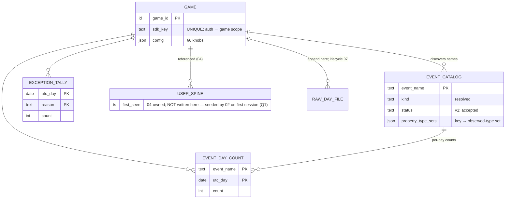

# Phase 01 — Ingest + Raw Events / Catalog

**Feature**: 001-analytics-platform · **Story**: US1 (P1 foundation) · **Reserved kind owned**: `generic` · **Status**: Draft
**Depends on**: nothing — this is the foundation every other phase sits on.
**Deeper reference**: [`../metrics/01-raw-events-catalog.md`](../metrics/01-raw-events-catalog.md). **Spec**: US1, FR-001..004 (tenancy/identity), FR-005..008c (ingestion/schema).
**Excluded here** (→ later per-phase design): queue choice, worker layout, key layouts, DDL, wire format.

---

## 1. Story understanding

**The story.** A developer registers a game in the platform, gets an SDK key and the platform's fixed ingest endpoint (`/v1/events`, Q9 — `game_id` is derived from the key, not a per-game URL path), drops the SDK into their Phaser/React game, fires events, and **watches the counts increment** within minutes — for their game, and only their game.

**The question it answers.** *"Is my game sending data, and what is it sending?"* This is the "counting up" first-run experience and the substrate every other metric rides on. Two coupled deliverables:
1. **The event catalog** — a self-populating, per-game registry of every event *name* seen, with its kind, first/last-seen, cumulative count, and the property keys observed on it. Derived metadata about the stream — never a raw event store.
2. **Live counts & top-N** — the current-UTC-day count per event name and the grand total, plus the top-N names by volume — the number that visibly ticks up as events arrive.

**What it means for the operator.** Confidence the integration works, a live pulse of volume, and a dashboard that fills itself in — no pre-declaring event schemas. Only the three reserved typed kinds (`economy` / `purchase` / `session`) are strictly validated; everything else is accepted permissively (**hybrid accept-all**, §H) so the operator can invent an event and see it appear the same minute.

**Trust boundary.** Client-sent generic events are the untrusted, spoofable majority — acceptable, because the catalog and raw counts make no money/economy claim. The server SDK may emit named events into the *same* catalog. Money/economy trust is a later phase's concern.

---

## 2. How it is calculated

**Time-bucketing.** The platform **logical day** (Foundation §4.7 — `utc_day(corrected + reporting_offset)`, single platform timezone; every "UTC day" below reads as the logical day), on skew-corrected client-event-time. Catalog `first_seen` / `last_seen` use the same corrected time.

**Grain.** Catalog = per `game_id` × `event_name`. Counts = per `game_id` × `event_name` × UTC-day (and a per-`game_id` × UTC-day grand total). **No user grain** — the catalog is stream-level and touches no per-user spine.

**Catalog upsert** (per accepted generic event, name `e`, game `g`):
- `first_seen(g,e) = min(existing, corrected_time)`; `last_seen(g,e) = max(existing, corrected_time)`.
- `count(g,e) += 1` **only if it survived dedup** (a repeat `event_id` within 24 h is a no-op). Count is **approximate-OK** (a duplicate beyond 24 h may double-count — accepted for non-money events).
- For each key `k` in `props`: add the observed value-type to the **type-set** `property_keys(g,e)[k]` (a *set*, not last-write-wins — mixed types raise a drift flag, never a rejection).
- If `e` is a new name and the game already holds `event_name_cap_per_game` names → **drop-and-count** into `dropped_capexceeded(g)`; do not register.

**Live count.** `live_count(g,e,day)` = accepted events named `e` whose corrected UTC day = `day`. Grand total = Σ over names.

**Top-N.** Rank names by `count` (all-time) or `live_count(…,today)` (live view); take `top_n_events`; ties broken by `last_seen` desc.

### Worked example

Game `g=42`, fresh integration. Cap 500, `top_n_events = 3`. Over one UTC day the collector accepts (post-dedup, post-skew):

| name | kind | count today |
|---|---|---|
| `level_start` | generic | 1 200 |
| `button_click` | generic | 3 050 |
| `screen_view` | generic | 900 |
| `economy` | economy | 400 |
| `session` | session | 260 |
| `boss_hit` | generic | 75 |

Plus 40 empty-`name` events, 12 unparseable bodies, 5 `economy` events missing `amount`.

- **Catalog**: 6 named rows. `level_start.property_keys = {level:{int}, mode:{str}}`; a later `level_start` with `level:"12"` makes it `{int,str}` and raises a drift flag — the event still counts.
- **live_total(42, today)** = 1200+3050+900+400+260+75 = **5 885** accepted.
- **Top-3 by volume**: `button_click` (3050), `level_start` (1200), `screen_view` (900).
- **Dropped-and-counted**: nameless 40 + unparseable 12 → drop tally **52** (surfaced, excluded from every rollup).
- **Quarantined**: 5 malformed `economy` → written to the raw file's quarantine; they do **not** count in the `economy` row's 400 nor any economy rollup.
- Name-cap: 6 names ≪ 500 → `boss_hit` registers normally.

---

## 3. Data needed (input)

This story consumes the **canonical envelope as-is** — it adds no new required field. What it needs from every event:

| Field | Why this story needs it | Req/Opt |
|---|---|---|
| `game_id` | Tenant scope; every catalog row and counter is per-game (server-derived from SDK-key auth). | required |
| `name` | The registry key — a free-form string or a reserved-kind name. | required (non-empty) |
| `kind` | Routes accept-all (`generic`) vs strict (`economy`/`purchase`/`session`). Defaults to `generic` if absent but `name` present. | required |
| `props` | Free-form bag; its **keys + observed value-types** populate the catalog. Values themselves are *not* stored by the catalog. | optional |
| `event_id` | Per-event dedup key so a duplicate does not inflate the count. | required |
| `client_event_time` / `client_sent_time` | Feed skew-correction → decide which UTC day a count lands in. | required |
| `server_received_time` | Collector stamp; other half of the skew formula; fallback bucket for nameless-drop counters. | required |

Minimum viable input for this story: a **stable non-empty `name`** and a **parseable body**. Absent either → dropped-and-counted (§6 of the deeper sheet).

**Registration input (one-time, per game).** To register a game the operator supplies a name; the platform returns a unique **SDK key** (public `sdk_key`) and the fixed ingest endpoint (`POST /v1/events`, Q9). Every ingest request authenticates by SDK key, and **`game_id` + `provenance` are derived server-side from the key's class** (Foundation §4.5) — there is no per-game URL path to scope by. Invalid/unknown keys are rejected with nothing recorded (FR-003).

---

## 4. Data stored for longer-run processing

Durable, derived-metadata only — never raw events:

- **Event catalog (per game × event name):** `kind`, `first_seen`, `last_seen`, cumulative `count` (approximate-OK), `property_keys` as key → **observed-type set**, and a `status` (reserved for future promotion; v1 sets every name `accepted`). One row per discovered name.
- **Count rollups (per game × name × UTC-day, and per game × UTC-day grand total):** accepted-event counts, enough to render live counts and top-N without touching raw events. Sealed days are final; today is provisional.
- **Exception tallies (per game):** running counts of `dropped_nameless`, `dropped_unparseable`, `dropped_capexceeded`, `quarantined_typed` — counters only, no payloads — kept both per-UTC-day and lifetime.
- **Distinct registered-name count (per game):** to enforce the 500-name cap.

**No per-user spine.** Deliberate — the catalog stores no `user_id`, sets no retention bit, keeps no per-user history. This is what keeps it results-only-cheap and honors SC-007.

Everything here is an **incremental upsert at ingest** (min/max for seen-times, +1 for counts, set-union for property types). The catalog *is* the accumulated result; it is never re-derived by scanning raw. Computable without raw re-scan? **Yes.**

---

## 5. Data-structure thinking — Redis & database

*Conceptual shapes only. Actual keys / DDL are a later-phase decision.*

**Redis (transient, hot, ≤ 1 day).**
- **The ingest queue** — batches land here fast and are drained by workers; this is the backpressure absorber that keeps the ingest endpoint quick (FR-006).
- **Today's live counters** — per game × name × today, and the grand total, as fast-incrementing hot counters. These are what tick up on the dashboard in real time. Transient by design; lost on a Redis crash (accepted).
- **The dedup window** — the set of `event_id`s seen in the last 24 h (each with a TTL), consulted before a count is applied.
- **Reserved for accepted-but-not-yet-flushed** catalog deltas awaiting the periodic flush.

**Database (durable, results-only).**
- **The catalog** — one durable row of derived metadata per game × name; the self-populating dashboard reads from here for history.
- **Count rollups** — durable per game × name × sealed-UTC-day counts + grand totals; the historical counts.
- **Exception tallies** — durable per-game counters for observability.
- **Game registry** — the tenant table: game, SDK key, config.

**The bridge.** Redis hot counters + catalog deltas **flush to the database on the periodic cadence** as an idempotent absolute-value upsert (a retried flush is a no-op). The dashboard reads *today* live from Redis and *history* durably from the database. Nothing raw is ever written to the database.

---

## 6. Configurations

| Knob | Default | Range / values | Forward / retro |
|---|---|---|---|
| `event_name_cap_per_game` | 500 | 1–10000 | **Forward-only** for new names. Already-registered names are never evicted by lowering it; names beyond the cap are dropped-and-counted from the moment it is hit. |
| `property_key_cap_per_event` | 50 | 1–1000 | **Forward-only.** Keys already observed on a name stay; new keys beyond the cap on that name are ignored (event still counts). |
| `top_n_events` | 10 | 1–100 | **Display-only, immediate** — a read-time ranking; mutates no stored aggregate. |
| `pii_prop_denylist` | **`[email, ip, phone, name, address, ...]`** (default-DENY, 2026-07-17) | list of property-key names | **Forward-only** for the *config*, but ships a **non-empty default** — common PII keys are stripped at ingest **before** the raw-append out of the box, so one careless `props.email` never lands in a 90-day raw file or the catalog by default. Already-registered keys are scrubbed by the **one-shot catalog-scrub tool** (00.5 §9 — now specified to exist, no longer a bare "Open"). |
| `pii_prop_value_scrubber` | on | on / off | **Forward-only.** Regex value-scrubber (emails, IP addresses) applied at ingest **before** raw-append — catches PII in *values* even under a non-denylisted key. A catalog PII-warning surfaces when a match is observed. |
| `pii_prop_hash` | off | off / hash-listed-keys | **Forward-only**, same rationale. |
| `drop_counter_visible` | on | on / off | **Display-only** — whether the dashboard surfaces the dropped/quarantined tallies. |

**Inherited globals (referenced, not redefined here):** dedup window 24 h (§F), day-seal grace 48 h (§G), flush cadence 5 min (§E), per-game reporting timezone offset (display-only). Rationale for the forward-only defaults: caps and denylists gate *ingestion*, and sealed aggregates / already-flushed catalog rows are immutable — a config change that reached backward would demand a forbidden raw re-scan.

---

## Cross-references

- Deeper sheet: [`../metrics/01-raw-events-catalog.md`](../metrics/01-raw-events-catalog.md) — full edge-case catalog (reserved-name collision, property-type drift, cardinality explosion, PII), rejected variants, open questions.
- Feeds every later phase: the accept-all substrate (this phase) is what economy/retention/monetization/sessions validate their reserved kinds *within*.

---

## Design

*Realizes §1–6 against [Foundation](00-foundation.md). Phase 01 is the substrate: its worker **is** the canonical front-door (Foundation §3.1 steps 1–6) for every event kind; typed kinds are routed onward at steps 7/8. Nothing below re-derives the backbone, envelope, flush, dedup, or seal machinery — only what this story owns and adds.*

### ER / data model

**Owned durable entities** (Foundation §1.2 names; loose logical types only):

| Entity | Key | Cardinality | Role |
|---|---|---|---|
| `GAME` | `game_id` | one per registered game | **Registry, not a result** — direct-written by the operator-admin API (phase 10, Foundation §5). Holds `name`, `config` (this story's §6 knobs; later stories' knobs live here too), `registered_at`. Its credentials are the 1..N `GAME_SDK_KEY` / `GAME_SERVER_CREDENTIAL` children (Q2, phase 10; Foundation §4.5) — the class of the authenticating credential yields both `game_id` **and** `provenance`, never body-trusted. Ingest is the single pinned path `/v1/events` (Q9), not a per-game URL. |
| `EVENT_CATALOG` | `game_id × event_name` | ≤ `event_name_cap_per_game` rows/game (default 500) | **Result table** (flushed). Adds to Foundation §1.2: `status` (v1 sets every row `accepted` on first sight; `unexpected`/promotion reserved, non-breaking). `kind` stores the **resolved** kind (declared kind, overridden to typed for the three reserved names). Type-drift is **derived at read time** — any `property_type_sets` key whose set holds > 1 type — no stored flag to drift out of sync. |
| `EVENT_DAY_COUNT` | `game_id × event_name × utc_day` | ≤ name-cap rows/game/day | **Result table** (flushed). Accepted-event count per name per corrected UTC day, every kind (Foundation §8.7). **The grand total is not stored**: `live_total(g,day)` = read-time Σ over the day's rows — cap-bounded (≤ 500 terms), drift-free by construction, same read-time stance as top-N (Foundation §3.3). Flagged below as a realization decision against §4's "grand total" line. |
| `EXCEPTION_TALLY` | `game_id × utc_day × reason` | ≤ ~7 reasons/game/day | **Result table** (flushed). Reasons per the Foundation §1.2 enum (amendment landed): `nameless`, `unparseable` (incl. missing `event_id`, see open questions), `capexceeded`, `quarantined_typed`, `sealed_late`, `time_fallback` (event *accepted* but bucketed on `server_received_time` because client times were unusable — Foundation §4.2's "then tallied"), `negative_offset` (04's rule, written via 02's path, [bridge 02.5](02.5-activeness-spine-contract.md)), `no_spine_row` (Q1 — non-session event with no spine row), `unknown_kind` (Q9 — an SDK newer than the server), 05's FX tallies `fx_stale_rate_used` / `fx_unconverted` (Q8), and `rate_limited` (00.5 — per-game ingest cap breach). Lifetime totals = read-time Σ over day rows; no second durable structure. Buckets on **arrival day** (see Worker flow). |

**Spine touch (not owned, and NOT seeded here — Q1, 2026-07-17):** `USER_SPINE.first_seen` is written by **02**, on the first accepted `session` event, on 04's behalf ([bridge 02.5 §6](02.5-activeness-spine-contract.md)) — **not** at this front-door and **not** on generic/economy/purchase events. This story owns **no** per-user write; the catalog stores no `user_id` (§4's "no per-user spine" holds trivially). An accepted **non-session** event whose `user_id` has no spine row tallies `no_spine_row` (advisory — SDK-integration signal; never blocks the event). Events carrying only `anon_id` touch no spine (Foundation §4.6 — no aliasing in v1). Sealed-late events stop at step 5 (Foundation §4.3).

**Raw day file (referenced):** `RAW_DAY_FILE` — 01 owns the **append** (write-ahead position, step 4, incl. quarantine-marked entries); 07 owns the lifecycle (upload → delete). Never in Postgres.

### Redis structures

Owned domain tags (Foundation §2.1): **`cnt`**, **`cat`**, and the shared front-door **`dedup`**. Types from the §2.2 palette; TTLs per §2.3. Queue keys and per-domain dirty-registries are Foundation §3.1/§3.2 machinery, not restated.

| Key pattern | Type | TTL | Lifecycle |
|---|---|---|---|
| `{game_id}:dedup:{event_id}` | string marker, SETNX-style check-and-set | **24 h fixed** | **Transient-and-losable** — loss risks a ≤ 24 h double-count, accepted for non-money (Foundation §4.1); purchases never rely on it (durable gate, 05). Never flushed. |
| `{game_id}:cnt:{utc_day}` | hash — field = `event_name`, value = running **absolute** day count | ~72 h from day end | **Flushes** → `EVENT_DAY_COUNT` (absolute upsert, §3.2); rehydrate-on-miss from Postgres (§2.3). Seals with the day. |
| `{game_id}:cnt:{utc_day}:exc` | hash — field = `reason`, value = running absolute | ~72 h from day end | **Flushes** → `EXCEPTION_TALLY`. |
| `{game_id}:cnt:{utc_day}:rank` | zset — member = `event_name`, score = day count | ~72 h from day end | **Transient-and-losable, display-only** (§2.2: zsets are never the stored truth). Maintained beside the hash for cheap live top-N; never flushed; on miss the dashboard falls back to the hash / last-flushed Postgres (§3.3). |
| `{game_id}:cat:{event_name}` | hash — `kind`, `first_seen`, `last_seen`, `count` (lifetime absolute), `p:{prop_key}` = encoded observed-type set | idle ~72 h, refreshed on write | **Flushes** → `EVENT_CATALOG`. **Day-less domain**: no seal (rows never finalize — `last_seen` advances for the game's life), dirty-marked for the §3.2 sweep, rehydrate-on-miss from `EVENT_CATALOG` seeds min/max/count/type-sets so increments and unions stay absolute. `property_key_cap_per_event` is enforced against this hash's `p:*` field count. |
| `{game_id}:cat:names` | set of registered names | idle ~72 h | **Transient-and-losable** — the name-cap gate + new-name detector; rehydrate-on-miss from `EVENT_CATALOG` (the durable truth for "is this name registered / how many exist"). |

**Split summary + flush classes (Foundation §3.2.1):** `cnt`/`cnt:exc` are **class M** (`+=`-only counts → `GREATEST` + `HSETNX` seed). `cat` is a **mixed day-less hash** flushed per-field: `count` and `last_seen` by `GREATEST` (max), **`first_seen` by `LEAST` (min — an earlier observed first-seen must lower it)**, property-type-sets by **union**; because `cat` never seals, a torn read there always self-heals on the next write, but the `first_seen`=`LEAST` direction is mandatory. `USER_SPINE.first_seen` is durable-immediate (never rides the flush); `dedup` markers, the rank zset, and the names set are transient-and-losable. SDK-key auth reads `GAME` directly (tiny registry; no Redis mirror, no new domain tag).

### Worker / pipeline flow

This story **realizes Foundation §3.1 steps 1–6 for all kinds** and adds its own steps 7/8. Per-step additions only; the backbone is not restated.

**Resolved-kind routing (explicit).** After envelope normalization (`kind` defaults `generic`; the three reserved names force the typed route regardless of declared kind — §H-2):

| Resolved kind | Steps 1–6 | Step 7 (durable-immediate) | Step 8 (hot buckets) |
|---|---|---|---|
| `generic` | front-door (01) | **none** (no spine seed — Q1; `no_spine_row` tally if no row) | 01: `cat` + `cnt` |
| `session` | front-door (01) | **`first_seen` seed (02, sequence A) then bitmap bit (02, sequence B)** — both on 04's behalf, bridge 02.5 | 01: `cat` + `cnt`, then 02: `sess`/`act` |
| `economy` | front-door (01) | none (`no_spine_row` tally if no row) → route → 03 | 01: `cat` + `cnt`, then 03: `eco`/`bal` |
| `purchase` | front-door (01); step 6 **is** 05's durable `transaction_id` gate | 05/06 money writes (05.5 atomic unit); **no `first_seen` seed** (money is spine-independent — Q1) | 01: `cat` + `cnt`, then 05: `mon`/`payer`/`rev`/`stage` |

Every accepted event of every kind feeds the catalog + day counts (Foundation §8.7); quarantined typed events feed **nothing** — no catalog row increment, no day count (§2 worked example).

**Step realization:**

- **API-side (pre-queue):** SDK-key auth resolves the game scope; unknown key or key↔URL mismatch → reject, nothing recorded (FR-003). The batch body is enqueued opaque and fast-acked (FR-006); every per-event verdict is worker-side.
- **Step 1:** parse each envelope; empty `name` / unparseable / missing `event_id` → **drop-and-tally**, never raw-appended (Foundation §4.4).
- **Step 2:** skew-correct per §4.2; unusable client times → `server_received_time` bucket + `time_fallback` tally (event still accepted).
- **Step 3 (01's realization):** reserved-name override → `pii_prop_denylist` / `pii_prop_hash` strip (forward-only, pre-catalog, pre-raw) → **name-cap gate** for new generic names (at cap → drop-and-tally `capexceeded`, decided **before** step 4 — drops are never raw-appended) → typed strict required-payload presence check (invalid → quarantine-mark, proceed to step 4, then stop). Property-key cap: excess *new* keys are ignored at the catalog upsert; the event still counts.
- **Step 4:** the raw append is **owned here** (write position; file format/lifecycle = 07): per-game corrected-day file, quarantine-marked entries included, fsync **before** any counter, spine, or Redis write (§E/SC-008).
- **Step 5:** seal check → quarantine tail + `sealed_late` tally → stop. **Arrival-day tally rule (realization):** `EXCEPTION_TALLY` buckets on the server-received UTC day of the offending arrival — exception subjects have unusable or beyond-seal corrected times, and arrival-day bucketing keeps tallies out of sealed days by construction.
- **Step 6:** windowed `event_id` marker for `generic`/`economy`/`session`; for `purchase` the gate is 05's durable insert-if-absent (05-owned write; 01 owns only the **sequencing** — gate before any spine or hot write, conflict → stop).
- **Step 7:** `first_seen` insert-if-absent runs **before** typed routing, so 02's bitmap write (same event, session-start) and all later Day-N offset math always find a spine row. Then the routed story's own step-7 writes run.
- **Step 8:** for every accepted kind: `cat` hash upsert (min/max seen-times, lifetime count +1, type-set union) + `cnt` hash increment + rank zset increment — all rehydrate-on-miss (§2.3); then the routed story's step-8 accumulators.
- **Idempotency:** flushes are no-ops on retry (§3.2). A worker crash between step 6 and ack makes the retried job a dedup no-op → possible undercount bounded by the crash window; accepted under approximate-OK counts (§2). Money is immune: the durable gate and durable-immediate writes are idempotent absolutes.

### API / contract surface

**Registration (one-time, operator).** The operator-admin API (phase 10) registers a game and auto-issues its public `sdk_key`; server credentials are created on demand (Foundation §4.5, Q2). §6 knobs are read/updated via that admin API onto `GAME.config`; forward-only semantics enforced at ingest time, never retroactively (§6, phase 10 config-effective-time rule).

**Ingest.** `POST /v1/events` (the versioned transport path, Q9 — Foundation §1.1 wire contract), credential in a header, body = the batch object `{v, sdk{name,version}, events:[…canonical envelopes…]}` (Foundation §1.1). `game_id` and `provenance` are **server-derived from the authenticating credential's class** (Foundation §4.5), never from the body. Ack = `2xx {received: n}` after enqueue — a queue-acceptance receipt, **not** a validation promise (verdicts are async; observability via tallies), and version-blind (an old SDK never distinguishes "understood" from "quarantined", Q9). Undecodable batch body / unknown-`v` batch → still `2xx`-acked where the events are recoverable, else `400`, with the appropriate tally (`unparseable`; unknown `kind` → `unknown_kind`). The path is pinned `/v1`; wire v1 is accepted for the life of the platform (Foundation §9.7).

**Per-event verdicts** (realizes Foundation §4.4):

| Condition | Verdict | Raw-appended? | Tally reason |
|---|---|---|---|
| empty / missing `name` | drop | no | `nameless` |
| unparseable envelope / missing `event_id` | drop | no | `unparseable` |
| new generic name while at name cap | drop | no | `capexceeded` |
| resolved typed kind missing required payload | quarantine | yes (marked) | `quarantined_typed` |
| corrected day already sealed | quarantine | yes (tail) | `sealed_late` |
| client times unusable, otherwise valid | **accept** | yes | `time_fallback` |

**Dashboard read-model** (WHAT is read; the live-vs-historical merge is Foundation §3.3, applied once, uniformly):

- **Live counts:** today's `{game_id}:cnt:{utc_day}` hash — per-name counts plus read-time Σ grand total; labeled provisional (≤ flush-cadence drift).
- **Top-N:** live from the `…:rank` zset (ties broken by catalog `last_seen` desc), `top_n_events` display-only; historical = read-time ordering over `EVENT_DAY_COUNT` — rankings are never stored (§3.3).
- **Catalog browser:** `EVENT_CATALOG` — name, resolved kind, first/last-seen, lifetime count (approximate-OK), property keys with observed-type sets + derived drift indicator, `status`.
- **Exception tallies:** `EXCEPTION_TALLY` per-day rows + read-time lifetime Σ; surfaced iff `drop_counter_visible`.
- **Registry:** game list + per-game config.

### Relations with other stories

- **Owns:** `GAME` (registry + config storage); `EVENT_CATALOG`; `EVENT_DAY_COUNT`; `EXCEPTION_TALLY` (including the tally writes for other kinds' quarantines); Redis domains `cnt`, `cat`, and the shared front-door `dedup`; the front-door worker steps 1–6 for **all** kinds (envelope validation, skew, raw-append position, seal verdict, the drop-vs-quarantine decision); the raw day-file **append** (lifecycle is 07's).
- **Writes (shared):** **none** to the spine — `USER_SPINE.first_seen` is seeded by **02** on the first session (Q1, bridge 02.5), no longer at this front-door. This story's only shared writes are the catalog/day-count/tally result tables it owns.
- **Reads:** `GAME.config` (own §6 knobs at ingest); `EVENT_CATALOG` / `EVENT_DAY_COUNT` for rehydrate-on-miss; nothing owned by another story.
- **Feeds:** **02 / 03 / 05** — validated, skew-corrected, deduped, seal-checked typed events routed at steps 7/8 (their inputs never bypass this front-door); **04** — via 02's session path (`first_seen` is seeded by 02 on the first session, Q1 — the front-door no longer seeds it); **07** — the day files + quarantine tails it ships; **all stories** — `EXCEPTION_TALLY` as the shared observability surface; **dashboard** — every read-model surface above.
- **Ordering / lifecycle:** the `GAME` row must exist before any ingest (auth gate). Per event, this story enforces the backbone order for everyone: raw append ≺ seal check ≺ dedup ≺ `first_seen` ≺ routed-story durable writes ≺ hot counters. `first_seen` precedes 02's bitmap write within the same event's step 7. Step 6 for purchases **hosts** 05's durable gate (write and conflict semantics are 05's design; sequencing is 01's). `cnt` buckets follow the §2.3 seal lifecycle; `cat` is day-less (dirty-flush, no seal). Registration precedes everything.
- **Flagged bridges (Stage-3 dispositions):**
  - **Typed-kind handoff contract (01 → 02/03/05)** — **folded into Foundation §3.1 ("the routed record")**: the normalized record (envelope + resolved kind + corrected event-time/day + front-door verdicts), single producer, three typed consumers — pinned there, no bridge file.
  - **Raw day-file contract (01 ↔ 07)** — **created: [`01.5-raw-file-contract.md`](01.5-raw-file-contract.md)** — 01 executes the append, 07 owns file semantics + lifecycle; routing, marker vocabulary, fsync grain, rotation, off-toggle, upload eligibility all normative there.

**Open questions (this design):**

1. **Missing `event_id` on a generic event** — realized as drop-and-tally under `unparseable` (an undedupable event would void the §F 24 h guarantee); the deeper sheet's "name + parseable body is enough" reading would instead accept-without-dedup. Default: drop; flag if accept-undeduped is wanted.
2. **`time_fallback` tally reason** — *resolved*: the Foundation §1.2 reason enum now includes `time_fallback` (amendment landed); this design's accepted-event tally is exactly that value. No semantic change; no longer an open question.
3. **Grand total as read-time Σ** — §4 lists a stored per-game×day grand total; this design derives it read-time from `EVENT_DAY_COUNT` (cap-bounded, drift-free, still raw-re-scan-free). Flag if a stored cell is preferred.
