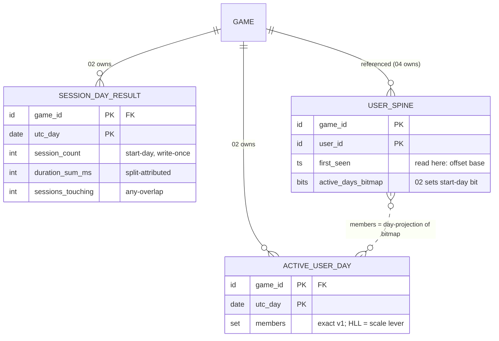

# Phase 02 — Sessions

**Feature**: 001-analytics-platform · **Story**: the shared engagement / activeness anchor · **Reserved kind owned**: `session` · **Status**: Draft
**Depends on**: Phase 01 (ingest substrate). **Blocks**: Phase 04 (retention), Phase 06 (DAU) — both consume the session definition locked here.
**Deeper reference**: [`../metrics/05-sessions.md`](../metrics/05-sessions.md). **Resolves** research §X-2 (session definition) and §B-1 ("active" = session).
**Excluded here** (→ later per-phase design): SDK timer implementation, key layouts, DDL.

---

## 1. Story understanding

**The story.** Players open the game, play for a while, drift away, come back later. A **session** is one such bout of engagement — the atomic unit everything else measures activeness in.

**The question it answers.** *How often and how long do players engage?* Session count, session length, sessions per user, session frequency. But its bigger job is to be the **shared anchor**: "active on a day" (for retention and DAU) means *a session started that day*, and `sessions_before_purchase` (for monetization) counts sessions.

**Locked session definition (this is the §X-2 resolution — every other phase inherits it):**
- **SDK-managed, not server-inferred.** The client SDK owns session lifecycle and mints `session_id`. Server-inferred sessionization is impossible under results-only storage (it would need per-user last-event memory / raw events in the hot window). The SDK emits one self-contained `session` fact — results-only-native.
- **Start.** First tracked event after SDK init, or the first event after the previous session expired. A fresh `session_id` is minted at that moment.
- **End.** When the inactivity timeout elapses with no tracked event (**default 30 min**, on skew-corrected client time), OR on an explicit app-close/background signal — whichever fires first.
- **Why 30 min.** Cross-industry default (GA4 / Adjust / GameAnalytics). Shorter over-splits an interrupted player; longer merges distinct bouts. Configurable per game.
- **`session_id`.** Client-generated opaque id (ULID preferred, UUID fine), unique per game+user; the server treats it as an opaque grouping key and never parses it.
- **What emits the kind.** The SDK emits **exactly one** `kind = session` event **at session end** (or reconciled at next init if the app was killed). It carries `session_id`, `session_start_time`, `session_end_time`, `duration_ms`. **This single event is the sole thing that marks a user "active on a day"** — the retention bit is driven by the session's **start** UTC day (§B-1). No other event kind sets it.
- **Midnight-spanning: SPLIT for duration, START-day for counting.** A session crossing UTC midnight is **counted once in its start day** (write-once, immutability-safe) while its **duration is split pro-rata** across each UTC day it overlaps (honest per-day engaged-time).

**Trust boundary.** Session data is client-reported and spoofable — accepted. Sessions are engagement, not money. The only server hardening is a sanity clamp on absurd durations.

---

## 2. How it is calculated

**Time-bucketing.** UTC day (§G). **Count/frequency** key on the session's **start** UTC day; **duration** splits across the days it overlaps. **Grain:** per `game_id` × UTC-day; sessions-per-user rolls up over a window.

**Formulas (definitional):**
```
session_count(D)      = |{ sessions whose session_start_time is on UTC day D }|         (start-day → write-once)
dur_on_day(s, D)      = max(0, min(end_s, D_end) − max(start_s, D_start))               (overlap of session s with day D)
total_duration(D)     = Σ_s dur_on_day(s, D)
avg_session_length(D) = total_duration(D) / sessions_touching(D)                        (sessions with any overlap on D)
sessions_per_user(W)  = total_sessions_in_W / distinct_users_with_a_session_in_W
session_frequency(W)  = total_sessions_in_W / active_user_days_in_W                     (active user-day = (user,day) with ≥1 session start)
```

### Worked example (one game, one player, timeout = 30 min)

Skew-corrected client times, UTC:
- `07-15 23:40` event A → **S1 starts** (`s1`).
- `07-15 23:52`, `07-16 00:20`, `07-16 00:35` → all < 30 min apart → still S1 (spans midnight).
- No event 30 min → **S1 ends** at `00:35`. SDK emits: `start=07-15 23:40, end=07-16 00:35, duration = 55 min`.
- `07-16 09:00` event E → **S2 starts**; `09:10` event F; no event 30 min → **S2 ends** at `09:10`, duration 10 min.

Results:
- **Session count**: S1 counts in start day **07-15** → `session_count(07-15)=1`; S2 → `session_count(07-16)=1`. (S1 crossing midnight does **not** add to 07-16.)
- **Retention bits** (§B-1): S1 start day 07-15 sets 07-15's bit; S2 sets 07-16's bit → user active both days.
- **Duration split**: S1 → 20 min on 07-15 (`23:40–24:00`) + 35 min on 07-16 (`00:00–00:35`) = 55 ✓. S2 → 10 min on 07-16. So `total_duration(07-15)=20`, `total_duration(07-16)=45`.
- **Avg length**: `sessions_touching(07-15)=1` → 20 min; `sessions_touching(07-16)=2` (S1 tail + S2) → 45/2 = **22.5 min**.
- **Sessions/user** over [07-15, 07-16]: 2 sessions / 1 user = **2.0**.
- **Frequency**: 2 sessions / 2 active-user-days = **1.0**.

---

## 3. Data needed (input)

Rides the canonical envelope. This story adds the reserved `session` typed kind — the payload of the **terminal `session` event only**:

| Field | Meaning | Req/Opt |
|---|---|---|
| `session_id` | The session this event closes (matches the id stamped on that session's other events). | required |
| `session_start_time` | First-event client time of the session (skew-correctable). | required |
| `session_end_time` | Last-event client time, or inactivity-expiry / app-close time. | required |
| `duration_ms` | `end − start`; server **recomputes** as the trusted value (client value is a sanity check). | required |
| `reason` | How it ended: `timeout` / `app_close` / `reconciled`. | optional |

**Envelope fields this story leans on:** `session_id` on **every** event (so `sessions_before_purchase` and any member-matching works); `client_event_time`/`client_sent_time`/`server_received_time` → skew-corrected start/end; `event_id` → 24 h dedup against a resent close; `user_id` → sessions-per-user grain (whichever id is current at session end).

Note the key results-only property: start/end/duration arrive **pre-paired inside one terminal event**. The server never holds member events to reconstruct a session.

---

## 4. Data stored for longer-run processing

Per-game aggregates — **no new per-user structure**:

- **Per game × UTC-day (start-day grain):** `session_count` (incremented by start day) and `session_duration_sum_ms` (attributed by the split rule — a session contributes to at most two adjacent days). Average length is a read-time division; no stored average.
- **Per game × UTC-day:** a `sessions_touching` count (any-overlap) so the split-duration average has a coherent denominator. Equals `session_count` except for midnight-spanners.
- **Per game × window:** distinct-users-with-a-session and active-user-days → sessions-per-user and frequency.

**Per-user spine: reuse, do not add.** "Active on a day" is exactly the retention `active_days_bitmap` — the session's **start** UTC day is the offset whose bit is set. Active-user-days = popcount over that bitmap. Session counts/durations are per-game×day results, not per-user. This keeps session analytics off the per-user spine (honors SC-007).

**Distinct-user counting** over a window is the one non-trivial shape: **exact** per game×day distinct sets in v1 (affordable at indie scale); an approximate sketch (HyperLogLog) is the documented scale lever (approximate is fine for frequency, never for retention). Fully computable without raw re-scan. ✓

---

## 5. Data-structure thinking — Redis & database

*Conceptual shapes only.*

**Redis (transient, hot).**
- **Today's session counters** — per game × today: running `session_count` and `session_duration_sum_ms`, plus `sessions_touching`. Hot, fast, lost on crash (accepted).
- **Today's distinct-active-user set** — the set of `user_id`s that started a session today (feeds DAU/frequency and the union for windows).
- **The 24 h dedup window** — shared; a resent `session` event is caught here.

**Database (durable, results-only).**
- **Per-day session results** — durable `session_count` / `duration_sum` / `sessions_touching` per game × sealed-day.
- **Retained daily distinct-user sets** (or per-day sketches) — so WAU/MAU/sessions-per-user windows are a union over days.
- **The retention spine's `active_days_bitmap`** — *reused*, not duplicated; the session's start day sets the bit (owned by Phase 04, written from the session event).

**The bridge.** Hot per-day counters flush to durable per-day results on the periodic cadence (idempotent absolute upsert). The retention bit is durable in the spine once flushed — a Redis loss doesn't un-retain a user whose bit already flushed.

---

## 6. Configurations

| Knob | Default | Range | Forward / retro |
|---|---|---|---|
| `session_inactivity_timeout_min` | 30 | 1–240 | **Forward-only.** Lives in the SDK; decides boundaries at capture time. Already-emitted sessions and sealed-day aggregates keep their old boundaries — retroactively re-timing would need a forbidden raw re-scan and would mutate sealed aggregates. |
| `session_max_duration_cap_min` | 720 (12 h) | 1–1440 | **Forward-only.** Server-side sanity clamp on a stuck/unclosed session; applies to sessions processed after the change. |
| `session_min_duration_ms` | 0 | 0–60000 | **Forward-only.** Optional floor for single-event (0-duration) sessions, for average-length honesty. Default 0 = count as-is. |

**Inherited globals (referenced, not owned):** flush cadence 5 min, dedup window 24 h, day-seal grace 48 h, per-game reporting timezone offset (display-only — never re-buckets session days).

---

## Cross-references

- Deeper sheet: [`../metrics/05-sessions.md`](../metrics/05-sessions.md) — reconciliation (killed-app), sealed-boundary spanning, anon→identified mid-session, and open questions (§S-1 server-SDK sessions, §S-2 `sessions_before_purchase` as a client counter, §S-3 distinct-user exactness).
- **Blocks** Phase 04 (retention consumes the start-day activeness bit) and Phase 06 (DAU reuses the same activeness). Feeds Phase 05 (`sessions_before_purchase` is a client-SDK counter, not server-derived).

---

## Design

*Realizes §4/§5 above on the Foundation backbone (cited as "Foundation §N"). Adds nothing to the envelope, flush, seal, or dedup machinery.*

### ER / data model

**Owned durable entities — both result tables, flushed per Foundation §3.2:**

| Entity | Key | Attributes (logical) | Cardinality | Rebuild path |
|---|---|---|---|---|
| `SESSION_DAY_RESULT` | `game_id` × `utc_day` | `session_count` (start-day keyed, write-once semantics), `duration_sum_ms` (split-attributed), `sessions_touching` (any-overlap denominator) | 1 row per game × corrected UTC day | raw day file only (manual, Phase 07) |
| `ACTIVE_USER_DAY` | `game_id` × `utc_day` | `members` — exact `user_id` set v1; HLL sketch is the named scale lever (§S-3) | 1 row per game × day; `members` ⊆ that game's `USER_SPINE` users | **spine scan** — projection of `active_days_bitmap` (Foundation §1.3), never a raw re-scan |

- **Result vs spine touch.** `SESSION_DAY_RESULT` is a pure result cell. `ACTIVE_USER_DAY` is a result *and* a rebuildable **projection** of the spine (Foundation §1.3, §9.2) — kept for read speed only. The single spine touch is a write into a **foreign** entity: one bit in `USER_SPINE.active_days_bitmap` (owned by Phase 04) at offset `corrected_start_day − first_seen_day`, set-once, durable-immediate (Foundation §5).
- **Deliberate absences.** No `SESSION` entity, no per-session rows, no per-user session history (§4, SC-007). `sessions_before_purchase` is a client-SDK counter (§S-2) — nothing here stores or derives it. Average length is never stored (read-time division, Foundation §3.3).
- Foundation §1.2's attribute lists for both entities are hereby confirmed **complete** — this story adds no further attributes.



### Redis structures

Owned domain tags: **`sess`**, **`act`** (Foundation §2.1).

| Key pattern (§2.1 grammar) | Type (§2.2) | Content | TTL (§2.3) | Fate |
|---|---|---|---|---|
| `{game_id}:sess:{utc_day}` | hash | fields `session_count`, `duration_sum_ms`, `sessions_touching` — running absolutes for that day-bucket | ~72 h from day end | **flushes** → `SESSION_DAY_RESULT` (absolute upsert) |
| `{game_id}:act:{utc_day}` | set (HLL at the same key under the scale lever) | `user_id`s with a session **start** on that day | ~72 h from day end | **flushes** → `ACTIVE_USER_DAY.members` (absolute membership replace — idempotent; sketch upsert under the lever) |

- A midnight-spanning session touches **two** `sess` hashes (start day: all three fields; end day: `duration_sum_ms` + `sessions_touching` only) and exactly **one** `act` set (start day). At most 3 open buckets per domain per game (Foundation §2.3).
- **Rehydrate-on-miss** (Foundation §2.3) applies to both: seed the hash from the `SESSION_DAY_RESULT` row and the set from `ACTIVE_USER_DAY.members` (empty if none) before the first post-crash increment.
- **Nothing in this story is durable-immediate *in Redis*** — the bitmap bit goes straight to Postgres and never lives in Redis. **Transient-and-losable:** un-flushed drift ≤ flush cadence (Foundation §6, accepted). The `{game_id}:dedup:{event_id}` marker is 01's front-door — read, not owned, here.

### Worker / pipeline flow

Additions at Foundation §3.1 steps 3, 7, 8 only; the backbone (steps 1–2, 4–6, 9) is untouched.

**Step 3 — strict `session` validation + trusted-time derivation** (failure → quarantine per Foundation §4.4, tally `quarantined_typed`):

1. **Shape check** of required props: `session_id` (opaque string, never parsed), `session_start_time`, `session_end_time` (parseable timestamps), `duration_ms` (integer ≥ 0). Optional `reason ∈ {timeout, app_close, reconciled}` — an unknown value is treated as absent, never a quarantine cause (informational only, folded into no result).
2. **Skew-correct** both payload timestamps with the step-2 envelope skew (same value, same 60 s dead-band); future-clamp each to server-now (Foundation §4.2).
3. **Server recomputes duration as the trusted value** (§3): `trusted_duration = corrected_end − corrected_start`, clamped to 0 if negative, then to `session_max_duration_cap_min`, then floored by `session_min_duration_ms`. Client `duration_ms` is a sanity signal only — never folded, never a rejection cause. All clamps **accept**, never quarantine: the session still counts (metrics sheet §6).
4. **Trusted interval** = `[corrected_start, corrected_start + trusted_duration)`; all split math uses it, never the raw client end. Because the cap range is ≤ 1440 min, the interval overlaps **at most two adjacent UTC days** — §4's "at most two days" holds by construction.
5. **Governing day = corrected START day** — it keys the count, the bit, the `act` membership, and the step-5 seal check below.

**Step 5 refinement — seal gates on the start day, atomically** (the sealed-boundary-spanning treatment, made normative):

- **Lemma (no partial splits).** Day-seal times increase strictly with the day (`D` seals at `D_end + 48 h`), so *an open start day implies every day the trusted interval touches is open*. An accepted session can never straddle a sealed boundary; the split is all-or-nothing. This realizes Foundation §2.3 (each cell governed by its own day's seal) with a single conservative gate on the earliest touched day.
- **Start day sealed ⇒ whole event quarantined** (backbone step 5: quarantine tail + `sealed_late` tally) — *even when the end day is still open*, which is reachable for a `reconciled` spanner arriving in the window between the two days' seals. No tail-only fold: count and bit are start-day write-once, and folding only a tail into the open end day would create duration/touching with no counted session anywhere, silently diverging from any raw rebuild.
- **Near seal = no special case.** The step-5 check is point-in-time; anything gated in before the seal moment lands in the still-open bucket and is captured by that day's final seal flush (Foundation §2.3, §3.2). Organic sessions cannot hit the sealed path at all (cap ≤ 24 h < 48 h grace) — only `reconciled` / offline-retried closes can.

**Step 7 — durable-immediate additions (sequence A seed, then the activeness bit)** — both 04-owned sequences execute here per [bridge 02.5](02.5-activeness-spine-contract.md) (`first_seen` ratified first-session, 2026-07-17): first sequence A — `USER_SPINE` insert-if-absent `(game_id, user_id, first_seen = corrected session_start)`, reporting *created?*, with the iff-created `size` increment riding step 8 — then the bit:

- Set bit `offset = corrected_start_day − first_seen_day` in `USER_SPINE.active_days_bitmap` — **set-once idempotent bit-OR**, straight to Postgres, never flush-mediated (Foundation §3.1 step 7, §5). `session` is the *only* kind that reaches this write (Foundation §7, activeness row).
- **Negative offset** (corrected start day earlier than the spine's `first_seen` day — one surviving cause under first-session seeding: an in-grace processing race, a later-day session seeding `first_seen` before an earlier-day session of the same user processes; bounded ≥ −2 by the 48 h window geometry): **skip the bit and the counter; tally `negative_offset`** (Foundation §1.2 enum — amendment landed); **never back-date the write-once `first_seen`**; the session still counts and splits normally in this story's day aggregates. Unified rule normative in [bridge 02.5 §5](02.5-activeness-spine-contract.md).
- **Ordering:** the bit (durable-immediate) strictly precedes step 8, so a crash in between leaves `ACTIVE_USER_DAY` / `RETENTION_CELL` at most one flush behind the spine truth — reconcilable by spine re-scan (Foundation §6) — never the reverse.

**Step 8 — hot updates** (all rehydrate-on-miss, Foundation §2.3):

| Bucket | Ops |
|---|---|
| `{game_id}:sess:{start_day}` | `session_count += 1`; `sessions_touching += 1`; `duration_sum_ms += dur_on_day(s, start_day)` |
| `{game_id}:sess:{end_day}` — iff the trusted interval has positive overlap with a second day | `sessions_touching += 1`; `duration_sum_ms += dur_on_day(s, end_day)` — **no count** |
| `{game_id}:act:{start_day}` | `SADD user_id` (`PFADD` under the lever) |

**Idempotency ledger.** Within 24 h a resent close never reaches steps 7–8 (`event_id` dedup, backbone step 6). Beyond 24 h a replay re-ORs the bit (no-op) and re-`SADD`s (no-op) but double-counts count/duration — the accepted non-money residual (Foundation §4.1, metrics sheet §6). The flush is retry-safe by construction (Foundation §3.2). `session_id` is never a dedup or storage key.

### API / contract surface

**Ingest — `kind = session`** (rides the canonical envelope, Foundation §1.1; payload inside `props`):

| Prop | Shape | On violation |
|---|---|---|
| `session_id` | opaque string (required) | quarantine (Foundation §4.4) |
| `session_start_time` | timestamp (required) | quarantine |
| `session_end_time` | timestamp (required) | quarantine |
| `duration_ms` | int ≥ 0 (required; untrusted — server recomputes) | quarantine if absent/malformed; value disagreement is never a violation |
| `reason` | `timeout` \| `app_close` \| `reconciled` (optional) | unknown value → treated as absent, event accepted |

Semantic anomalies (negative span, cap breach, zero duration) **clamp and accept**; quarantine is reserved for shape violations and sealed-day arrival (Foundation §4.3–4.4). Exactly one terminal event per session; member events are ordinary `generic` traffic (Phase 01's concern, Foundation §8 convention 7).

**Dashboard read-model** — sealed days from Postgres, open days live from `sess`/`act` buckets with last-flushed fallback, merged once by the API layer (Foundation §3.3). What is read:

| Metric | Reads | Read-time computation (never stored) |
|---|---|---|
| Session count / day | `SESSION_DAY_RESULT.session_count` | stored cell |
| Avg session length / day | `duration_sum_ms`, `sessions_touching` | division — the **split form**, labeled as such (§S-4 default) |
| Sessions per user (window W) | `session_count` over W; `ACTIVE_USER_DAY.members` over W | Σ counts ÷ \|union of members\| — exact set union v1 |
| Session frequency (W) | same | Σ counts ÷ Σ per-day \|members\| (active user-days) |

- Windows touching open days are marked **provisional** until seal (§2 immature handling).
- **HLL lever consequence, stated:** under the lever, sealed-day membership degrades to a sketch — window unions become `PFMERGE` approximations, affecting sessions/user and frequency only; retention stays on the exact bitmap (Foundation §2.2: HLL never for money or retention).
- No per-session or per-user-session endpoint exists — nothing stored could serve one (results-only, FR-010).

### Relations with other stories

- **Owns:** `SESSION_DAY_RESULT`, `ACTIVE_USER_DAY` (Postgres, flushed); Redis domains `sess`, `act`; the locked session definition (§1) every other phase inherits.
- **Writes (shared):** `USER_SPINE.first_seen` (sequence A — first accepted session, ratified 2026-07-17) and `USER_SPINE.active_days_bitmap` (sequence B, on the session's **start** UTC day, set-once) — both owned by Phase 04, written here durable-immediate per [bridge 02.5](02.5-activeness-spine-contract.md) (Foundation §5; §7 "activeness = session-start").
- **Reads:** `USER_SPINE.first_seen` (bit-offset base); `GAME.config` (the three §6 knobs); the shared front-door dedup verdict (01). `EXCEPTION_TALLY` is fed only via the shared backbone paths (quarantine / sealed-late tallies), never directly.
- **Feeds:** **04** — the activeness bits + the "active = session start" definition (cohorts/retention popcount them); **06** — `ACTIVE_USER_DAY` (DAU, window unions, stickiness denominator) and `SESSION_DAY_RESULT` (engagement panels); **05** — definition only: `sessions_before_purchase` is a **client-SDK counter** stamped on purchase context (§S-2) — no server data flows from this story's stores to 05.
- **Ordering / lifecycle:** spine row must exist before offset math — guaranteed inside step 7 (sequence A runs here, immediately before the bit write — bridge 02.5); the bit precedes hot updates (projections may lag the spine by ≤ one flush, never lead it — Foundation §6); the start-day seal gates the whole event atomically (no partial split, above); all three §6 knobs are forward-only (no re-bucketing of emitted sessions). 04/06 may observe a set bit before the corresponding `ACTIVE_USER_DAY` flush lands — the spine is the truth (Foundation §1.3).
- **Flagged bridges:** **created — [`02.5-activeness-spine-contract.md`](02.5-activeness-spine-contract.md) (01 · 02 → 04)** — the joint contract pinning sequence A/B delegation, offset math, the negative-offset / over-horizon / sealed-day rules, set-once transition semantics, and the shared spine-re-scan rebuild of `ACTIVE_USER_DAY` / `RETENTION_CELL`, so writer and owner cannot drift. No other bridge: the 05 handoff is an SDK-contract note (§S-2, absorbed by 05's context-dimension design), and 06 is a plain read of owned results.

**Open question (resolved into the bridge):** the **negative bit-offset rule** is now normative in [bridge 02.5 §5](02.5-activeness-spine-contract.md) — bit and counter skipped, `negative_offset` tallied (Foundation §1.2 enum, amendment landed), `first_seen` never back-dated, session still counts; the clamp-to-bit-0 alternative is rejected there (fabricates Day-0 activity). No Foundation §7 invariant was at stake; the bridge's `first_seen` ruling (its §6) is now also resolved — first accepted session, seeded in this story's step 7 (2026-07-17).
