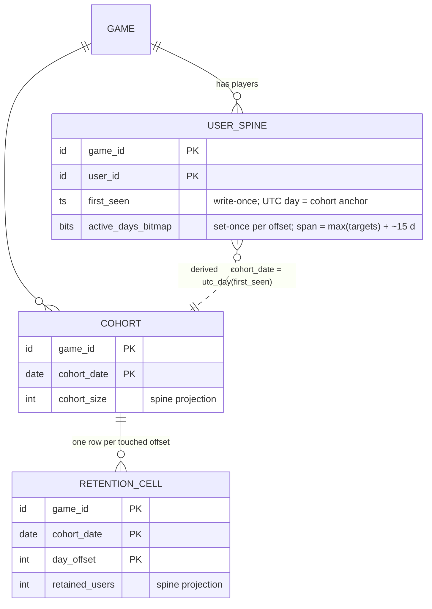

# Phase 04 — Retention (Classic Day-N)

**Feature**: 001-analytics-platform · **Story**: US3 (P2) · **Reserved kind**: consumes `session` (owns none) · **Status**: Draft
**Depends on**: Phase 01 (ingest), **Phase 02 (sessions — activeness anchor; the session-start bit is retention's only input)**.
**Deeper reference**: [`../metrics/03-retention.md`](../metrics/03-retention.md). **Spec**: US3, FR-015/016/017.
**Excluded here** (→ later per-phase design): bitmap storage realization, key layouts, DDL.

---

## 1. Story understanding

**The story.** The developer sees how many players return on day 1, day 7, and day 30 after their first session — each as a percentage of that install-date cohort.

**The question it answers.** *Of the players who first appeared on a given calendar day (an install-date cohort), what fraction were still active exactly N days later?* Retention is the headline health metric — D1 caps everything downstream — and it is the metric that drove the "minimal per-user spine" storage decision.

**Definition (LOCKED — classic Nth-day / "On" retention):**
> `D_N = retained_users(offset = N) / cohort_size`, grouped by install-date cohort, where a user counts toward `offset = N` iff they were **active on the day exactly N days after their `first_seen` day** (UTC). Independent per offset; stable and write-once once day N has elapsed.

The dashboard MUST label this **"classic Day-N retention."**

**Rejected variants.** *Range/bracket* (active on day N or later within a bracket — more forgiving, not the reference metric) and *rolling/unbounded* (Mixpanel's "On or After" — **disqualified by results-only storage**: its per-cell test `max(active_offsets) ≥ N` depends on a *future* maximum, so a late return retroactively bumps earlier cells → requires rewriting sealed cells or per-user return history, both forbidden). Classic's test is `N ∈ active_offsets` — idempotent, order-independent, write-once. This is the load-bearing reason for the choice.

**What it means for the operator.** A retention curve and the full cohort heatmap triangle from a spine of a few small columns per user — no raw event history.

---

## 2. How it is calculated

**Grain / bucketing.**
- **Cohort** = `date_utc(first_seen)`, per `game_id`.
- **Day-offset** = `date_utc(session_start_time) − date_utc(first_seen)`, on skew-corrected UTC time. Offset 0 = install day.
- **Bit-set rule (idempotent):** for each qualifying `session` event, if the user's bit for `offset` is unset, set it and increment `retained_users(game, cohort, offset)`. Setting an already-set bit is a **no-op** — this makes reprocessing, dedup-misses, and midnight-span-splits safe (FR-016).
- A midnight-spanning session counts once, in its **start** day (only that bit set).

**Formulas:**
```
cohort_size(g, c)       = # distinct users with date_utc(first_seen) = c   (game g)
retained_users(g, c, N) = # users in cohort (g,c) whose active-offset set contains N
D_N(g, c)               = retained_users(g, c, N) / cohort_size(g, c)
headline D_N(g)         = Σ_c retained_users(g,c,N) / Σ_c cohort_size(g,c)   over mature cohorts only
```
D1/D7/D30 are columns N = 1/7/30 of the same table; the cohort × offset triangle **is** the heatmap.

**Immature-cohort masking:** mask (render **N/A**, never a low number) any cell where `today_utc − cohort_date < N` (day N not yet elapsed). Headline averages **mature cohorts only** — a cohort installed 3 days ago must not drag D7/D30 toward zero.

### Worked example (today = 2026-07-17 UTC)

**Cohort A — 2026-06-01** (46 days elapsed), size 200: offset1 = 82 → **D1 41.0%**; offset7 = 46 → **D7 23.0%**; offset30 = 22 → **D30 11.0%**.
**Cohort B — 2026-07-14** (3 days), size 150: offset1 = 63 → **D1 42.0%**; D7, D30 → **N/A (masked)**.
**Cohort C — 2026-07-16** (1 day), size 90: offset1 = 41 → **D1 45.6%**; D7, D30 → **N/A**.

**Headline (mature only):**
- D1 = (82+63+41)/(200+150+90) = 186/440 = **42.3%**
- D7 = 46/200 = **23.0%** (only A mature at offset 7)
- D30 = 22/200 = **11.0%** (only A mature at offset 30)

Without masking, D7 would falsely read 46/440 = 10.5% because 290 users hadn't had the chance to reach day 7.

**Heatmap triangle** (`—` = masked):

| Cohort | size | off 0 | off 1 | off 7 | off 30 |
|---|---|---|---|---|---|
| A (06-01) | 200 | 100% | 41.0% | 23.0% | 11.0% |
| B (07-14) | 150 | 100% | 42.0% | — | — |
| C (07-16) | 90 | 100% | 45.6% | — | — |

Benchmark sanity band: D1 ≈ 40% / D7 ≈ 20% / D30 ≈ 10% — Cohort A sits in-band (plausibility check, not a validation rule).

---

## 3. Data needed (input)

Retention consumes **only the `session` typed event** — "active" is driven exclusively by sessions, never by generic/economy/purchase events. Envelope fields used:

| Field | Meaning |
|---|---|
| `game_id` | Tenant. |
| `user_id` | Stable game-provided identity — anchors the spine row and the cohort (authoritative in v1). |
| `session_id` | Opaque per-game+user key. |
| `session_start_time` | Its **UTC day** sets the retention bit. |
| `client_event_time` / `client_sent_time` / `server_received_time` | Feed skew-correction and the day-seal reference. |
| `event_id` | 24 h dedup — prevents a resent `session` event double-touching the bitmap. |

**Only sessions drive activeness.** A user firing generic/economy events without a `session` event does **not** set a retention bit. Server SDK sessions are out of scope in v1 (server activity does not, on its own, mark a retention day).

---

## 4. Data stored for longer-run processing

**This is the phase that defines the per-user spine.**

- **Per-user spine (minimal, durable):** per `(game_id, user_id)` — a `first_seen` timestamp (its UTC day = cohort + Day-0 anchor) and **the set of active day-offsets from `first_seen`**, realized as a per-user **active-days bitmap** (one bit per offset; ~4–46 bytes for D30+ coverage). "Set bit N" is **idempotent** — the property that removes the need for return history. The set spans up to `max(retention_day_targets)` + headroom.
- **Per cohort × offset (result):** per `(game_id, cohort_date, day_offset)` a `retained_users` count; per `(game_id, cohort_date)` a `cohort_size`. Together these **are** the heatmap triangle.

**Reused by other phases.** Phase 02 (sessions) writes this bitmap's bits; Phase 06 (DAU) reprojects the same activeness by day instead of by cohort-offset; Phase 02's active-user-days = popcount over it. No per-session/per-day/per-event per-user rows are kept.

Computable without raw re-scan? **Yes** — cohort assignment happens once at `first_seen`; every later session needs only `first_seen` (from the spine) + its own UTC start day to compute an offset and conditionally flip one bit + bump one counter. The set-once idempotency is precisely what removes return history. **Results-only satisfied.**

---

## 5. Data-structure thinking — Redis & database

*Conceptual shapes only.*

**Redis (transient, hot).**
- **Today's cohort×offset increment counters** — the live retention tallies before they flush; transient, may be lost.
- **The 24 h dedup window** — shared; catches a resent `session` event.
- (The **bitmap itself is durable**, not a hot Redis counter — bit-setting is idempotent absolute state, so a re-flush after recovery is a no-op and a returning user stays marked.)

**Database (durable, results-only).**
- **The user spine** — `(game_id, user_id, first_seen, active_days_bitmap)`; the only per-user data kept long-term. The bitmap answers "which day-offset is this, and have we counted it?"
- **Retention results** — durable `retained_users` per game × cohort × offset, and `cohort_size` per game × cohort. The heatmap + headline read straight from here, masking immature cells at read time.

**The bridge.** Live increments flush to durable retention results on the cadence; the bitmap is updated durably (idempotent). Because the bit is absolute state (not a delta), Redis loss never double-counts on recovery.

---

## 6. Configurations

| Knob | Default | Range / values | Forward / retro |
|---|---|---|---|
| `retention_day_targets` | `[1, 7, 30]` | any set of positive offsets | **Forward-only for widening past the tracked horizon** (offsets beyond the previously-tracked max were never recorded — results-only, nothing to re-derive). Adding an offset ≤ the tracked max, or reporting narrower, is retroactive. Recommend tracking `max(targets)` + ~15 days headroom so modest widening stays retroactive. |
| `session_inactivity_timeout_min` | 30 | 1–240 | Owned by Phase 02; changing it changes what qualifies as a session going forward → **forward-only**. Retention inherits, does not redefine. |
| `per_game_reporting_timezone_offset` | UTC | display offset | **Display-only, never re-buckets** — offset math stays UTC to preserve write-once immutability. A true timezone re-bucket is a rebuild-forward, out of v1 scope. |

**Inherited globals:** flush 5 min, dedup 24 h, day-seal 48 h.

---

## Cross-references

- Deeper sheet: [`../metrics/03-retention.md`](../metrics/03-retention.md) — `first_seen` determination, anon/identified cohort double-seed, sealed-day quarantine, target-widening horizon, all open questions.
- **Depends on Phase 02** for the session-start activeness bit. **Owns the per-user spine** that Phase 06 (DAU / new-vs-returning) and Phase 02 (active-user-days) reuse.

---

## Design

*Design-phase realization of §4/§5 on the Foundation backbone (shape per Foundation §8.3). Everything above this line is untouched; envelope, skew, seal, dedup, and flush machinery are cited as "Foundation §N", never re-derived.*

### ER / data model

**Three owned entities — one spine touch, two result tables** (UPPER_SNAKE per Foundation §1.2; key attributes live there, full attribute intent here):

| Entity | Nature | Key | Non-key attributes | Cardinality / bound |
|---|---|---|---|---|
| `USER_SPINE` | **Spine touch** — the core tier itself (Foundation §1.3); 04 defines it | `(game_id, user_id)` | `first_seen` — write-once (insert-if-absent); its UTC day is the cohort + Day-0 anchor. `active_days_bitmap` — one bit per day-offset from `first_seen`, **set-once**, bit 0 = install day | 1 row per game×user; ~4–46 B/user (Foundation §1.3) |
| `COHORT` | **Result table** — projection of spine `first_seen` days | `(game_id, cohort_date)` | `cohort_size` | ≤ 1 row per game×UTC-day (only days with ≥ 1 new user) |
| `RETENTION_CELL` | **Result table** — projection of spine bits | `(game_id, cohort_date, day_offset)` | `retained_users` | ≤ horizon+1 rows per cohort; sparse — only touched offsets materialize; an absent mature cell reads as 0 |

- **Projections, not truth** (Foundation §1.3): `COHORT.cohort_size` and `RETENTION_CELL.retained_users` are rebuildable from a **spine re-scan** — never a raw re-scan. This is the recovery lever the worker section leans on.
- **Bitmap span:** `max(retention_day_targets) + ~15 days` headroom (§6). Offsets beyond the span are untracked by design; widening past the tracked horizon is **forward-only** — new bits exist only from the change date, and the read model annotates "tracking begins <date>".
- **Cardinality caveat (accepted v1):** anon→identified double-seed (metrics sheet §6) can create two spine rows for one human — mild cohort inflation, bundled with the deferred identity merge (Foundation §4.6, §9.3). Documented, not re-litigated here.



(`GAME` referenced for the §6 knobs. `ACTIVE_USER_DAY` (02) is the *by-day* reprojection of the same spine bits — a sibling projection, no relationship owned here.)

### Redis structures

**Domain tag `ret` (owned; Foundation §2.1 grammar, §2.2 palette).** One structure only — retention needs no zsets, no staging, and HLL is **forbidden** for retention counts (Foundation §2.2).

| Key | Type | Content | TTL | Class |
|---|---|---|---|---|
| `{game_id}:ret:{utc_day}` | **hash** | open **activity-day** bucket. Fields: `cell:{cohort_date}:{offset}` → running **absolute** `retained_users` for the cell whose activity day `cohort_date + offset = utc_day`; `size` → running absolute `cohort_size` of the cohort born this day (`cohort_date = utc_day`, the offset-0 day) | ~72 h from day end (Foundation §2.3) | **Flushed** — absolute-value upsert every 5 min |

- **Bucket-day rule (explicit):** a cell lives in the bucket of its **activity day** `d = cohort_date + offset`, not its cohort day — per Foundation §2.3's retention carve-out. Day `d`'s bucket therefore holds `size`, `cell:{d}:0`, `cell:{d−1}:1`, `cell:{d−7}:7`, … At most 3 open `ret` buckets per game (today + 2 grace days).
- **Flusher mapping:** `cell:{c}:{N}` → `RETENTION_CELL(g, c, N)`; `size` → `COHORT(g, utc_day)`. Absolute upserts only; a retried flush is a no-op (Foundation §3.2). Seal of `d` = final flush, then the bucket is left to expire.
- **Rehydrate-on-miss (mandatory, Foundation §2.3):** before the first increment after a bucket miss, seed `cell:…` from `RETENTION_CELL.retained_users` and `size` from `COHORT.cohort_size` (0 if absent) — what makes the absolute flush safe post-crash.
- **Dirty tracking:** touched `ret` buckets register in the shared per-domain dirty-registry (Foundation §3.2); no new mechanism.

**Durability classes for everything 04 touches:**

| State | Path | Class |
|---|---|---|
| `first_seen`, bitmap bits | Postgres, step 7 | **Durable-immediate** — never in Redis, never flush-mediated (absolute state; loss would silently corrupt retention) |
| `cell:…` / `size` running values | `ret` hash → flush | **Flushed** — loss window ≤ flush cadence, healed by rehydrate + spine re-scan |
| Un-flushed drift / live open-day view | `ret` hash | **Transient-and-losable** (Foundation §6 accepted loss) |
| `event_id` dedup markers | `{game_id}:dedup:…` | Consumed at step 6 — 01's `dedup` domain, **not** `ret`-owned |

### Worker / pipeline flow

**Additions only, at Foundation §3.1 steps 7/8** — retention adds no queue, no route, no backbone step. Any event reaching step 7 is already accepted, skew-corrected, deduped, and in an **open** corrected day (steps 1–6).

**Sequence A — first-session seed (first accepted `session` event; executed in 02's session path on 04's behalf, immediately before sequence B — DD-1 resolved below):**
- **7a.** `USER_SPINE` insert-if-absent of `(game_id, user_id, first_seen = corrected session_start)`. The insert **reports created?** and runs **immediately before 7b** within the same session event's processing (Foundation §8.4 ordering rule: spine row before offset math). Seeding from the corrected **start** time — the same value 7b uses — makes the seeding event's own offset 0 by construction.
- **8a.** *Only if created:* rehydrate-on-miss, then increment `size` in `{game_id}:ret:{c}`, `c = utc_day(first_seen)` = the session's corrected start day. `c` is **open by construction** — 02's step-5 gate governs on the start day — so a fresh `first_seen` can never target a sealed `COHORT` row.

**Sequence B — set-once bit + conditional increment (`session` kind only; executed in 02's session-start path on 04's behalf):**
- **7b — offset math:** `offset = utc_day(corrected session_start) − utc_day(first_seen)`; the spine row is guaranteed by 7a for this same event. Guards: `offset < 0` (the one surviving cause under first-session seeding — an in-grace processing race, a later-day session seeding `first_seen` before an earlier-day session of the same user processes; the late-`reconciled`-first-touch cause is structurally eliminated, [bridge 02.5 §5](02.5-activeness-spine-contract.md); bounded ≥ −2 by the 48 h window geometry) → skip bit + counter, tally **`negative_offset`** (Foundation §1.2 enum — amendment landed; unified rule in [bridge 02.5 §5](02.5-activeness-spine-contract.md)); `offset > tracked horizon` → silent no-op by design (untracked). `first_seen` is write-once — no backdating; backdating would mean cross-cohort moves and sealed-cell rewrites, both forbidden.
- **7b′ — set-once bit (durable-immediate):** one atomic conditional durable write — "set bit `offset` iff unset, report the **transition**". Bit already set → **full no-op**: 8b is skipped entirely. This single guard is what makes dedup misses beyond 24 h, reprocessing, and midnight-span splits safe (§2, FR-016).
- **8b.** *Only on a 0→1 transition:* rehydrate-on-miss, then increment `cell:{c}:{offset}` in `{game_id}:ret:{d}`, `d = c + offset` = this event's own corrected start day — open, because this very event passed step 5 for day `d`.

**Exactly-once coupling (crash between 7 and 8).** The order **durable bit first, counter second** is deliberate. If the process dies between them, the unacked job is redelivered but stops at step 6 (its `event_id` marker is already set) — the increment is lost, so the projection runs **behind** the spine truth, never ahead. Every interleaving fails conservative: phantom retention is impossible (the inverse order could overcount undetectably); the cost is a detectable undercount. Healing is the Foundation §1.3 lever: **re-project the affected cells from a spine re-scan** (popcount-by-offset over `first_seen` + bitmap for the game×day range) — a spine scan, never a raw re-scan. The same lever covers Redis loss ≤ one flush window (Foundation §6 cross-check).

**Idempotency ledger:**

| Operation | Mechanism | Duplicate / retry outcome |
|---|---|---|
| `first_seen` | insert-if-absent (write-once) | no-op |
| bitmap bit | set-once conditional, transition-reported | full no-op; suppresses 8b |
| `cell` / `size` increments | fired only on a reported transition; each `(user, cohort, offset)` transitions at most once ever | overcount impossible; undercount only via crash-between, healed by spine re-scan |
| flush | absolute-value upsert (Foundation §3.2) | retried/duplicated flush is a no-op |

**Day-seal / late handling (explicit).**
- A cell `(c, N)` is **mutable only while activity day `d = c + N` is open** (`d_end + 48 h`, Foundation §2.3). At seal: final flush, Postgres cell final, bucket expires.
- **Sealed-day quarantine:** a late `session` event whose corrected start day is sealed stops at step 5 — quarantine tail + `sealed_late` tally — and per Foundation §4.3 is **never folded into any aggregate, spine bit, or catalog count**: no bit, no counter, no `first_seen`. Consequence for a user whose *genuinely first* session arrives sealed-late: their cohort anchors at their next in-grace **session** event (OQ-2).
- `cohort_size(c)` freezes when day `c` itself seals (it lives in bucket `c`); the cohort's cells keep maturing one activity day at a time afterwards.
- Midnight-spanning session: start-day bit only (§2); 02's duration split never re-enters retention.

**DD-1 — `first_seen` determination — RESOLVED (2026-07-17, research-ratified).** FR-015's session-only reading is confirmed: `first_seen` = the user's **first accepted `session` event**, seeded from the corrected session start, with sequence A relocated to 02's session path immediately before 7b — exactly the localized fix DD-1 anticipated (no entity, key, or formula changes). The decision record with rationale + sources is [bridge 02.5 §6](02.5-activeness-spine-contract.md) (Foundation §9.4/§5/§3.1 updated). Net effects here: **D0 = 100 % by construction** (the seeding session sets bit 0 within the same event), `COHORT.cohort_size ≡ RETENTION_CELL(c, 0)` becomes a free cross-counter integrity check, cohort denominators are benchmark-comparable (GameAnalytics/Adjust install ≡ first-session semantics), and never-sessioned users never enter denominators — they have no spine row (`no_spine_row` advisory tally at the front-door; 05/06 read their install dims as `unknown`).

**Open questions raised by this design:**
- **OQ-1** — *resolved (2026-07-17)*: `first_seen` = first accepted **session** event (DD-1 above; decision record in [bridge 02.5 §6](02.5-activeness-spine-contract.md)). Spine shape and formulas survived unchanged, as predicted.
- **OQ-2** — sealed-late *first* session: the metrics sheet suggests `first_seen` "still records the corrected day" (spine rows not day-sealed); Foundation §3.1 step 5 + §4.3 stop sealed-day events before step 7 and explicitly protect spine bits. **Adopted: Foundation wins — full stop at step 5**; the metrics sheet itself invites this flag. Revisit only if operators want first-session lateness special-cased.
- **OQ-3** — *resolved*: the Foundation §1.2 reason enum now includes **`negative_offset`** (amendment landed); the `offset < 0` skip is tallied under it (written via 02's executing path per [bridge 02.5 §5](02.5-activeness-spine-contract.md)), no longer silent.

### API / contract surface

**No owned ingest kind.** Retention registers no route, no payload schema, no validation table. It **requires of Phase 02's session flow** (its only input, §3):

1. Every accepted, deduped, in-grace `session` event reaches sequence B **exactly once per processing attempt**, after skew-correction (Foundation §4.2) and the seal check (step 5), with the corrected UTC start day attached.
2. The spine row exists before 7b (sequence A runs immediately before 7b in the same event — DD-1 resolved).
3. Midnight-spanning sessions are presented **once, as their start day**; 02's pro-rata duration split never re-enters retention.
4. Session *qualification* (`session_inactivity_timeout_min`, `session_id` semantics) is wholly 02's; retention inherits and never re-qualifies (§6).

And a fifth requirement, also of **Phase 02's session flow** (DD-1 resolved, 2026-07-17): execute sequence A — the coupled `first_seen` insert-if-absent + conditional `size` increment — immediately before 7b, for the same session event. Phase 01's front-door executes **no** spine sequence; it only tallies `no_spine_row` (advisory) for accepted non-session events whose `user_id` has no spine row.

**Dashboard read-model** (shapes only; live-vs-historical is Foundation §3.3's uniform merge — sealed days Postgres-only, open days from the `ret` bucket with fall-back to last flush):

| Surface | Reads | Computation (read-time, never stored) | Masking |
|---|---|---|---|
| **Headline D1/D7/D30** | `COHORT`, `RETENTION_CELL` at `N ∈ retention_day_targets` | `Σ_c retained(c,N) / Σ_c size(c)` over **mature cohorts only** (`today_utc − c ≥ N`) | immature cohorts excluded from both sums |
| **Cohort × offset heatmap triangle** | all window cells + `cohort_size` per row | per-cell `retained/size`; absent mature cell = 0 % | cell rendered **N/A** + greyed where `today_utc − c < N` ("day N not yet elapsed" tooltip) |
| **Per-cohort curve** | one triangle row | same cells | same rule |

- **Per-cell liveness:** a cell `(c, N)` is live (Redis-merged) iff its **activity day** `c + N` is still open — one cohort row can mix sealed historical cells with 1–3 live tail cells; the merge is per-cell by activity day, exactly Foundation §3.3.
- **Nothing masked is stored** — maturity and masking are pure read-time predicates; sealed cells are immutable regardless.
- **Labelling:** the UI labels the figure **"classic Day-N retention"** with the contrast tooltip (§B-3); offsets beyond a widened horizon carry the "tracking begins <date>" annotation (forward-only, §6).
- **Timezone:** `per_game_reporting_timezone_offset` is display-only; maturity, masking, and offset math stay UTC (§6).

### Relations with other stories

- **Owns:** `USER_SPINE` (entity definition; `first_seen` + bitmap semantics; the set-once rule), `COHORT`, `RETENTION_CELL`; Redis domain tag `ret`.
- **Writes (shared):** **none** — 04 writes no structure owned elsewhere. (The inverse holds: 02 executes both sequences A and B **on 04's behalf** per Foundation §5 and [bridge 02.5](02.5-activeness-spine-contract.md) — 04 owns the semantics and sequences, 02 owns the surrounding path. OQ-3 added one `EXCEPTION_TALLY` reason via 01's shared tally machinery, not a direct write.)
- **Reads:** `GAME.config` (`retention_day_targets` + inherited globals, §6); its own spine (`first_seen` for offset math); backbone services (skew, seal, dedup outcomes) as machinery, not structures.
- **Feeds:** **02** — bitmap popcounts for active-user-days; **05 / 06** — `first_seen` as conversion / new-vs-returning anchor; **06** — `COHORT` + `RETENTION_CELL` for new/returning splits; **dashboard** — the headline + triangle above.
- **Ordering / lifecycle:** spine row before offset math (7a → 7b, same event); durable bit transition before counter increment (7b′ → 8b — the crash-safe direction); cell `(c, N)` mutable only while day `c + N` is open; `cohort_size` freezes at day `c`'s seal; horizon widening forward-only; sealed-late events never reach steps 7/8 (full stop at step 5).
- **Flagged bridges:** **created — [`02.5-activeness-spine-contract.md`](02.5-activeness-spine-contract.md)** (the spine write-delegation contract; numbered 02.5, jointly flagged with 02) — two other stories execute 04-owned durable-immediate + conditional-increment sequences whose transition-reporting, ordering, and crash semantics are pinned identical in both paths there; it is also the home of the OQ-1 ruling (its §6) and the unified negative-offset rule (its §5).
