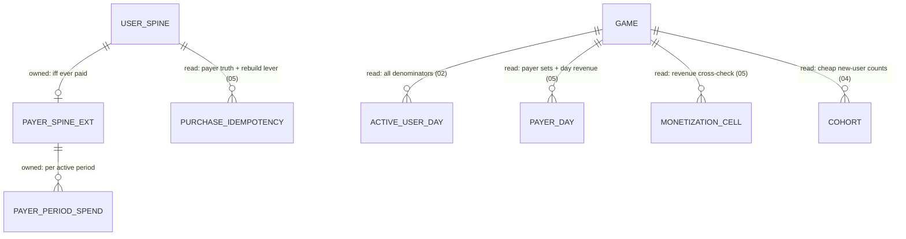

# Phase 06 — Derived KPIs

**Feature**: 001-analytics-platform · **Story**: overall health & profitability KPIs · **Reserved kind owned**: none (derived) · **Status**: Draft
**Depends on**: **Phase 02 (sessions → active-user counts)**, **Phase 05 (revenue rollup + payer set)**, **Phase 04 (user spine / `first_seen`)**.
**Deeper reference**: [`../metrics/07-derived-kpis.md`](../metrics/07-derived-kpis.md).
**Excluded here** (→ later per-phase design): distinct-count sketch choice, key layouts, DDL.

---

## 1. Story understanding

**The story.** The developer sees the composite KPIs every game dashboard reports: how many players are active (DAU/WAU/MAU), how habitual they are (stickiness), how much money each player type produces (ARPU/ARPPU/ARPDAU), what fraction pay (conversion), and how concentrated revenue is among the biggest spenders (whale concentration).

**The question it answers.** *How healthy and how profitable is the game overall?* These are **derived** — computed from results the other phases already maintain (session/active-user counts, the retention spine, the monetization revenue rollup) plus a small denominator spine. Almost none need their own SDK event.

**Definitions (chosen variants):**
- **DAU / WAU / MAU** = distinct active `user_id`s (≥ 1 session **started** in the period; the §B-1 activeness anchor). DAU = exact distinct-per-UTC-day; WAU/MAU = distinct over trailing **7 / 30** rolling UTC days — distinctness holds *across* days (a user active on 12 of 30 days counts once in MAU). Rejected: "active = any event" (over-counts pings; would disagree with retention) and calendar-month MAU (rolling-30 is the internal grain; calendar is a display variant).
- **Stickiness** = DAU / MAU (same report day). ~0.2 is a common sticky bar.
- **ARPU** = period revenue ÷ active users (payers + non-payers).
- **ARPPU** = period revenue ÷ paying users (distinct users with ≥ 1 verified prod purchase). ARPPU ≥ ARPU always.
- **ARPDAU** = daily revenue ÷ DAU (the day-grain ARPU; the most-watched monetization pulse).
- **Conversion** = distinct paying ÷ distinct active. **First-purchase conversion** = distinct users whose **first-ever** verified purchase fell in the period ÷ active (or new) users — a flow rate.
- **Whale concentration** = share of period revenue from the **top X% of payers** by spend (default X ∈ {1%, 5%, 10%}). The one KPI needing a *new maintained aggregate* (a per-payer spend distribution).
- **(Optional) New / Returning / DAU composition** = new users (`first_seen` in period) + returning (active, `first_seen` before period) = DAU, disjoint.

**What it means for the operator.** One glance at whether the game is growing, habitual, and profitable — and how dependent it is on a few whales.

---

## 2. How it is calculated

All bucketing is the platform **logical day** (Foundation §4.7 — `utc_day(corrected + reporting_offset)`, single platform timezone; every "UTC day" below reads as the logical day); WAU = trailing 7, MAU = trailing 30; headline grain is whole-game. All money is normalized, prod + verified only.

```
DAU(d)          = |{ user_id : a session STARTED on UTC day d }|
WAU(d)          = |{ user_id : a session STARTED in [d-6 .. d] }|      (distinct across 7)
MAU(d)          = |{ user_id : a session STARTED in [d-29 .. d] }|     (distinct across 30)
Stickiness(d)   = DAU(d) / MAU(d)
Revenue(P)      = Σ normalized amount over verified prod purchases in P
PayingUsers(P)  = |{ user_id : ≥1 verified prod purchase in P }|
ARPU(P)         = Revenue(P) / ActiveUsers(P)
ARPPU(P)        = Revenue(P) / PayingUsers(P)
ARPDAU(d)       = Revenue(d) / DAU(d)
Conversion(P)   = PayingUsers(P) / ActiveUsers(P)
FirstConv(P)    = |{ user_id : first-ever verified purchase in P }| / ActiveUsers(P)
WhaleShare(X,P) = (Σ spend of top ⌈X%·PayingUsers(P)⌉ payers) / Revenue(P)
NewUsers(P)     = |{ user_id : first_seen ∈ P }|
```

### Worked example — one UTC day `d` (given, already maintained by other phases)

DAU = 1,000; MAU = 5,000; revenue = $400; distinct payers = 40.
- **Stickiness** = 1,000/5,000 = **0.20** (~6 of 30 days).
- **ARPDAU** = $400/1,000 = **$0.40** (= ARPU(day) by definition).
- **ARPPU(day)** = $400/40 = **$10.00**.
- **Conversion(day)** = 40/1,000 = **4.0%**.

### Worked example — whale concentration (period P)

PayingUsers = 10, spend desc `[$500,$200,$120,$80,$40,$30,$15,$10,$3,$2]`, Revenue = $1,000.
- Top **10%** = 1 payer → $500 → **50.0%**. Top **20%** = $700 → **70.0%**. Top **50%** = $940 → **94.0%**. Classic whale shape — *only* computable if the per-payer spend distribution for P is retained.

### DAU composition

DAU = 1,000; 150 have `first_seen == d` → **New 150, Returning 850** (disjoint, sum = DAU).

**Immature/partial:** WAU with < 7 days, MAU/stickiness with < 30, render **N/A** (masked) — never a low number. Today's ARPDAU/conversion are provisional; sealed prior days exact.

---

## 3. Data needed (input)

**Essentially NO new SDK event** — this phase consumes fields already required by Phases 02, 04, 05:

| Field | Used for |
|---|---|
| `user_id` | distinct-count key for DAU/WAU/MAU, active/paying denominators |
| `session` event + `session_start_time` | active-user membership (all denominators) — activeness is a client-SDK session concept |
| purchase revenue row (`transaction_id`, normalized amount, `verified`, `environment`, `source`) | numerators of ARPU/ARPPU/ARPDAU; payer set; per-payer spend for whale |
| first-purchase detection (server-side, per `user_id`) | first-purchase conversion, new-payer flow |
| `first_seen` (user spine) | new vs returning composition |

**Trust boundary (critical):** every **money numerator** is **server-sourced only** (verified prod purchases; sandbox excluded). Every **active-user denominator** comes from the **client-SDK session** stream. The **payer set** is server-derived (a payer has ≥ 1 verified prod purchase). No KPI trusts a client-reported revenue or a client "is_payer" flag.

---

## 4. Data stored for longer-run processing

Reuse first; add only the minimum:

- **(reuse) Active-user counts** — per game × UTC-day the distinct active-user set (session-start), *the same activeness the retention spine establishes*. DAU is exact-per-day; WAU/MAU are a set-union over 7/30 days. No new raw scan.
- **(reuse) Revenue numerators** — per game × UTC-day total normalized verified-prod revenue (the monetization rollup, summed over products). Period revenue = sum of daily totals.
- **(reuse) Paying-user counts** — per game × UTC-day the distinct set of `user_id`s with ≥ 1 verified prod purchase (sourced from the `transaction_id`→user idempotency spine); period payers = a window-union like MAU.
- **(new, minimal) First-purchase-day flag** — a write-once, idempotent per-payer field (mirrors the retention set-once bit) marking the day of a payer's first-ever verified purchase → first-purchase conversion.
- **(new, the one genuine spine expansion) Per-payer cumulative period spend** — per game × period × paying `user_id`, cumulative normalized verified-prod spend → whale ranking. Daily totals are insufficient (the distribution is lost once summed). **Payer-bounded** (payers ≪ users, a few % → thousands of rows/period at indie scale, not millions), so it stays results-only *in kind* and modest, but it does expand the spine beyond "a handful of columns per user." See the spine-budget ledger in `../metrics/README.md`.

**Distinct-over-window exactness:** DAU trivially exact; WAU/MAU/period-payers are set-unions of daily distinct sets — **exact in v1** (affordable at indie scale), with **HyperLogLog as the named scale lever** (approximate only ever touches distinct-*user counts*, never the money numerators). Computable without raw re-scan? **Yes.**

---

## 5. Data-structure thinking — Redis & database

*Conceptual shapes only.*

**Redis (transient, hot).**
- **Today's DAU set** — the distinct active-`user_id` set for today (reused from Phase 02); ARPDAU/conversion/stickiness read from it live.
- **Today's distinct-payer set** — `user_id`s with a verified prod purchase today.
- **Today's revenue counter** — running normalized verified-prod revenue.
- (Whale concentration is a **period aggregate, read from durable results** — not a hot counter, so unaffected by Redis loss.)

**Database (durable, results-only).**
- **Daily active-user sets** (or per-day sketches) — retained so any trailing window (WAU/MAU) is a union.
- **Daily payer sets** — same, for period-payer windows.
- **Daily revenue totals** — from the monetization rollup.
- **Per-payer first-purchase-day flag** — write-once on the payer spine.
- **Per-payer per-period cumulative spend** — the whale distribution; ranked and top-X%-summed at read time.

**The bridge.** Today's hot sets/counters flush to durable per-day results on the cadence; windowed KPIs union the retained daily sets. Because DAU/payer membership is set-based, duplicate-delivered sessions/purchases (24 h `event_id` window; durable `transaction_id`) collapse the same `user_id` and never inflate a distinct count.

---

## 6. Configurations

| Knob | Default | Range / values | Forward / retro |
|---|---|---|---|
| `mau_window_days` | 30 | 28–31 (WAU 7, DAU 1 fixed) | **Forward-only** for sealed daily active-sets (re-slices retained per-day data only if retained; else forward-only). |
| `whale_top_percents` | `[1, 5, 10]` | subset of 1–50 | **Retroactive IF** full per-payer period spend is retained (a re-rank, no re-scan); **forward-only** if only a top-k prefix is kept. The §4/§5 scope tradeoff (WC-1). |
| `active_definition` | `session_start` | `session_start` (v1-locked; `any_event` is v2-only) | **Locked to `session_start`** — inherits §B-1; not operator-settable in v1. |
| `arppu_first_purchase_denominator` | `active_users` | `active_users` / `new_users` | Forward-only (display choice for the first-purchase base). |
| `revenue_currency` | inherits monetization FX (§D-2) | config FX table | Forward-only (FX stamped at purchase date; no retro re-conversion). |
| `partial_window_mask` | on | on / off | **Display-only** — masks WAU/MAU/stickiness until the trailing window has fully elapsed. |
| `whale_min_payers` | 20 | integer | Below this, whale share is a single noisy user — still computed, flagged low-confidence. |

**Rule:** anything that would rewrite a sealed daily active-set or sealed revenue is forward-only. The deliberate exception is `whale_top_percents` (retroactive only because re-ranking a stored distribution needs no raw re-scan — and only if the full distribution is retained).

---

## Cross-references

- Deeper sheet: [`../metrics/07-derived-kpis.md`](../metrics/07-derived-kpis.md) — whale-concentration spine scope (WC-1), small-N masking, MAU window semantics, distinct-over-window exactness, gross-vs-net (inherits §D-1), all open questions.
- **Pure consumer:** reuses Phase 02 (activeness), Phase 04 (spine / `first_seen`), Phase 05 (revenue rollup + payer set). Its only new durable state is the payer-bounded first-purchase flag and per-payer period spend — reconciled against SC-007 in the ledger in `../metrics/README.md`.

---

## Design

*Realizes §4/§5 on the Foundation backbone. Posture: **pure consumer** — this story owns no event kind, no Redis domain, no SDK field, and stores no KPI value. Its entire durable footprint is the two payer-bounded structures below; everything else is read-only references to other stories' structures by their Foundation §1.2 names.*

### ER / data model

**Owned entities (the whole footprint — Foundation §1.3 tier 2, payer-bounded):**

| Entity | Key | Attributes (logical) | Cardinality / bound | Nature |
|---|---|---|---|---|
| `PAYER_SPINE_EXT` | (`game_id`, `user_id`) | `first_purchase_day` — **write-once** logical day of the payer's first-ever verified prod purchase; `lifetime_spend_normalized` — monotonic cumulative converted spend (Q3); `has_unconverted_spend` — **bool** flag set when a parked (`fx_unconverted`) purchase commits, cleared when it later converts pre-seal (05 step 7 — the whale-mis-tier abstention: while true, `payer_tier` reads `indeterminate`, never a deflated `minnow`) | ≤ 1 row per user, exists **iff ever paid** (payers ≪ users) | **Spine touch** — the tier-2 payer extension (Foundation §1.3); mirrors the retention set-once bit |
| `PAYER_PERIOD_SPEND` | (`game_id`, `period`, `user_id`) | `spend_normalized` — cumulative verified-prod spend, normalized under 05's FX rule (§D-2, stamped at purchase date) | one row per payer × period **with ≥ 1 purchase in that period** ≈ payers × active periods (thousands/period at indie scale, never user-bounded) | Formally tier-2 spine; **in kind a result** — a rebuildable **projection of `PURCHASE_IDEMPOTENCY`** (+ dated FX config), exactly as `PAYER_DAY` is (Foundation §1.3) |

**`period` semantics (v1, locked here):** `period` = **UTC calendar month** (`YYYY-MM`). Chosen over a trailing window because trailing whale windows would force payer×**day** spend grain (~30× the rows — the WC-1 containment this story rejects); calendar month is the coarsest grain that preserves the full distribution. A period's rows are **mutable while any of its days is unsealed** and freeze at `period_end + 48 h` — purely a consequence of the day-seal (Foundation §4.3) sitting upstream of every write; **no period-level seal machinery exists**. The current month is provisional by construction; sealed months are immutable.

**WC-1 posture (consistent with §6):** v1 retains the **full per-payer distribution** — every payer's row, never a top-k prefix. That is precisely what makes `whale_top_percents` **retroactive** (a read-time re-rank of stored rows, no re-scan) for every retained period; adopting a top-k prefix later would flip the knob forward-only (§6 rule).

**Everything else is read-only.** Active denominators from `ACTIVE_USER_DAY` (02); money numerators, payer sets, and the money-truth spine from `PAYER_DAY` / `MONETIZATION_CELL` / `PURCHASE_IDEMPOTENCY` (05); new-vs-returning from `USER_SPINE.first_seen` + `COHORT` (04). Every §2 formula is a read-time computation over these cells — never a stored value (Foundation §3.3).



**Recovery / re-normalization lever:** both owned structures re-derive from `PURCHASE_IDEMPOTENCY` (`user_id`, `purchase_day`, `price_local`, `currency` + the dated FX table) — a spine-family re-scan, never a raw re-scan. The same lever refreshes affected `PAYER_PERIOD_SPEND` rows if 05 re-normalizes an **unsealed** day under a corrected FX table; sealed periods are never re-normalized (§6 `revenue_currency`).

### Redis structures

**This story owns no Redis keys.** No domain tag under Foundation §2.1, no dedup markers of its own (it rides 05's durable `transaction_id` gate), no hot accumulators. Rationale (§5): the whale distribution is money-derived period state whose correctness must not depend on Redis — both durable writes go straight to Postgres at step 7 — and a period-cumulative cell cannot legally live in an open-day bucket anyway (a period spans ~30 days; Foundation §2.3 binds every incremental cell to exactly one corrected-UTC-day bucket).

What it **reads** (owners' keys, open days only; Foundation §3.3 does the live-vs-flushed merge once):

| Key (owner's pattern, §2.1) | Type | Owner | Used for |
|---|---|---|---|
| `{game_id}:act:{utc_day}` | set | 02 | live DAU; today's tail of WAU/MAU unions; live denominators (ARPDAU, conversion, stickiness) |
| `{game_id}:payer:{utc_day}` | set | 05 | live distinct-payer count (today's conversion / ARPPU) |
| `{game_id}:rev:{utc_day}` | counter | 05 | live revenue numerator (today's ARPDAU / ARPU) |

Layouts, TTLs, and rehydrate-on-miss for these are their owners' concerns; 06 treats them as opaque day-scoped read surfaces.

### Worker / pipeline flow

**No new backbone, no new kind route, nothing at steps 1–6, zero step-8 additions.** This story's entire pipeline presence is one **step-7 addition on the purchase-accept signal** (Foundation §3.1).

**The coupling point (explicit).** "Purchase accept" = 05's durable `transaction_id` insert-if-absent at step 6 **succeeding**. 06's writes execute **in-band, in the same worker step 7** — not via a downstream consumer. *Rejected:* a BullMQ fan-out consumer — it would need its own delivery guarantee and dedup for money-derived state, re-opening exactly the problem the gate just closed; in-band keeps a single atomic unit possible (normative contract: [bridge 05.5](05.5-purchase-accept-contract.md)). Foundation §5 now records these two structures as **durable-immediate (both), gate-coupled on 05's purchase-accept signal** — the resolution this design requested (amendment landed; a flush-mediated period accumulator would violate §2.3's one-cell-one-day-bucket rule).

On each accepted purchase (corrected day `d`, month `M(d)`), appended to step 7:

1. **`PAYER_SPINE_EXT.first_purchase_day` write-once** — insert-if-absent with `d` (idempotent absolute, mirrors the §B set-once bit). Never backdated: a purchase for a sealed day was quarantined at step 5 and never reaches this write.
2. **`PAYER_SPINE_EXT.lifetime_spend_normalized += normalized_amount`** (Q3, ratified 2026-07-17) — the payer-tier source read pre-purchase by 05 against `payer_tier_rule` fixed thresholds; monotonic non-decreasing; a 0/parked `normalized_amount` (missing FX rate, Q8) adds nothing **and sets `has_unconverted_spend = true`** (the whale-mis-tier abstention, 05 step 7) — so the tier reads `indeterminate` rather than a deflated value until the parked amount converts (the unsealed FX recompute then adds it and clears the flag). Never let a parked (unknown-value) purchase read as $0 through the fixed-dollar tier gate.
3. **`PAYER_PERIOD_SPEND[game, M(d), user] += normalized_amount`** — the three writes above are bound into the **same atomic unit as the step-6 gate insert**: gate row + first-purchase write + lifetime-spend add + period-spend add commit together or not at all.

**Idempotency argument.** Duplicate purchases cannot double-add spend because the `transaction_id` gate sits **upstream**: a duplicate stops at step 6 and step 7 never runs. A worker crash mid-purchase either re-runs the whole atomic unit (nothing committed) or no-ops at the gate (everything committed) — so the spend add is **exactly-once**, deliberately stronger than step 7's "idempotent absolute" letter, which a cumulative money distribution requires (an increment is not intrinsically idempotent; the gate makes it so). **Spine-independence (Q1, 2026-07-17):** the payer family keys `(game_id, user_id)` as a logical association — it does **not** require a `USER_SPINE` row to exist first (a purchase-before-first-session, or a never-sessioned payer, is valid; `first_seen` is seeded only by 02's session path, so it may be absent or later than `first_purchase_day`). The old "front-door `first_seen` precedes" ordering claim is retired; only `PAYER_SPINE_EXT → PAYER_PERIOD_SPEND` existence order matters, and it holds within the atomic unit.

**Read-time / window computation (the story's other half — computed at read, never stored):**

```
DAU(d)         = |ACTIVE_USER_DAY(d).members|                (open d: 02's act set, live)
WAU/MAU(d)     = |∪ ACTIVE_USER_DAY[d−6..d] / [d−29..d]|     (set-union across days, exact v1)
PayingUsers(P) = |∪ PAYER_DAY[P].payer_members|              (window-union, exact v1)
Revenue(P)     = Σ PAYER_DAY[P].revenue_day_total            (≡ Σ MONETIZATION_CELL — read-time cross-check)
WhaleShare(X,M)= rank PAYER_PERIOD_SPEND[M] desc → Σ top ⌈X%·payers⌉ ÷ Revenue(M)
New(d)         = |ACTIVE_USER_DAY(d).members ∩ {first_seen = d}|   (cheap variant: Σ COHORT.cohort_size)
FirstConv(P)   = |{first_purchase_day ∈ P}| ÷ configured denominator
```

**HLL lever (named, never default):** if exact daily membership outgrows retention, per-day HLL sketches replace member sets and window unions become **HLL merges** — approximate WAU/MAU/period-payers, exact DAU counts kept, **money never approximated** (Foundation §2.2, §9.2). Flipping it also degrades New/Returning to the `COHORT.cohort_size` variant. Whale ranking is a read-time sort of durable rows; zsets, if used at all, are display-time only (Foundation §2.2).

### API / contract surface

**No new SDK event, no new envelope field, no reserved kind — the ingest contract is untouched by this story.** Its entire surface is the dashboard read-model (NestJS dashboard API → Next.js); live-vs-historical follows Foundation §3.3 uniformly (sealed days from Postgres, open days live from the owners' Redis keys with last-flush fallback, today marked provisional).

| KPI | Reads (stored structures) | Window | Masking / flags |
|---|---|---|---|
| DAU(d) | `ACTIVE_USER_DAY(d)` (live: 02's `act`) | 1 UTC day | today provisional |
| WAU(d) / MAU(d) | ∪ `ACTIVE_USER_DAY` trailing 7 / 30 | trailing, ends on report day | **masked N/A** until window fully elapsed (`partial_window_mask`); exact v1, HLL lever |
| Stickiness(d) | DAU(d) ÷ MAU(d), same day | — | masked with MAU; N/A when MAU = 0 |
| ARPU(P) | Σ `PAYER_DAY.revenue_day_total` ÷ active-union | revenue period **pairs** with same-length active window (DK-5) | gross-labeled (§D-1) |
| ARPPU(P) | same numerator ÷ ∪ `PAYER_DAY.payer_members` | paired | N/A when 0 payers |
| ARPDAU(d) | day revenue ÷ DAU(d) | 1 UTC day | the only sanctioned day-numerator ratio; today provisional |
| Conversion(P) | payer-union ÷ active-union | paired | N/A when DAU = 0 |
| First-purchase conv(P) | count `PAYER_SPINE_EXT.first_purchase_day ∈ P` ÷ denominator | paired | denominator = `arppu_first_purchase_denominator` |
| WhaleShare(X, M) | `PAYER_PERIOD_SPEND[M]` rank + top-X% sum ÷ Revenue(M) | **calendar month** (current month provisional) | **`low_confidence` flag** when `PayingUsers(M) < whale_min_payers` (default 20) — still computed, never hidden; N/A at 0 payers; X retroactive (full distribution retained). Payers with `has_unconverted_spend` (tier `indeterminate`) are surfaced as their own line and **never folded into `minnow`** — their rank position uses their lower-bound spend, flagged as a floor (05 whale-mis-tier fix). |
| New / Returning(d) | `ACTIVE_USER_DAY(d)` ∩ `USER_SPINE.first_seen` (= d / < d) | 1 UTC day | disjoint, sums to DAU |

Calendar-month MAU is a **display-only reprojection** of the same daily sets (DK-1) — never the internal grain. Division-by-zero anywhere renders **N/A, never 0** (§2). Every money figure in this table is server-sourced verified prod only; every active denominator is client-session-sourced (§3 trust boundary) — the read-model has no path that mixes them differently.

### Relations with other stories

- **Owns:** `PAYER_SPINE_EXT`, `PAYER_PERIOD_SPEND` (Postgres, durable-immediate path, written on 05's purchase-accept signal). No Redis domain, no event kind, no SDK contract surface.
- **Writes (shared):** none — 06 writes no structure owned elsewhere.
- **Reads:** `ACTIVE_USER_DAY` + 02's `act` set (all active denominators); `PAYER_DAY`, `MONETIZATION_CELL` (cross-check), `PURCHASE_IDEMPOTENCY` + 05's `payer`/`rev` keys (money numerators, payer truth, rebuild lever); `USER_SPINE.first_seen` + `COHORT` (04, new-vs-returning); `USER_SPINE.active_days_bitmap` only as the reconciliation source behind `ACTIVE_USER_DAY` (Foundation §1.3), never on the read path; `GAME.config` (§6 knobs).
- **Feeds:** the dashboard KPI endpoints only — no other story consumes 06's structures in v1 (but see flagged bridge 2, where 05 may need to).
- **Ordering / lifecycle:** 06's step-7 writes fire strictly after (and atomically with) 05's step-6 `transaction_id` gate success; the payer family is **spine-independent** (Q1) — no `USER_SPINE` row is required, only `PAYER_SPINE_EXT → PAYER_PERIOD_SPEND` existence order (held within the atomic unit). Window KPIs require `ACTIVE_USER_DAY` / `PAYER_DAY` day rows retained across the longest window (≥ 30 days of membership — 06 is the stakeholder in Foundation §9.2's membership-retention flag). Period rows freeze at `period_end + 48 h` via the upstream day-seal alone.
- **Flagged bridges** — **created: [`05.5-purchase-accept-contract.md`](05.5-purchase-accept-contract.md)** (the 05↔06 money seam), covering both flagged concerns:
  1. **purchase-accept contract** — the cross-ownership atomic unit (gate row + 06's two writes commit together or not at all) is the bridge's §1 normative statement, with the signal payload (§2) and failure ledger (§4).
  2. **payer-tier spend lookup** — **RESOLVED 2026-07-17 (Q3)**: `payer_tier` reads **lifetime** `PAYER_SPINE_EXT.lifetime_spend_normalized` (written above) against `payer_tier_rule` fixed thresholds, not the period row; the spine stores spend, never the tier label. Decision record + rationale in [bridge 05.5 §6](05.5-purchase-accept-contract.md); spine ledger amended (`../metrics/README.md`).
