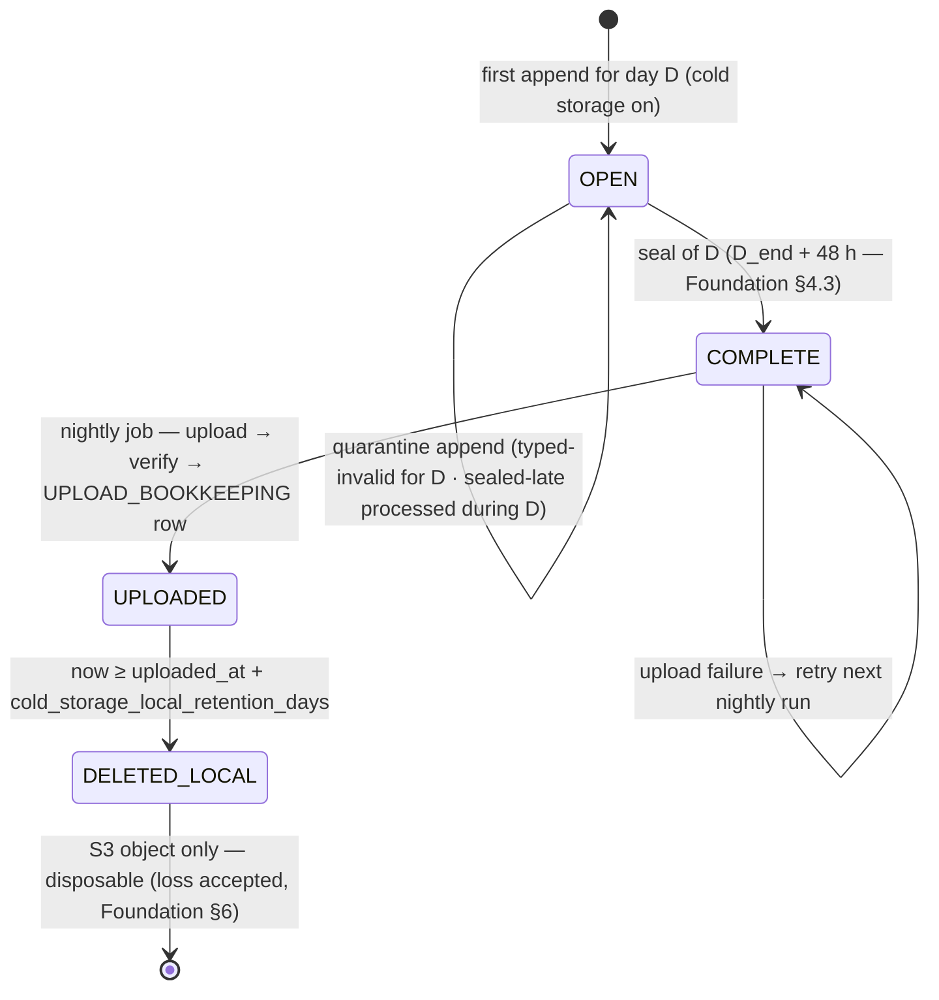

# Phase 07 — Cold-Storage Lifecycle

**Feature**: 001-analytics-platform · **Story**: US5 (P3 — operational) · **Reserved kind owned**: none (ops) · **Status**: Draft
**Depends on**: Phase 01 (the raw event stream workers append). Read anytime after 01.
**Deeper reference**: no dedicated metric sheet — this is an operational story. **Spec**: US5, FR-023/024, SC-010, and the Redis-loss / write-ahead Edge Cases.
**Excluded here** (→ later per-phase design): file format, compression codec, S3 client, scheduler, key layouts.

---

## 1. Story understanding

**The story.** Raw events are appended to a per-game **daily file**; a nightly job uploads yesterday's file to S3-compatible storage, then deletes it locally — all configurable — so the operator keeps a disposable backup / backfill escape hatch without paying for long-term hot storage.

**The question it answers.** *Where does the raw truth go, and how do we keep it cheap and disposable?* The platform stores only processed results in the database (never raw logs); the raw stream still has to land *somewhere* durable-enough to be the **manual rebuild floor** and a theoretical backfill source — but nowhere expensive or permanent.

**What it means for the operator.** A per-game gzip file per day, shipped nightly to any S3-compatible target (MinIO / Arvan / etc. — works under network restrictions), then removed from local disk. Losing a day's raw file or the Redis cache is explicitly acceptable; losing durable database results is not. The pipeline works fully **without** this phase — it is the disposable safety net, not a metric.

**The load-bearing invariant it upholds (§E write-ahead).** A worker appends the raw file (fsync'd, if cold storage is on) **before** updating any counter. This makes the raw file a **complete superset** of anything counted — so no event is ever counted-but-unlogged (SC-008), and the file is a valid rebuild floor. Getting the order wrong (counter-first) would create counted-but-never-logged events. This ordering is owned by the pipeline (Phase 01's workers); this phase owns the file's **lifecycle** after it's written.

**Also the quarantine floor.** Typed-kind events that fail strict validation, and valid events arriving after their day sealed, are **quarantined to the raw file** (the dead-letter floor) rather than folded into aggregates — so the raw file is also where recoverable-but-excluded events live.

---

## 2. How it is calculated

This is a **lifecycle**, not a metric — no formula. The state machine per game per day:

```
DURING DAY d      → append each processed raw event (write-ahead, fsync'd) to the game's day-d file (compressed)
                    [+ append quarantined typed-invalid / sealed-late events to the same file's quarantine tail]
NIGHTLY JOB       → for each game, take yesterday's (day d) completed file:
                       1. upload to the configured S3-compatible bucket
                       2. on confirmed upload → delete the local file
                    (respects config: enable/disable, bucket, credentials, retention)
IF cold storage OFF → no raw file is written at all
```

### Worked example

Game `g=42`, cold storage enabled, bucket `analytics-cold`, local retention 0 days (delete right after upload).

- **During 2026-07-16 (UTC):** workers append every accepted raw event for `g=42` — write-ahead, before counters — into `g42/2026-07-16.log.gz`. The 5 malformed `economy` events from the Phase 01 example also land here (quarantine tail). By midnight the file is a complete superset of everything counted that day.
- **Nightly job (early 2026-07-17):** yesterday's file `g42/2026-07-16.log.gz` exists → uploaded to `analytics-cold`; on confirmed upload it is **deleted locally**. `g42/2026-07-17.log.gz` (today) is untouched — still being appended.
- **If cold storage were disabled:** no `g42/2026-07-16.log.gz` is ever written; counters still update (but the write-ahead superset guarantee is waived — the operator has accepted no rebuild floor).

There is nothing to hand-verify numerically; the acceptance test is behavioral (SC-010): a file is written, uploaded, deleted, and every config toggle is honored.

---

## 3. Data needed (input)

This phase consumes the **same raw event stream** Phase 01 ingests — it adds **no new SDK field**. What it needs is not from the SDK but from the pipeline and config:

- **The processed raw event** (the full envelope + payload) as it passes through a worker — appended verbatim to the day file. This is the one place the *raw* form is written down.
- **The event's `game_id` and corrected UTC day** — to route it to the correct per-game daily file.
- **Quarantine-flagged events** — typed-invalid or sealed-late events the metric phases refuse — routed to the same file's quarantine tail.
- **Operator config** (below) — enable/disable, bucket, credentials, retention.

---

## 4. Data stored for longer-run processing

Cold storage is deliberately the phase that stores **the most and keeps it the least**:

- **Per-game daily raw file (cold, disposable):** a compressed append log of the day's raw events (+ quarantine tail). Local only until the nightly upload, then **deleted locally** and living only in S3-compatible storage. Not queried by any dashboard; it is the manual rebuild / backfill floor.
- **No database rows.** This phase writes **nothing** durable to the results database — that would violate results-only (FR-010). The database never holds raw events; the file is the only raw form and it is explicitly disposable.
- **Optional operational bookkeeping** — the nightly job may keep a small durable record of "which day-files uploaded successfully" for idempotency/observability, but that is operational metadata, not events or metrics.

The whole point: raw truth is voluminous, so it is kept **off the hot path and out of the database**, compressed, shipped, and deleted — the opposite storage posture from every metric phase.

---

## 5. Data-structure thinking — Redis & database

*Conceptual shapes only.*

**Redis (transient).**
- **No cold-storage state in Redis.** Redis holds the queue + hot counters (Phase 01); the raw file is written to **local disk** by the worker, not to Redis. The only interaction is *ordering*: the fsync'd file append happens **before** the Redis counter update (write-ahead), so a Redis loss never leaves a counted-but-unlogged event.

**Filesystem (local, transient) → object storage (cold, durable-cheap).**
- **Local disk:** one open append file per game per current day (compressed). Today's file is being written; yesterday's is a completed candidate for upload.
- **S3-compatible object storage:** the destination — one object per game per day. This is the durable-but-cheap resting place; not hot, not queried, disposable.

**Database (durable, results-only).**
- **Nothing raw.** At most the optional upload-bookkeeping record noted in §4. The database's role in this story is to be the place raw events **never** go.

**The bridge.** Worker → **fsync local file append (write-ahead)** → then Redis counter → (periodic) → database results. Separately, the **nightly job** moves completed local files → object storage → deletes local. Two independent flows: the per-event write-ahead append (durability floor) and the once-a-day file shipment (cost control).

---

## 6. Configurations

| Knob | Default | Range / values | Forward / retro |
|---|---|---|---|
| `cold_storage_enabled` | on | on / off | **Forward-only** — turning it off stops new raw files being written; already-uploaded files are untouched. Turning it on begins writing from that point (no backfill of days that ran with it off). |
| `cold_storage_bucket` | operator-set | S3-compatible bucket name | Applies to uploads from the change forward; past uploads stay where they landed. |
| `cold_storage_credentials` | operator-set | endpoint + key/secret (any S3-compatible provider) | Applies forward. |
| `cold_storage_local_retention_days` | 0 | 0–N days | How long the local file is kept **after** a confirmed upload before deletion. 0 = delete right after upload. Forward-only. |
| `cold_storage_upload_schedule` | nightly | cron-like cadence | When the upload job runs; applies forward. |
| `raw_file_compression` | on (gzip) | on / off / codec | **Forward-only** — a codec change applies to newly-written files; existing files keep their codec. |

**Inherited globals (referenced):** the write-ahead ordering and 48 h day-seal / quarantine rules are pipeline invariants (owned by Phase 01 / §E / §G), not cold-storage knobs — cold storage honors them but does not define them. All operational choices here are **configurable so the operator can change strategy without code changes** (FR-027).

---

## Cross-references

- No metric sheet (operational story). Grounded in `../spec.md`: US5, FR-023/024, SC-010, and the Redis-loss / write-ahead / quarantine Edge Cases.
- **Upholds the durability invariant** every metric phase relies on (write-ahead raw append → complete superset → SC-008). Consumes Phase 01's raw stream and the quarantine tails of Phases 03 / 04 / 05 (typed-invalid and sealed-late events).
- **Future escape hatch:** the raw file is the theoretical source for the deferred "rebuild dimensions forward from raw" backfill and the manual raw-file rebuild runbook (research §X-1) — neither shipped in v1.

---

## Design

*Realizes §4–§5 above per the Foundation §8.3 shape. Lifecycle precision only — no file-format byte specs, no S3 client, no DDL, no code.*

### ER / data model

**Durable footprint: one operational table, zero raw rows.** This story's only Postgres entity is `UPLOAD_BOOKKEEPING` (Foundation §1.2; owner 07 per Foundation §5) — metadata about *files*, never about events. **Nothing raw touches Postgres** (FR-010; §4 above): no envelope, no event row, no quarantined payload, no per-event anything. The raw form exists in exactly two places — the local day file and its S3 object — both disposable.

| `UPLOAD_BOOKKEEPING` attribute | Role |
|---|---|
| `game_id` PK, FK · `utc_day` PK | ≤ 1 row per game × corrected-UTC-day file — written **only after a verified upload** |
| `uploaded_at` | verification timestamp; **presence of the row = "object verified in bucket"** — no status enum, absence = not (yet) shipped |
| `object_ref` | deterministic per-game×day object reference (one object per game per day, §5) |
| `integrity_ref` | size/checksum captured at upload, used by the verify step and any later audit (logical ref, not a format spec) |
| `local_deleted_at` | nullable; stamped when the retention pass removes the local copy |

Tiny, direct-write (Foundation §5 path "direct"), rebuild-irrelevant: DB results never depend on it.

**`RAW_DAY_FILE` — logical lifecycle, one machine per game × corrected UTC day:**



- **The file seals with its day.** Corrected-day routing (§3 above; Foundation §3.1 step 4) means day D's file legally receives body appends for the whole 48 h grace — the file's mutability window *is* the day-bucket's (Foundation §2.3/§4.3). `COMPLETE` begins at **seal**, never at midnight — see the upload-eligibility decision (and flag) in the worker flow.
- **The quarantine tail is part of the file — logically, not physically.** Quarantined records are **marker-tagged envelopes inside the same day file** (marker = reason `quarantined_typed | sealed_late` + the event's corrected day — the vocabulary equals the `EXCEPTION_TALLY` reason names, [bridge 01.5 §3](01.5-raw-file-contract.md)); the "tail" is the region selected by marker, not a byte-layout promise (format is excluded by this story's header). A rebuild filters by marker. SC-008's superset = body (everything counted) ∪ quarantine tail (recoverable-but-excluded); drop-and-tally events (Foundation §4.4) are deliberately *not* in the file.
- **No append ever targets a sealed file.** Sealed-late events for day D are quarantine-appended to the **current processing-day's open file** (their marker records D) — never to D's shipped file. This one rule makes the 01→07 handoff lock-free.
- **No file, no machine.** Cold storage off — or a day with zero events — never instantiates the machine; nothing compensates later (forward-only, §6). Loss of a local file or an S3 object loses that day's rebuild floor and nothing else (US5; Foundation §6).

### Redis structures

**None owned** (§5 above): no 07 domain tag exists in Foundation §2.1's owned-tag list. The story's only Redis interaction is **ordering, not state** — the fsync'd file append precedes every Redis write for the same event/batch (Foundation §3.1 step 4; §E write-ahead). 07 defines what the append must guarantee; 01 executes it.

**Nightly-job coordination lives in Postgres bookkeeping, not Redis — justified:**

| Candidate Redis use | Why Postgres instead |
|---|---|
| "which days shipped" markers | must survive Redis loss (Foundation §6: Redis = accepted-loss). A lost marker would only re-upload (overwrite-idempotent, harmless), but the ops truth "did day D ship?" must not evaporate — PG direct path (Foundation §5) |
| job lock / progress cursor | eligibility is **state-derived** (sealed file present ∧ no bookkeeping row), never event- or cursor-derived — re-runs and missed runs need no memory. The BullMQ repeatable job (already Redis-backed) is the only scheduling state; losing it merely re-registers the schedule |
| upload counters / rate state | cadence is daily, volume ≤ 1 row per game×day — no hot path exists to justify a hot store |

### Worker / pipeline flow

**Two independent flows** (§5 "the bridge"): the per-event write-ahead append (durability floor) and the nightly shipment (cost control).

**(a) Write-ahead append — executed by the 01 front-door at Foundation §3.1 step 4; file-side requirements owned here (normative contract: [bridge 01.5](01.5-raw-file-contract.md)).**

| Requirement | Rule |
|---|---|
| Routing | by `game_id` × **corrected UTC day** (§3 above), **among open (unsealed) day files only** — ≤ 3 open files per game, mirroring Foundation §2.3's ≤ 3 open buckets. Corrected day sealed (no open file) → quarantine-append to the **current processing-day's** file, `sealed_late` marker carrying the corrected day. |
| Ordering / fsync grain | appends fsync'd **before any counter, spine, or Redis write for the same batch** (FR-009; Foundation §3.1 step 4). Per-event append, **one fsync per dequeued batch**: the superset guarantee holds at batch grain — an event is counted only after its batch's raw bytes are durable; a crash between fsync and count loses counts, never log entries (the safe direction, SC-008). |
| Compression | compressed append log (`raw_file_compression`, default gzip); a file keeps the codec it was opened with (§6 forward-only). Codec identity is a lifecycle fact; layout is format-phase territory. |
| Quarantine marker | typed-invalid (03/04/05 validation, run inside the 01 worker path) and sealed-late envelopes are appended **quarantine-marked** (reason + corrected day) at the same write-ahead position (Foundation §4.3–4.4), before their `EXCEPTION_TALLY` increment. |
| Cold storage OFF | step 4 is a **no-op**: no file, no fsync, no lifecycle. Counters, spine, money, tallies proceed unchanged; the superset guarantee is **waived, operator-accepted** (§2 above; US5 scenario 3) and quarantine-destined events become tally-only. Toggle is forward-only: on-mid-day starts a partial file (ships normally); off-mid-day stops appends, but an already-open file **completes its normal lifecycle** (seal → upload → delete). |

**(b) Nightly shipment — one BullMQ scheduled job** (`cold_storage_upload_schedule`, default nightly). Per run, per game — per-file isolation, one failure never blocks the rest:

1. **Enumerate:** local day files with `now ≥ seal(D) = D_end + 48 h` (state `COMPLETE`) and **no** `UPLOAD_BOOKKEEPING` row.
2. **Upload** to `cold_storage_bucket` (per `cold_storage_credentials`) at the deterministic `object_ref` — one object per game per day.
3. **Verify:** confirm the stored object against the local file's `integrity_ref` (size/checksum read-back).
4. **Record:** insert the `UPLOAD_BOOKKEEPING` row — an upload does not exist until the row does (**verify-then-record**).
5. **Retention pass:** delete local files whose row satisfies `now ≥ uploaded_at + cold_storage_local_retention_days` (default 0 = same run); stamp `local_deleted_at`. **A local file is never deleted without a verified row.**

**Idempotency & failure posture.**
- **Re-run = no-op** for shipped days (row present → skipped at step 1); an overlapping run at worst re-uploads to the *same* `object_ref` — overwrite-idempotent.
- **Partial upload** (crash mid-step 2/3): no row → next run re-uploads from scratch to the same ref; no partial-object state is ever recorded.
- **Missed run** (downtime, Redis/schedule loss): catch-up is automatic — eligibility is state-derived, so the next run picks up *every* sealed-unshipped day, not just "yesterday's".
- **Persistent failure** (bad credentials/bucket): files accumulate in `COMPLETE`, local disk grows, surfaced via the ops read-model — no DB-side data-loss mode exists.

**Upload eligibility — decision + flag (the "yesterday vs 48 h" tension is genuine).** US5/SC-010 and §1–§2 above phrase the job as shipping "**yesterday's** file", but corrected-day routing + the §G grace mean day D's file legally receives accepted body appends until `D_end + 48 h`. Shipping D on the night after D would ship an incomplete file — grace arrivals for D would be counted-but-unshipped, breaking the SC-008 superset *in the object* — or force object rewrites. **Decision: a file is upload-eligible at seal.** The nightly run ships every *newly-sealed* day (under the default 48 h grace, day `run_day − 3`; literally "yesterday" only if the grace were 0). Nightly cadence is honored; "yesterday's completed file" is read as "the most recent **completed (= sealed)** file". Consequence: local disk holds ~3 open files + the retention-window sealed files per game. **Ratified (2026-07-17, research-confirmed)** — close-then-ship is the industry-standard branch for event-time-keyed objects (Kafka Connect S3 sink ships only rotated/closed files; GA4's BigQuery daily export has a ~72 h finality window, longer than our 48 h seal; S3-compatible objects are immutable, so ship-early = whole-object rewrites). Decision record + sources in [bridge 01.5 §6](01.5-raw-file-contract.md); SC-010's behavioral test passes with the eligibility clock aligned to the seal.

### API / contract surface

- **No SDK contract.** This story adds no field, no endpoint, no envelope change (§3 above); the SDK never knows cold storage exists.
- **Operator config surface:** exactly the §6 knobs, carried in the operator config (Foundation §1.2 `GAME.config`), all forward-only and changeable without code changes (FR-027). `cold_storage_bucket` / `cold_storage_credentials` are sensibly platform-level defaults with per-game override; enable/disable, retention, schedule, codec are per game.
- **Ops read-model (dashboard API, PG-direct):** upload status per **game × day**, derived at read time — never stored — from `UPLOAD_BOOKKEEPING` ⨝ file-lifecycle state: `n/a` (cold storage off, or no events → no file) · `open` (day unsealed) · `pending` (sealed, no row — includes retrying failures) · `uploaded` (row present, local copy within retention) · `local-deleted` (row + `local_deleted_at`). No Redis merge applies — this is operational metadata, not an open-day metric (Foundation §3.3's merge rule is for result cells).

### Relations with other stories

- **Owns:** `UPLOAD_BOOKKEEPING` (PG, direct); the raw-day-file **lifecycle** disk → S3 → deleted (Foundation §5: appends executed by 01, lifecycle owned here); the write-ahead *guarantee* definition (§E / SC-008) that 01's step 4 realizes.
- **Writes (shared):** none — this story writes no structure owned elsewhere (quarantine/sealed-late *tallies* ride `EXCEPTION_TALLY`, owned and written by 01's path).
- **Reads:** `GAME.config` (§6 knobs); local filesystem state (open/sealed files); the seal clock (Foundation §4.3). Nothing from Redis; no metric results.
- **Feeds:** no v1 story consumes the file — downstream is the **future** manual rebuild runbook and "rebuild dimensions forward from raw" backfill (research §X-1, not shipped), plus the ops read-model for operators. Indirectly, every metric story (01–06) leans on the superset guarantee — a posture, not a data feed.
- **Ordering / lifecycle:** (1) fsync'd raw append **before** any Redis/spine/money write, per batch (Foundation §3.1 step 4 — the one hard cross-story ordering this design owns); (2) **no append ever targets a sealed file** — sealed-late quarantine goes to the current open file, making the append→ship handoff lock-free; (3) upload-eligible strictly at seal; (4) local delete strictly after verified bookkeeping row + retention; (5) all quarantine producers (01's sealed-late gate; 03/04/05 typed-invalid validation) reach the file through 01's single step-4 append — 07 has no writer of its own on the hot path.
- **Flagged bridges:** **created — [`01.5-raw-file-contract.md`](01.5-raw-file-contract.md)** (the raw-append contract, numbered 01.5, jointly flagged with 01) — the fsync'd append is *executed* by 01's workers but its semantics (open-file routing, quarantine-marker vocabulary, batch-fsync grain, off-toggle behavior, upload eligibility) are *owned* here and pinned normative in that file; silent drift between the two would break SC-008 without any single-story test tripping.
