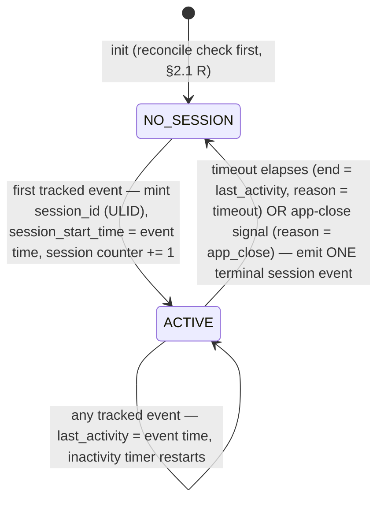
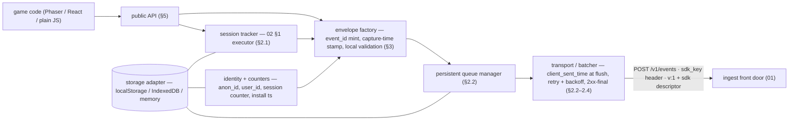

# Phase 08 — Client SDK (Browser / Game)

**Feature**: 001-analytics-platform · **Layer**: SDK design (ships inside game builds; owns no server-side structure) · **Reserved kind owned**: none — emits `generic` / `economy` / `session` / the zero-money `purchase` companion · **Status**: Draft (2026-07-17)
**Grounding**: [Foundation](00-foundation.md) §1.1 (canonical envelope + the Q9 wire contract), §4.5 (credential classes — this SDK is the public-`sdk_key` side), §4.6 (identity / `anon_id`); [Phase 02 §1](02-sessions.md) — the **normative session definition this SDK implements, never redefines**; [Phase 05](05-monetization.md) Design §3 + contract table (the context companion); [Phase 03 §3](03-economy.md) (client-provenance economy payload); [Phase 01](01-ingest-raw-events.md) (the batch front door). Locked decisions consumed: research §7 **Q9** (wire versioning) and **Q10** (license + npm publishing).
**Numbering note**: 08 was informally reserved for funnels; funnels remain deferred (README scope note, FR-022) and would take the next free number when ratified. This file claims 08 for the client SDK.
**Excluded here** (→ implementation): source code, TypeScript signatures, bundler configuration, storage-adapter internals.

---

## 1. Story understanding

**The story.** An indie developer registers a game, gets a public `sdk_key`, runs `npm install` (or drops a script tag into a Phaser build), calls `init` + `track`, and **watches counts tick up on the dashboard within minutes** — the US1 promise. The SDK is the shipped half of that promise: it turns game-code calls into canonical envelopes, survives flaky networks and killed tabs, and implements the session definition every metric downstream leans on.

**Who integrates it.** Game developers embedding it in *shipped, public* builds — Phaser games, React apps, plain-JS web games. The integration surface must be small (one init, a handful of verbs), dependency-free, and safe to hand to hostile clients, because every shipped copy *is* handed to hostile clients.

**Trust posture.** The client SDK is the **spoofable convenience path** by design. It authenticates with the public `sdk_key` (Foundation §4.5 — embeddable by design, ingest-only); every event it sends is therefore stamped `provenance = client` by credential class, never by anything in the body. Consequences the SDK does not fight: its `purchase`-kind traffic can never be revenue-eligible (05 — hence the zero-money companion), its economy events land in the untrusted slice (03), and its sessions are accepted as-is because sessions are engagement, not money (02 §1 trust boundary). The SDK's job is honesty of *shape and timing*, not trustworthiness of *content*.

**What it means for the operator.** Confidence in minutes, no schema pre-declaration, and a client that keeps data flowing through offline stretches, page reloads, and app kills — with the server-side dedup machinery absorbing the retries that resilience requires.

---

## 2. Behavior contracts

### 2.1 Session lifecycle — the Phase 02 §1 executor

Phase 02 §1 is **normative**; this section restates it only as *what the SDK does to honor it*. Nothing here redefines a boundary, a timeout, or an emission rule.

- **Start.** The first tracked event after `init`, or the first event after the previous session expired, mints a fresh `session_id` — a client-generated **ULID**, opaque to the server (02 §1). "Tracked event" = any capture: `track`, `economy`, `purchaseContext`. Init itself starts nothing; sessions begin lazily at the first capture.
- **Activity timer.** Every capture sets `last_activity` and restarts the inactivity countdown (`session_inactivity_timeout_min`, default 30 — the SDK-local mirror of 02 §6's knob). The countdown is measured on **elapsed (monotonic) time where the runtime provides it**; recorded timestamps come from the wall clock. A wall-clock jump therefore never spuriously splits or merges a session, and skew in the recorded timestamps is the server's problem to correct (Foundation §4.2).
- **End + the single terminal event.** When the timeout elapses with no capture (end = `last_activity`, per 02 §2's worked example) or an explicit app-close signal fires — whichever first — the SDK emits **exactly one** `kind = session` event carrying `session_id`, `session_start_time`, `session_end_time`, `duration_ms` (= end − start; the server recomputes the trusted value), and `reason ∈ {timeout, app_close}`. The open-session record is cleared **after** the terminal event is durably enqueued (§2.2) — the queue, not transmission, is the emission point. Midnight spanning needs nothing from the SDK: split-vs-start-day math is entirely server-side (02 §2).
- **App-close signal + reliable unload flush (browser lifecycle — hardened 2026-07-17).** The SDK closes the session (`reason = app_close`) and flushes the terminal event on **`visibilitychange → hidden` and `pagehide`**, using **`navigator.sendBeacon` (or `fetch` with `keepalive: true`)** — the delivery-reliable unload path (~91 % delivery, vs. a plain `fetch`/XHR in `beforeunload`/`unload` losing ~10 %+ *and* disabling bfcache). `beforeunload`/`unload` are **not** used. The unload flush is **size-bounded to sendBeacon's ~64 KB cap** — it ships the queue *tail* (most-recent, including the terminal session and any purchase companion) and lets the rest ride the next normal flush or reconcile. Backgrounding alone does **not** close a session — but because a hidden tab may be killed without another event, treating `visibilitychange → hidden` as a flush trigger is what makes the terminal event near-certain to arrive; the reconcile-at-next-init path (§2.1 R) is the backstop for the residual hard-kill-mid-beacon case. The **inactivity timeout is the boundary rule**, not a fabricated end time — the terminal event carries the true `last_activity` end, so a session's duration is never inflated to last-activity + timeout (02 §1, hardened).
- **Background-tab timer caveat.** The inactivity countdown is measured on **monotonic elapsed time** (§2.1 activity-timer), not wall-clock or `requestAnimationFrame` (which pauses when hidden and whose `setTimeout` is throttled to ~1/min after 5 min hidden). A late-firing throttled timer never mis-splits a session because the boundary is recomputed from elapsed time at the next event or at the `visibilitychange` flush, not from when the timer callback happens to run.
- **R — Reconcile-at-next-init (the killed-app path).** The SDK persists an **open-session record** (`session_id`, `session_start_time`, `last_activity`) updated on every capture. At `init`, if such a record exists, the SDK emits the prior session's terminal event with `session_end_time = persisted last_activity`, `reason = reconciled`, then clears the record. Per 02 §1's start rule, no session ever resumes across init — every init closes the orphan (if any) and the next capture mints a fresh `session_id`. If the terminal event was already emitted before the kill (it sits in the persistent queue), no record exists and reconcile is a no-op — reconcile covers exactly the never-emitted case.
- **Session counter.** The mint moment also increments the persistent lifetime session counter that backs `sessions_before_purchase` (§3.4).

### 2.2 Offline queue + at-least-once delivery

- **Capture → durable enqueue.** Every capture assembles its envelope (minus `client_sent_time`, §2.3), mints its `event_id`, and appends it to a **persistent queue** (storage adapter, §4). Only then does the call return. A crash before enqueue loses the event (accepted); a crash after enqueue never does.
- **Delivery.** A batcher drains the queue on `flush_interval_ms` / `batch_max_events` and POSTs batches to the ingest path. Events are removed from the queue **only on a 2xx response**. Network failure or 5xx/429 → the batch is retained and retried with exponential backoff + full jitter (base `retry_backoff_base_ms`, capped at `retry_backoff_max_ms`). Other 4xx → the batch can never succeed; drop it and surface in debug. Auth failure (401/403 — e.g. a revoked `sdk_key`, the emergency Foundation §4.5 warns about) → pause transport, keep queueing up to the cap, surface loudly.
- **At-least-once, explicitly.** A retry after a crash-between-send-and-ack, or after a lost response, **re-sends events the server already processed**. The SDK never pretends otherwise — the retried events carry their **original `event_id`s (never re-minted)**, and the game's server flow carries its durable `transaction_id`. *This at-least-once contract is precisely what makes the platform's dedup machinery necessary and sufficient*: the 24 h windowed `event_id` gate absorbs the SDK's non-money redelivery, and the durable `transaction_id` gate absorbs money redelivery arriving days late (Foundation §4.1). The SDK's redelivery and the server's dedup are one design, split across the wire.
- **Bounded queue.** The queue is capped (`offline_queue_max_events`, default 10 000); at the cap the oldest events are dropped first (a drop counter is visible in debug). Losing the oldest offline history beats unbounded storage growth inside someone's shipped game.
- **Storage engine — IndexedDB by default (2026-07-17).** The persistent queue defaults to **IndexedDB** (async, off the main thread), not `localStorage`. `localStorage` is synchronous and blocks the game's main thread on every write — a Phaser 60 fps loop drops frames serializing a growing event array — and its ~5 MB (≈ 2.5 MB JSON, UTF-16) quota throws `QuotaExceededError` inline. IndexedDB avoids the jank and the tight quota; `localStorage`/memory remain fallbacks (`storage` knob) for environments where IndexedDB is blocked. Writes are wrapped so a quota/■write failure evicts oldest and counts a `queue_overflow` drop (observable), never throws into game code.
- **Client-side TTL before send (2026-07-17 — honors the 24 h dedup contract).** Because a persistent queue can hold events for **days** (backgrounded tab, closed laptop over a weekend), and the server's `event_id` dedup window is 24 h, a naive replay of multi-day-old events would land *outside* the window and routinely double-count (the design's "accepted rare double-count" would become common). So the SDK **drops (or flags) queued non-money events older than the dedup window before sending** — a client-side TTL slightly under 24 h — so it never emits an event guaranteed to double-count. Money events are exempt (durable `transaction_id` dedup catches them at any lateness); their value makes losing them worse than a rare double-count, which the durable gate prevents anyway.

### 2.3 Batching + `client_sent_time` at flush — the skew contract

`client_event_time` is stamped **at capture**; `client_sent_time` is stamped **at the moment of transmission, on every attempt** — never at capture, and re-stamped on each retry. This is load-bearing, not stylistic: Foundation §4.2 computes `skew = server_received_time − client_sent_time` and shifts `client_event_time` by it. A flush-time stamp makes `skew` ≈ pure clock offset, so an event buffered offline for three days is corrected back to its true capture moment. A capture-time stamp would inflate `skew` by the buffering delay and teleport the event three days forward. Every event in a batch carries the same sent-time (the attempt moment).

### 2.4 The wire contract (Q9, locked)

- Batches POST to the pinned **`/v1/events`** path, `sdk_key` in a header, body = `{ v: 1, sdk: { name, version }, events: [envelope…] }`. The SDK always emits explicit `v: 1` and the **mandatory `sdk` descriptor** (`name` = the published package name, `version` = the package semver — decoupled from wire `v`, which stays 1 additive-only forever).
- **Any 2xx is a final ack.** 01's `202 {received: n}` is a queue-acceptance receipt; per-event verdicts are asynchronous and worker-side. The SDK **never learns, and never tries to learn**, whether an event was understood, quarantined, or tallied — a 2xx-then-quarantine and a 2xx-then-count are indistinguishable and behaviorally identical client-side (an embedded SDK can do nothing useful with the difference; Q9). Observability lives in the dashboard tallies, not the wire.
- **Additive discipline.** The SDK never emits top-level envelope or batch fields outside the Foundation §1.1 spec; all free-form context rides inside `props` (Q9). It likewise never emits a `kind` outside the four it produces — the open-enum/quarantine machinery exists for *future* SDKs, not as license to improvise.

---

## 3. Data emitted

### 3.1 Envelope conformance

Every event conforms to Foundation §1.1 **byte-for-byte in field names**. Per-field emission stance:

| Envelope field | SDK behavior |
|---|---|
| `game_id` | **Never sent.** Server-derived from `sdk_key` auth (Foundation §1.1); anything body-supplied would be ignored. |
| `user_id` | Present iff `identify` has been called; the value current *at capture time* (queued events keep their capture-time identity). |
| `anon_id` | Always present — minted (ULID) and persisted at first-ever init; rides every envelope for late identify (Foundation §4.6). **No aliasing claim**: merging anon→identified history is out of v1 scope; the SDK just carries both ids. |
| `session_id` | The current session's ULID (every capture starts or belongs to one, §2.1). On the terminal `session` event: the id of the session being closed. |
| `event_id` | **Minted per event at capture** (ULID), persisted with the queued event, identical across every retry — the windowed dedup key (Foundation §4.1). **Generation is collision-safe by construction:** the SDK uses `crypto.randomUUID()`/`crypto.getRandomValues()` and **feature-detects** — `crypto.randomUUID` is secure-context-only (absent on plain-HTTP origins/old webviews), so the SDK falls back to a `crypto.getRandomValues`-seeded v4 UUID (or a bundled `nanoid`), **never `Math.random`** (which collides and can be deterministic across cloned sessions → silent over- or under-dedup). |
| `name`, `kind` | Caller-supplied name (generic) or the reserved name/kind for typed emissions. Never empty — the API rejects an empty name locally rather than shipping a `nameless` drop. |
| `client_event_time` | Capture moment, wall clock. |
| `client_sent_time` | Transmission moment, re-stamped per attempt (§2.3). |
| `server_received_time` | Never sent — collector-stamped. |
| `props` | Kind-specific payload + caller's free-form context. The only home for non-envelope data (Q9). |

### 3.2 Per-kind payloads this SDK produces

| Kind | Produced by | Payload (inside `props`) | Contract owner |
|---|---|---|---|
| `generic` | `track` | free-form `props` | 01 (permissive accept; catalog caps server-side) |
| `economy` | `economy` | `flow_type`, `currency_type`, `amount` (> 0, magnitude only), `reason` (all required); optional `balance_after`, `player_level`, `region` | 03 §3 (strict; client-provenance slice) |
| `session` | session tracker, terminal only | `session_id`, `session_start_time`, `session_end_time`, `duration_ms`, `reason` | 02 §3 (strict; server recomputes duration) |
| `purchase` (companion) | `purchaseContext` | **`purchase_attempt_id`** (required join key — SDK-minted ULID, see below), optional `transaction_id` (if the client happens to know it), `source = client`; optional `player_level` (raw — the **server** buckets it against `level_bucket_boundaries`), `region`, `in_game_state`, `sessions_before_purchase`, `days_since_install` | 05 §3 / contract table (zero-money invariant) |

The companion is **enrichment only**: it never carries money fields (any it carried would be ignored, never summed — 05), never creates a monetization cell alone, and joins the server SDK's authoritative revenue row **on `purchase_attempt_id`** (not the store `transaction_id`). The game's backend emits that row via the server SDK (09); this SDK emits the companion **at client-side purchase completion**, in the same session, so purchase-moment context (`in_game_state`, level, the session counter) is captured when it is true.

**Why `purchase_attempt_id`, not the store `transaction_id` (the join-feasibility fix, 2026-07-17).** Keying the client companion on the store `transaction_id` silently fails in production for two independent reasons: (1) the store id is **semantically slippery** — StoreKit 2's `Transaction.id` rotates on every renewal/restore (the stable key is `originalID`), and Google Play's `purchaseToken` (the API-keyed id) differs from the human `orderId` (which gets suffixed on renewals); picking "the transaction_id" guarantees mismatches unless pinned per-platform. (2) The client **often does not have the final store id at purchase-context time** — Ask-to-Buy / Family-Sharing deferred purchases return `.pending` and the real transaction arrives minutes-to-days later via `Transaction.updates` (frequently after the app closed), and the robust Play flow grants entitlement only *after* the server validates the token, so the canonical id is server-side by design. A same-moment client-to-server join on the store id would therefore drop for a real fraction of purchases — and drop *invisibly* (revenue still lands via the authoritative server row; only the dimensions vanish), so segmentation looks fine in dev and returns near-empty dims in production.

The fix: the client **mints its own `purchase_attempt_id` (ULID) at purchase-context time**, stamps it on the companion, **and passes it into the store purchase** so the game backend can read it back and relay it onto the authoritative server row — StoreKit 2 via `appAccountToken` (a UUID the client sets on the purchase, surfaced on the validated `Transaction`), Google Play via `obfuscatedAccountId` / the developer payload. The server SDK (09) sends `purchase_attempt_id` on the revenue row; the platform joins companion ↔ revenue on it. The join therefore never depends on the client knowing the store id, and it tolerates the store id arriving later on a separate event. The store `transaction_id` remains the **money** dedup + audit key on the server row (05); `purchase_attempt_id` is the **context-join** key. If a game cannot thread `purchase_attempt_id` through the store call, the companion still ships (context is captured), the join simply misses, and the purchase stands with reduced dims — the same graceful degradation as a never-arriving companion.

### 3.3 What the SDK validates locally

Only what would be unconditionally lost or unusable: empty `name`, missing `transaction_id` on `purchaseContext`, non-positive `amount` / invalid `flow_type` on `economy` — rejected at the call site (debug-surfaced), because shipping them buys a guaranteed drop or quarantine. Everything else ships as given; strict validation is the server's job (Foundation §3.1 step 3), and the SDK never duplicates it.

### 3.4 The client-kept counters

- **`sessions_before_purchase`** — a persistent lifetime counter incremented at each session mint (§2.1); the companion stamps its current value, i.e. "this purchase happened in session N". **Device-local truth**: it does not travel across devices or profiles, which is fine — 05 treats it as an opaque low-trust slicing dimension, never money and never server-derived (metrics §S-2, ratified into 05).
- **`days_since_install`** — derived from a persisted first-init timestamp: whole UTC days elapsed. Sent on the companion as a courtesy; **server-wins** whenever a spine row exists (05 §2), so the client value only surfaces for never-sessioned edge cases resolving to `unknown` anyway.

---

## 4. Local state kept

Logical storage design; the storage adapter maps it onto `localStorage` / IndexedDB / in-memory (auto-detected, overridable).

| State | Persistence | Content | Lifecycle |
|---|---|---|---|
| `anon_id` | **persistent** | ULID minted at first init | forever (per storage scope) |
| `user_id` | **persistent** | last `identify` value | until re-identify / reset |
| install timestamp | **persistent** | first-ever init wall time | write-once |
| session counter | **persistent** | lifetime sessions started | monotonic |
| open-session record | **persistent** | `session_id`, `session_start_time`, `last_activity` | written on every capture; cleared on terminal-event enqueue; consumed by reconcile (§2.1 R) |
| offline event queue | **persistent** | complete envelopes minus `client_sent_time`, FIFO, capped | entries removed only on 2xx (§2.2) |
| inactivity timer, in-flight batch, backoff state, config | **in-memory** | — | rebuilt on init |

**Restart semantics.** Everything a killed app must not lose is persistent: identity, counters, the un-acked queue, and the open-session record that powers reconcile. Everything in-memory is safely re-derivable at init. Where persistent storage is unavailable (blocked storage, private mode), the adapter degrades to memory-only: the SDK keeps working within the page's lifetime, and the operator loses cross-restart continuity — degraded, never broken.

---

## 5. Public API surface

Signatures in prose (not TypeScript); each verb's envelope effect is the contract.

| Call | Takes | Does | Envelope effect |
|---|---|---|---|
| `init` | `sdk_key` (required), `endpoint` (required), config object (§6) | Validates the key is **client-class by prefix and fails fast otherwise** (Foundation §4.5 — a server credential must never ship in a build); loads persisted state; runs session reconcile (§2.1 R); starts the flush loop and lifecycle listeners. | May enqueue one `session` event (`reason = reconciled`). |
| `identify` | `user_id` | Persists the id; subsequent captures carry it. Already-queued events keep their capture-time identity — no retroactive restamp, no aliasing claim (Foundation §4.6). **If this is the first identify after an anon-only span, emits a one-off `identify` alias event carrying `(anon_id, user_id)`** — the identity-edge capture (Foundation §4.6): v1 does not merge history, but the edge is recorded so a future retroactive stitch stays possible. | `user_id` on future envelopes; one `identify` alias event on the anon→user transition. |
| `track` | `name` (non-empty), optional `props` | The generic verb; bumps session activity (§2.1). | One `kind = generic` envelope. |
| `economy` | `flow_type`, `currency_type`, `amount`, `reason`, optional `balance_after` + context | Emits a client-provenance economy flow (03); bumps session activity. | One `kind = economy` envelope. |
| `purchaseContext` | `purchase_attempt_id` (mint via `newPurchaseAttempt()` and thread into the store call), optional context (`player_level`, `region`, `in_game_state`) | Emits the zero-money companion (§3.2) keyed by `purchase_attempt_id`, auto-stamping `sessions_before_purchase` and `days_since_install`; bumps session activity. | One `kind = purchase`, `source = client` envelope. |
| `newPurchaseAttempt` | — | Mints and returns a `purchase_attempt_id` (ULID) to pass into the store purchase (`appAccountToken` / `obfuscatedAccountId`) and into `purchaseContext`, so the server row and companion join on it (§3.2). | None (id is caller-relayed). |
| `appClose` | — | Explicit close signal for runtimes without reliable lifecycle events (a Phaser game's own quit path); closes the session (`reason = app_close`) + best-effort flush. Browser lifecycle listeners call this internally. | The terminal `session` envelope. |
| `flush` | — | Forces an immediate transmit attempt of the queued backlog. | None new. |

There is **no** session-start/session-end verb: session boundaries belong to the tracker, not game code (02 §1 — "SDK-managed"). There is no verb that emits a revenue-bearing purchase; that is the server SDK's surface (09).

---

## 6. Configurations

SDK-side knobs, set at `init`. One mirrors a server knob; the rest are SDK-local (the server never reads them).

| Knob | Default | Range | Mirror / local | Notes |
|---|---|---|---|---|
| `endpoint` | — (required) | URL | local | Base URL; events POST to its `/v1/events` (Q9 pinned path). |
| `sdk_key` | — (required) | client-class key | local | Prefix-checked at init; wrong class fails fast. |
| `session_inactivity_timeout_min` | 30 | 1–240 | **mirrors** `session_inactivity_timeout_min` (02 §6) | Capture-time boundary decision, forward-only by nature. **No remote config in v1** — the operator keeps SDK and server values in agreement by hand; drift changes session *boundaries* only (the server never re-times sessions). Flagged in Design §Relations. |
| `batch_max_events` | 50 | 1–500 | local | Flush triggers on size or interval, whichever first. |
| `flush_interval_ms` | 10 000 | 1 000–120 000 | local | |
| `offline_queue_max_events` | 10 000 | 100–100 000 | local | Drop-oldest at cap (§2.2). |
| `retry_backoff_base_ms` / `retry_backoff_max_ms` | 2 000 / 300 000 | — | local | Exponential + full jitter. |
| `storage` | `auto` | `auto` \| `indexeddb` \| `localstorage` \| `memory` | local | Adapter selection (§4). `auto` prefers **IndexedDB** (async, no main-thread jank), then `localStorage`, then memory. |
| `batch_max_bytes` | 60 000 | 1 000–500 000 | local | Hard per-POST byte cap (splits oversized offline buffers into multiple POSTs; the unload/`sendBeacon` flush stays under the ~64 KB beacon cap). |
| `compress` | `auto` | `auto` \| `on` \| `off` | local | gzip the request body via the `CompressionStream` API where available (`Content-Encoding: gzip`) — bandwidth win for large offline batches; `auto` = on where supported. |
| `event_ttl_ms` | 82 800 000 (23 h) | 60 000–86 400 000 | local | Client-side TTL: non-money events older than this are dropped before send (honors the 24 h server dedup window, §2.2). Money events exempt. |
| `debug` | off | on/off | local | Local validation rejections, drop counters, transport errors to console. |

---

## Design

*Design altitude per Foundation §8 conventions, adapted for a shipped client: logical modules, packaging design, conformance surface, relations. No code.*

### Module / architecture (logical)

Responsibilities are single-owner: only the **session tracker** touches session state and emits `session` events; only the **envelope factory** mints `event_id`s and assembles envelopes; only the **transport** stamps `client_sent_time` and talks HTTP; only the **queue manager** decides persistence and eviction. Lifecycle listeners (browser `pagehide`-class events) are a thin edge that calls `appClose`/`flush` — replaceable per runtime without touching the core.

### Packaging & distribution (Q10, concrete)

- **Workspace layout.** The SDK lives at `packages/sdk-client` inside this monorepo — its own manifest, its own README, **independently versioned** from the platform and from the sibling server SDK (09). Dev-time consumers (dashboard e2e, ingest conformance tests) consume it via workspace link; the world consumes it via `npm install`.
- **Name.** Scoped public package, placeholder **`@<org>/analytics-sdk`** — **`<org>` is operator input** (the project's npm organization is not yet chosen; every occurrence of `<org>` in specs and manifests is flagged for that decision).
- **Build targets.** ESM + CJS entry points, a browser global bundle (script-tag / Phaser embed path), and TypeScript declaration files. Zero runtime dependencies is a design goal — an embeddable SDK earns its keep by what it *doesn't* add to a game build.
- **License: MIT** (per Q10; the platform is Apache-2.0). Why the split: the SDK is embedded in shipped, possibly-GPL-2.0 game code, and MIT is GPL-2.0-compatible where Apache-2.0 is not; MIT is the adoption norm for embeddable trackers — no surveyed peer (Sentry, Plausible, Matomo, Aptabase) puts copyleft or Apache-2.0 on the embeddable half.
- **Release flow.** Semver via **changesets** (each behavioral PR carries a changeset; release PRs aggregate); **CI publishes on tag via npm trusted publishing (OIDC) — no `NPM_TOKEN` exists anywhere** — with **automatic provenance attestations**. Manifest requirements: `publishConfig.access = public` (scoped package), `repository.directory = packages/sdk-client` (provenance links the attestation to the exact source directory), license file in-package.
- **Versioning relation to the wire (Q9).** The package semver moves freely — breaking *API* changes bump the SDK major — while the **wire stays `v: 1` additive-only forever**. The `sdk {name, version}` descriptor is what lets the server correlate behavior with a shipped release years later (it is stamped into the raw floor); the SDK version is provenance, never protocol.

### Conformance / test surface

- **Golden-event fixtures.** Canonical JSON fixtures for each emission (generic, economy, terminal session incl. `reconciled`, companion) with byte-for-byte Foundation §1.1 field names, checked into the repo. The SDK's unit tests assert its output matches them; **01's ingest tests consume the same files** — one fixture set, two ends of the wire, drift impossible by construction.
- **Reference event stream.** A scripted multi-day scenario (the 02 §2 worked example extended with an economy day and the 05 worked-example purchases) that the SDK, driven by a fake clock, must reproduce as a batch sequence; ingest integration tests replay it and assert the resulting result cells. This is the executable form of the cross-spec examples.
- **Bridge-checklist replay (SDK-side halves).** From 02.5's conformance scenarios: exactly one terminal event per session; the reconciled close carries the original start time; `session_id` is opaque and never reused. From 01.5's posture: a conforming SDK never originates drop-class events (no empty `name`, no missing `event_id`) — asserted as "the local validation layer makes them unconstructible".
- **At-least-once tests.** Kill the transport between send and ack → the retry carries identical `event_id`s and the mock server's windowed dedup absorbs it; queue survives a simulated restart; `client_sent_time` differs across attempts while `client_event_time` does not (§2.3's contract, asserted directly).
- **Wire conformance.** Every batch carries `v: 1` + the `sdk` descriptor; no top-level field outside the spec; a mock server answering 2xx-with-quarantine and 2xx-with-count produces identical SDK behavior (the Q9 indistinguishability, tested).

### Relations with other stories

- **Owns:** the client-side execution of the session lifecycle (state machine §2.1, incl. reconcile); minting of `session_id`, `event_id`, `anon_id`; the `sessions_before_purchase` counter and client `days_since_install`; the persistent offline queue + transport/backoff behavior; the `packages/sdk-client` package and its release flow. Owns **no** server-side entity, Redis domain, or tally.
- **Emits — consumed by:** **01** — every batch, through the `/v1/events` front door (catalog + day counts for all kinds); **02** — the terminal `session` event (the sole activeness signal; Foundation §7); **03** — `economy` events landing in the `provenance = client` slice; **05** — the `purchase` companion (context enrichment keyed by `transaction_id`, zero money).
- **Reads:** nothing server-side at runtime — the SDK has no read API and no remote config in v1; its only inputs are the operator-supplied `sdk_key` + `endpoint` and its own persisted state. (Provenance, `game_id`, skew, dedup verdicts are all server-derived; the SDK ships raw material.)
- **Ordering / lifecycle:** `init` precedes every capture; reconcile precedes the first new session; `identify` affects captures from that point forward only; per event, `event_id` mint ≺ persistent enqueue ≺ flush-time `client_sent_time` stamp ≺ 2xx ≺ queue removal. The companion should be emitted in the purchase's own session (context truthfulness), but 05's staging/join tolerates either arrival order and a 48 h lag.
- **Flagged:**
  1. **Ingest-path inconsistency (01 vs Q9) — RESOLVED (2026-07-17).** 01's Design body already uses the pinned `POST /v1/events` (Foundation §1.1/§9.7); the residual stale phrasing was in 01's *story prose* and `spec.md` US1/FR-001 ("game-scoped ingest URL"), now reconciled to "a fixed `/v1/events` endpoint; `game_id` derived from the key." This flag is closed.
  2. **Timeout-knob drift (02 ↔ 08).** `session_inactivity_timeout_min` lives in `GAME.config` (02 §6) *and* as an SDK init value, with no v1 sync channel. A remote-config pull (SDK fetches per-game knobs at init) is the named future option; until then, keeping the two aligned is documented operator responsibility.
  3. **Aliasing.** Full anon→identified *merge* stays out of scope (Foundation §4.6/§9.3), but the SDK now **emits the `identify` alias edge** on the anon→user transition (§5) so the linkage is captured for a future stitch — the "identity landmine" (shipping with no edge) is closed.
  4. **Purchase-context join** now keys on the SDK-minted **`purchase_attempt_id`** threaded through the store call (§3.2), not the store `transaction_id` — closes the silent-join-failure that would have emptied segmented-monetization dimensions in production. Games must relay `purchase_attempt_id` via `appAccountToken`/`obfuscatedAccountId`; the server SDK (09) sends it on the revenue row.
  5. **No bridge files needed:** the SDK-facing contracts it implements are already normative elsewhere (02 §1 sessions, 05 §3 companion, 03 §3 economy, Foundation §1.1/Q9 wire) — this spec adds the client-side halves without creating new cross-story seams.
