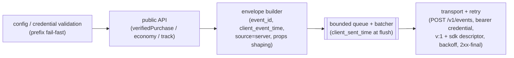

# Phase 09 — Server SDK (Node)

**Feature**: 001-analytics-platform · **Layer**: SDK spec (the **trusted** emitter — money + economy truth) · **Status**: Draft (2026-07-17)
**Grounding**: Foundation §1.1 (envelope + Q9 wire contract), §4.5 (provenance / two credential classes — Q2), §4.1–4.2 (dedup regimes, skew correction); [05 §3 + Design](05-monetization.md) (the authoritative verified revenue row, gates 6a/6b); [bridge 05.5](05.5-purchase-accept-contract.md) (the money seam this SDK's row triggers); [03 §3 + Design](03-economy.md) (server-provenance economy); [01 Design](01-ingest-raw-events.md) (batch front door); [`../research.md` §7](../research.md) — Q2, Q8, Q9, Q10 locked.
**Sibling**: `08-client-sdk.md` — the public-key, spoofable, zero-money path (owns sessions and the purchase companion). This document is a **design spec**: behavior contracts, API surface in prose, packaging design — no implementation code.

---

## 1. Story understanding

**The story.** The game's **trusted backend** — the Node service that already talks to its payment provider and validates store receipts with Apple/Google — drops in the server SDK, initializes it with the game's secret `server_credential`, and ships two things the platform will treat as truth: **verified purchase rows** (US4 money-truth) and **server-granted/debited economy flows** (03's trusted slice). One call after a receipt validates → one authoritative revenue row on the dashboard.

**The trust posture.** Provenance is never a body field — it derives from the **class of the authenticating credential** (Foundation §4.5, Q2). The client SDK (08) authenticates with the public, embeddable `sdk_key` and everything it sends is stamped `provenance=client` — spoofable by design, zero money. This SDK authenticates with the secret `server_credential` (show-once, stored hashed, 1..N per game with dual-active rotation — issuance lifecycle in phase 10), so its events are stamped `provenance=server`: the **only** events eligible for revenue (05 gate 6a) and the trusted slice of economy totals (03). The entire reason this SDK exists as a separate package is that this credential must never ship inside a game build.

**Explicitly out of scope: receipt validation.** The SDK does **not** talk to Apple/Google/Stripe and does not verify receipts. The game's backend does that (or delegates to its payment stack) and passes the *outcome* — the SDK ships the **already-verified** row, `verified` as a caller-supplied boolean. Shipping `verified=false` rows is permitted and useful: they are accepted-but-ineligible (zero revenue, raw-file audit trail only — 05 Design 6a).

**What it means for the operator.** Revenue on the dashboard is server-verified by construction; the untrusted client can enrich it (companion dimensions) but can never mint, inflate, or double-count it.

## 2. Behavior contracts

1. **Init — the credential is the sole auth input.** `init` takes the `server_credential` and the self-hosted endpoint; nothing else authenticates. Doc posture (Q2): the credential comes from an environment variable or secret manager by convention (e.g. `ANALYTICS_SERVER_CREDENTIAL`), **never inline in source** — it is show-once and hashed server-side; leaking it makes an attacker's events money-truth. Credentials are **prefix-typed** (Foundation §4.5): `init` **fails fast, before any network call**, if handed a wrong-class key — a public `sdk_key` in the server SDK is a configuration error, never a silent downgrade to `provenance=client`.
2. **Verified-purchase emission — one call, one authoritative row.** `verifiedPurchase` builds exactly one `kind=purchase` envelope carrying the full 05 §3 required-field set (§3 below), with `source=server` stamped by the SDK itself. The store-issued `transaction_id` rides the row as the **durable dedup + companion-join key**; the SDK performs **no local dedup** — the platform's durable gate (05 6b, Postgres UNIQUE) is the truth, which is what makes every retry below safe.
3. **At-least-once delivery, retry with backoff.** Queued events are batched and POSTed; a network failure or non-2xx response retries the batch under capped exponential backoff with jitter. Delivery is therefore **at-least-once** — the exact contract that makes the platform's dedup regimes *necessary*, and why they make SDK retries harmless: purchases die at the durable `transaction_id` gate at any lateness; non-money events die at the 24 h `event_id` window (Foundation §4.1). The SDK may resend; it may never double-count.
4. **2xx-is-final (Q9).** Any 2xx ack retires the batch permanently — including batches the server quarantined (unknown kind, future `v`). The SDK never inspects the ack for per-event verdicts (there are none — acceptance is decided in the worker, 01 Design) and never re-sends an acked batch.
5. **Batching + `client_sent_time` at flush.** Each event is stamped with `client_event_time` at the emit call; each batch is stamped with one `client_sent_time` at flush — the pair the platform's skew correction needs (Foundation §4.2, research §G). Server clocks are trusted-ish (NTP'd; skew normally inside the 60 s dead-band, making correction a no-op), but the fields are **mandatory contract**, not optional politeness — the envelope does not special-case trusted senders.
6. **Wire contract (Q9).** Every batch carries `v: 1` and the mandatory `sdk {name, version}` descriptor (`name` = the stable wire identifier `analytics-sdk-server`, independent of the npm scope; `version` = the package semver). The SDK never emits top-level fields outside Foundation §1.1 — free-form context goes inside `props`. SDK semver is decoupled from the wire version: the SDK can ship v3.x and still speak wire v1 forever.
7. **`event_id` on every event (research §F-3, resolved by Q2).** The server SDK stamps a unique `event_id` (UUID) on every emission, purchases included. Server events are **always exact** — they are never placed behind the RedisBloom scale lever (a false-positive drop of a trusted event is unacceptable); purchases additionally carry the durable `transaction_id` regime.
8. **No FX, ever (Q8).** The SDK sends `price_local` + ISO `currency` exactly as charged. Normalization is the platform's job (as-of FX lookup, park-unconverted, `fx_staleness_max_days`) — the SDK has no FX table, no conversion knob, and `normalized_amount` never appears on the wire (05.5 §2: it may even be 0 platform-side under a missing rate; the SDK neither knows nor cares).
9. **Analytics never breaks checkout.** Emit calls enqueue and return immediately; transport is background. Failures surface through the debug/error hook — never as a thrown exception inside the caller's payment path.

## 3. Data emitted

**Envelope conformance (Foundation §1.1).** Every emission is one canonical envelope: `user_id`, `event_id`, `name`, `kind`, `client_event_time`, `props` per event; `client_sent_time` per batch; `v` + `sdk` per batch (Q9). The SDK **never sends `game_id`** — it is server-derived from the credential (Foundation §1.1); `anon_id` is not applicable (the backend always knows its user); `session_id` is absent by default (this SDK owns no sessions — §4) but a caller-relayed one passes through as opaque envelope context (03 consumes it context-only, no session semantics).

**The authoritative verified revenue row** (`kind=purchase`, `source=server`) — required fields exactly per 05 §3 (a missing one → platform quarantine, `quarantined_typed`):

| Field | Supplied by | Note |
|---|---|---|
| `transaction_id` | caller (store-issued) | durable dedup + companion-join key |
| `original_transaction_id` | caller (store-issued) | stable across renewal/restore |
| `product_id`, `product_category` | caller | the SKU + coarse category |
| `price_local`, `currency` | caller | raw charged amount + ISO currency; **never normalized by the SDK** (Q8) |
| `source` | **SDK-stamped** `server` | selects the 05 sub-contract; honored only under the server credential (Foundation §4.5) — under any other credential class the platform treats the mismatch as a validation failure |
| `verified` | caller | the outcome of the game's own receipt validation; only `true` counts (gate 6a) |
| `environment` | caller | `prod` / `sandbox`; sandbox is accepted-but-ineligible |
| `user_id` | caller | the game's user id at emit time — the identity↔store mapping (research §D-4); the SDK never invents identity |
| `refunded` | caller, optional | gross-only v1; the v2 net hook |

Server-derivable dimensions (`days_since_install`, `payer_tier`, `install_cohort`) are **not sent**: the platform derives them from its own spine/payer state at count time (05 Design step 8) and would not trust SDK copies. Anything else the caller supplies rides inside `props` as free-form context.

**Server-provenance economy rows** (`kind=economy`, per 03 §3): required `flow_type` (`source`|`sink`), `currency_type`, `amount` (> 0, magnitude only), `reason`; optional `balance_after` (feeds depth) and player context. No provenance field is sent — 03 derives it from the credential and **ignores any body-supplied flag**. These land in the `provenance=server` key slice: the trusted-only economy totals.

**Generic events** (`kind=generic` via `track`): name + `props`, feeding 01's catalog like any event — 01 §1 explicitly admits server-named events into the same catalog.

**Never emitted:** the purchase context-companion (that is 08's job — zero-money, client-context, joined by `transaction_id`; a game wanting segmented purchases passes the same store `transaction_id` to both SDKs), `session` events (activeness is client-session-anchored, Foundation §7), any top-level envelope field outside Foundation §1.1, any normalized/converted amount.

## 4. Local state kept

Deliberately minimal — this SDK is a stateless emitter with a buffer, not a tracker:

- **Outbound queue** — in-memory, bounded (`queue_max_events`). Overflow policy is money-aware: non-purchase events beyond the bound are dropped-and-counted (surfaced via the error hook); a `verifiedPurchase` that cannot be enqueued surfaces **synchronously** to the caller — money is never silently dropped.
- **In-flight batch + retry schedule** — the batch awaiting ack and its backoff state.
- **Config** — the validated init inputs.

**No session state** (no session tracker, no heartbeats — contrast 08), **no `sessions_before_purchase` counter** (a client-SDK counter arriving on the companion — 05 §3), **no identity store**, **no FX state**, **no durable spool in v1**: a process crash loses the un-acked queue. Flagged, accepted: the recovery source for money is the game backend's own payment records — re-emitting a purchase after a crash is *safe by design* (durable `transaction_id` dedup), so a disk spool buys little for its complexity. `flush_on_purchase` (§6) shrinks the loss window to near-zero for the events that matter most.

## 5. Public API surface (signatures in prose)

| Call | Caller supplies | Envelope effect |
|---|---|---|
| `init(config)` → client | `serverCredential` (required; prefix-checked, wrong class → immediate error, no network), `endpoint` (required; the self-hosted base URL — the SDK targets `{endpoint}/v1/events`, the Q9-pinned path), §6 knobs | none — validates config, starts the flush timer |
| `verifiedPurchase(p)` | the §3 caller-supplied fields: `userId`, `transactionId`, `originalTransactionId`, `productId`, `productCategory`, `priceLocal`, `currency`, `verified`, `environment`, optional `refunded`, optional extra `props` | one `kind=purchase` envelope; SDK stamps `source=server`, `event_id`, `client_event_time`; by default triggers an eager flush (`flush_on_purchase`) |
| `economy(f)` | `userId`, `flowType`, `currencyType`, `amount`, `reason`, optional `balanceAfter`, optional context `props` | one `kind=economy` envelope → the `provenance=server` trusted slice (03) |
| `track(name, props, opts)` | event name, free-form `props`, `userId` (and optional relayed `sessionId`) | one `kind=generic` envelope → 01's catalog + day counts |
| `flush()` → promise | — | drains the current queue; resolves on ack or after exhausting the retry budget |
| `shutdown()` → promise | — | final `flush()` + stops timers; documented for graceful backend termination |

Every call implies the **server credential and therefore `provenance=server`** — there is no per-call trust downgrade, no way to emit as `client` from this package. All emit calls are non-blocking (contract 9); errors flow to the `on_error`/debug hook.

## 6. Configurations

All knobs below are **SDK-local** (constructor inputs) — none mirror `GAME.config` server knobs, and deliberately absent are FX knobs (platform owns FX — Q8), dimension/cap knobs (05 §6, server-side), and any dedup window (dedup is platform machinery, Foundation §4.1).

| Knob | Default | Meaning |
|---|---|---|
| `endpoint` | — (required) | self-hosted platform base URL; SDK appends `/v1/events` |
| `server_credential` | — (required) | the secret credential; env/secret-manager by convention, prefix-validated at init |
| `flush_interval_ms` | 5 000 | background flush cadence |
| `batch_max_events` | 100 | max envelopes per POST; a full batch flushes early |
| `flush_on_purchase` | `true` | `verifiedPurchase` triggers an immediate flush (minimizes the crash-loss window on money) |
| `retry_backoff` | exp base 1 s, cap 60 s, jitter | non-2xx / network retry schedule; 2xx is always final (Q9) |
| `retry_max_elapsed_ms` | 15 min | per-batch retry budget before surfacing to `on_error` (the event is then the caller's to re-emit — safe under dedup) |
| `queue_max_events` | 10 000 | outbound bound; overflow per §4 (money never silently dropped) |
| `on_error` / `debug` | no-op / `false` | failure + diagnostics hook; never throws into caller code |

---

## Design

*Design layer per Foundation §8.3, adapted to an SDK (no server-side structures — this package owns no Postgres/Redis; its "ER" is the wire contract cited above).*

### Module / architecture (logical)

Four logical modules — no session tracker, no identity module, no persistence layer (the deliberate contrast with 08):

- **Envelope builder** is the conformance chokepoint: one place constructs every envelope, so "never a top-level field outside Foundation §1.1" is enforced structurally, not by review.
- **Transport** is plain bearer over TLS (Foundation §4.5 — no HMAC in v1) against `{endpoint}/v1/events`. *Consistency note:* 01's Design phrases the ingest path as `/ingest/{game_id}`; the later Q9 lock pins `/v1/events` with game scope derived from the credential — this spec follows Q9 and flags the 01 phrasing as superseded, not re-derived.
- **Runtime posture:** minimal dependency surface (a money-path package is a supply-chain target); no native modules; no global state — multiple clients (e.g. two games' credentials in one backend) coexist.

### Packaging & distribution (Q10, locked)

| Decision | Value |
|---|---|
| Location | `packages/sdk-server` in the platform monorepo; own manifest; **independently versioned** from the platform and from `packages/sdk-client` (08) |
| npm name | `@<org>/analytics-sdk-server` — **`<org>` is operator/maintainer input, not decided here**; the wire `sdk.name` (`analytics-sdk-server`) stays stable regardless of scope |
| Build targets | Node ≥ current LTS at release (v1: Node ≥ 20); dual **ESM + CJS** entry points + bundled **type declarations** |
| License | **MIT** (per-package override; the platform is Apache-2.0). Why split: the SDK is embedded in and consumed by third-party codebases — MIT maximizes adoption and stays GPL-2.0-compatible; no surveyed peer puts copyleft or Apache-2.0 on an embeddable SDK (Sentry, Plausible, Matomo, Aptabase all split exactly this way — Q10) |
| Versioning | **semver via changesets** (changeset per PR; release PR aggregates; tag per publish). SDK semver is **decoupled from wire `v`** (Q9): breaking API changes bump the SDK major; the wire stays v1 |
| Publishing | **CI publish on tag via npm trusted publishing (OIDC) — no `NPM_TOKEN` secret anywhere** — with automatic **provenance attestations**; `publishConfig.access = public`; `repository.directory` pointing at `packages/sdk-server` for provenance linkage |
| Docs | per-package README with a quickstart (init from env var → `verifiedPurchase` after receipt validation → `shutdown` on exit) + the credential-handling posture (Q2: env/secret-manager, never inline, rotation-aware) |
| Dev vs prod consumption | inside the monorepo: workspace-linked (the platform's conformance suite imports it); consumers: plain `npm install` from the registry |

### Conformance / test surface

- **Golden verified-purchase fixtures** — canonical `verifiedPurchase` inputs → expected wire envelopes, asserting byte-for-byte the 05 §3 required-field names, `source=server` stamping, and absence of any normalized amount or extra top-level field.
- **05.5 checklist replay (SDK side)** — drive the reference ingest with SDK-emitted batches and verify bridge 05.5 §8 holds end-to-end: a duplicate emission (same `transaction_id`, any lateness, including a crash-simulated re-emit) produces zero durable effect; a `verified=false` / `sandbox` row consumes no `transaction_id` slot; a parked-FX purchase still counts.
- **Shared reference event stream** — the same fixture stream 08 and the platform ingest tests consume, so SDK and server conformance never drift.
- **Wire-contract tests (Q9)** — every batch carries `v:1` + `sdk` descriptor; 2xx (including quarantine-acks) is terminal; non-2xx retries with backoff; retries reuse identical `event_id`s.
- **Credential-class test (Q2)** — an `sdk_key`-prefixed string fails `init` before any network call.

### Relations with other stories

- **Owns:** the trusted emission contract only — no server-side structure, no Redis domain, no `GAME.config` knob. Everything durable it touches is owned elsewhere and reached only through the wire.
- **Emits → consumed by:** **05** — the authoritative verified revenue row (`kind=purchase`, `source=server`): passes gate 6a (verified ∧ prod ∧ server-credential) → durable 6b gate → triggers the 05.5 atomic unit (payer spine + period spend, 06's writes) and the monetization rollups; **03** — server-provenance economy rows → the trusted (`provenance=server`) slice of flow cells; **01** — every named emission feeds the catalog + day counts (Foundation §8.7).
- **Reads:** nothing server-side. The SDK holds no platform state; its only inputs are init config and per-call arguments.
- **Ordering / lifecycle:** (1) a `server_credential` must exist before init — issuance/rotation is phase 10's admin surface; rotation is dual-active, so a backend can migrate credentials with zero downtime (Foundation §4.5). (2) The game's receipt validation strictly precedes `verifiedPurchase` — the SDK ships outcomes, never performs validation. (3) The SDK supplies `price_local` + `currency`; the platform normalizes under as-of FX (Q8) — `normalized_amount` may be 0/parked downstream (05.5 §2) with zero SDK involvement. (4) Companion enrichment (08) joins on the same store `transaction_id` within the purchase day's seal window; the server row never waits for it.
- **Sibling boundary (08):** sessions, activeness, the purchase companion, and `sessions_before_purchase` are exclusively 08's; money, verified rows, and trusted economy are exclusively 09's. A field on the wrong side of this line is a spec bug, not a convenience.
