# ER-full — Assembled Whole-System ER (Design Layer)

**Feature**: 001-analytics-platform · **Layer**: design (assembled view) · **Status**: Design-complete (2026-07-17)
**Role**: the one complete entity/relationship view across the Foundation and all story designs (01–07, plus the operational entities from phase 10 and 00.5). [Foundation §1.2](00-foundation.md) is the **skeleton**; each story's `## Design` section is the **per-entity source of truth** (attribute/key decisions below are pulled from them verbatim). This file assembles; it never overrules. Altitude per Foundation: logical model + relations only — loose types, no DDL.
**Coverage**: every durable Postgres entity (results + spine family + idempotency keys + registry + bookkeeping + the phase-10 credential/audit + phase-00.5 erasure ledger) plus the one non-DB store (`RAW_DAY_FILE`, marked). Redis structures are per-story transients — see each Design's "Redis structures", not repeated here.
**Second-round updates (2026-07-17, SDK + hardening phase)**: `first_seen` now written by **02** (first-session, Q1); `PAYER_SPINE_EXT.lifetime_spend_normalized` added (Q3); `ECONOMY_SUPPLY_DAY` added (Q5); `GAME` credential scalars realized as 1..N children + `OPERATOR_ACCOUNT`/`CONFIG_AUDIT` (phase 10, Q2); `ERASURE_LEDGER` added (Q7); `EXCEPTION_TALLY.reason` enum extended. See the marked rows below.

---

## 1. The complete ER

`RAW_DAY_FILE` is **not a database entity** — it is the per-game per-corrected-day disk→S3 write-ahead file ([bridge 01.5](01.5-raw-file-contract.md)); it appears here because it is durable state with an owner. Everything else is Postgres.

```mermaid
erDiagram
    GAME {
        id      game_id PK
        text    name
        json    config "per-game knobs (every story's §6 + 00.5/10)"
        ts      registered_at
    }
    GAME_SDK_KEY {
        id      game_id PK, FK
        id      key_id PK
        text    key_prefix "public, viewable; client-scope (Q2, phase 10)"
        text    key_hash
        ts      last_used_at
        ts      revoked_at
    }
    GAME_SERVER_CREDENTIAL {
        id      game_id PK, FK
        id      credential_id PK
        text    credential_prefix "secret; show-once, hashed; 1..N; server-scope provenance (Q2, §4.5)"
        text    credential_hash
        ts      last_used_at
        ts      revoked_at
    }
    OPERATOR_ACCOUNT {
        id      operator_id PK
        text    email
        text    role "admin|viewer (phase 10)"
    }
    CONFIG_AUDIT {
        id      game_id PK, FK
        id      audit_id PK
        id      operator_id FK
        text    config_key
        ts      effective_from "processing-time watermark; forward-only rule (phase 10)"
    }
    ERASURE_LEDGER {
        id      game_id PK, FK
        id      request_id PK
        text    subject_ref "per-game KEYED HASH, never plaintext user_id (Q7)"
        text    status "pending|awaiting_seal|executed"
        ts      executed_at
    }
    USER_SPINE {
        id      game_id PK, FK
        id      user_id PK
        ts      first_seen "write-once; corrected first-SESSION start; UTC day = cohort + Day-0 (04; seeded by 02, Q1)"
        bits    active_days_bitmap "set-once per offset; span = max(targets) + ~15d (04; bits by 02)"
    }
    PAYER_SPINE_EXT {
        id      game_id PK, FK
        id      user_id PK, FK
        date    first_purchase_day "write-once (06, on 05's accept signal)"
        num     lifetime_spend_normalized "monotonic; payer-tier source (Q3, 05.5 atomic unit)"
    }
    PAYER_PERIOD_SPEND {
        id      game_id PK, FK
        text    period PK "UTC calendar month YYYY-MM (06)"
        id      user_id PK, FK
        num     spend_normalized "cumulative verified-prod; full distribution, never top-k"
    }
    PURCHASE_IDEMPOTENCY {
        id      transaction_id PK "UNIQUE - the durable money dedup (05)"
        id      original_transaction_id
        id      game_id FK
        id      user_id FK
        date    purchase_day "corrected UTC"
        num     price_local
        text    currency "kept beside normalized for unsealed re-normalization"
        text    product_id "05 story-added: audit + day-total re-derivation"
        bool    refunded "05 story-added: default false; gross-only v1, v2 net hook"
    }
    EVENT_CATALOG {
        id      game_id PK, FK
        text    event_name PK
        text    kind "resolved (declared, overridden for reserved names)"
        ts      first_seen
        ts      last_seen
        int     lifetime_count "approximate-OK"
        json    property_type_sets "key -> observed-type SET; drift derived at read"
        text    status "01 story-added: v1 always accepted"
    }
    EVENT_DAY_COUNT {
        id      game_id PK, FK
        text    event_name PK
        date    utc_day PK
        int     count "grand total = read-time sum, never stored (01 OQ-3)"
    }
    EXCEPTION_TALLY {
        id      game_id PK, FK
        date    utc_day PK "arrival-day bucketed (01)"
        text    reason PK "nameless|unparseable|capexceeded|quarantined_typed|sealed_late|time_fallback|negative_offset|no_spine_row|unknown_kind|fx_stale_rate_used|fx_unconverted|rate_limited"
        int     count
    }
    SESSION_DAY_RESULT {
        id      game_id PK, FK
        date    utc_day PK
        int     session_count "start-day keyed, write-once semantics (02)"
        int     duration_sum_ms "split-attributed across at most 2 days"
        int     sessions_touching "any-overlap denominator"
    }
    ACTIVE_USER_DAY {
        id      game_id PK, FK
        date    utc_day PK
        set     members "exact user_id set v1; HLL sketch = scale lever (02)"
    }
    ECONOMY_FLOW_RESULT {
        id      game_id PK, FK
        text    currency PK
        date    utc_day PK
        text    provenance PK "client|server — credential-derived (§4.5), never body-trusted"
        text    reason PK
        text    flow_type PK "source|sink"
        num     amount_sum "running absolute"
    }
    ECONOMY_FLOW_SEGMENT_RESULT {
        id      game_id PK, FK
        text    currency PK
        date    utc_day PK
        text    provenance PK
        text    segment_dim PK "level_bucket|region - independent axes, no cross-dim combos (03)"
        text    segment_value PK
        text    reason PK
        text    flow_type PK
        num     amount_sum
    }
    BALANCE_SNAPSHOT {
        id      game_id PK, FK
        id      user_id PK, FK
        text    currency PK
        num     last_known_balance "opt-in tier-3; only if economy_depth_capture_mode on"
        ts      as_of "LWW guard - corrected event-time of last writer (03)"
        text    provenance "of last writer; advisory, non-key (03)"
    }
    ECONOMY_SUPPLY_DAY {
        id      game_id PK, FK
        text    currency PK
        date    utc_day PK
        num     money_supply "Sigma last_known_balance at seal; snapshot-at-seal (Q5, 03)"
        num     depth_percentiles "p50/p90 etc.; balance-derived level, not cumulative flow"
        int     n_users "balance-reporting user count that day"
    }
    COHORT {
        id      game_id PK, FK
        date    cohort_date PK
        int     cohort_size "spine projection; freezes at day c's seal (04)"
    }
    RETENTION_CELL {
        id      game_id PK, FK
        date    cohort_date PK, FK
        int     day_offset PK
        int     retained_users "spine projection; mutable while activity day c+N open (04)"
    }
    MONETIZATION_CELL {
        id      game_id PK, FK
        text    product_id PK
        text    dim_combo PK "canonical lexicographic encoding; unknown first-class (05)"
        date    utc_day PK "the purchase's corrected day governs seal"
        int     purchase_count
        num     revenue_normalized "FX stamped at purchase date"
        text    product_category "05 story-added, non-key: read-time category marginalization"
        json    revenue_local_breakdown "05 story-added: currency -> local sum; unsealed re-normalization source"
    }
    PAYER_DAY {
        id      game_id PK, FK
        date    utc_day PK
        set     payer_members "distinct payers that day; exact v1, HLL lever"
        num     revenue_day_total
    }
    UPLOAD_BOOKKEEPING {
        id      game_id PK, FK
        date    utc_day PK "row exists = object verified in bucket (07)"
        ts      uploaded_at
        text    object_ref "deterministic per game x day"
        text    integrity_ref "07 story-added: size/checksum at upload"
        ts      local_deleted_at "07 story-added: nullable; retention pass stamp"
    }
    RAW_DAY_FILE {
        file    per_game_per_corrected_day "NON-DB: local gzip -> S3 -> deleted; body + quarantine markers; NEVER in Postgres"
    }

    GAME ||--o{ GAME_SDK_KEY : "issues (>=1, public; phase 10)"
    GAME ||--o{ GAME_SERVER_CREDENTIAL : "issues (1..N, secret; phase 10)"
    GAME ||--o{ CONFIG_AUDIT : "config changes (phase 10)"
    GAME ||--o{ ERASURE_LEDGER : "erasure requests (Q7)"
    OPERATOR_ACCOUNT ||--o{ CONFIG_AUDIT : "made by"
    GAME ||--o{ ECONOMY_SUPPLY_DAY : "supply snapshot (Q5, if depth on)"
    GAME ||--o{ USER_SPINE : "has players"
    GAME ||--o{ EVENT_CATALOG : "discovers names"
    GAME ||--o{ EVENT_DAY_COUNT : ""
    GAME ||--o{ EXCEPTION_TALLY : ""
    GAME ||--o{ SESSION_DAY_RESULT : ""
    GAME ||--o{ ACTIVE_USER_DAY : ""
    GAME ||--o{ ECONOMY_FLOW_RESULT : ""
    GAME ||--o{ ECONOMY_FLOW_SEGMENT_RESULT : ""
    GAME ||--o{ COHORT : ""
    GAME ||--o{ MONETIZATION_CELL : ""
    GAME ||--o{ PAYER_DAY : ""
    GAME ||--o{ UPLOAD_BOOKKEEPING : "1 row per shipped day-file"
    GAME ||--o{ RAW_DAY_FILE : "cold path, off-DB (01 appends, 07 lifecycle)"
    EVENT_CATALOG ||--o{ EVENT_DAY_COUNT : "per-day counts per name"
    USER_SPINE }o..o| PAYER_SPINE_EXT : "logical (Q1: spine-independent; payer may exist w/o spine row)"
    USER_SPINE }o..o{ PURCHASE_IDEMPOTENCY : "logical assoc by (game_id,user_id), not enforced FK (Q1)"
    USER_SPINE }o..o{ BALANCE_SNAPSHOT : "optional depth (tier-3); logical (Q1: no spine-parent guarantee)"
    PAYER_SPINE_EXT ||--o{ PAYER_PERIOD_SPEND : "per active period"
    COHORT ||--o{ RETENTION_CELL : "one row per touched offset"
    USER_SPINE }o..|| COHORT : "derived: cohort_date = utc_day(first_seen)"
    USER_SPINE }o..o{ ACTIVE_USER_DAY : "members = day-projection of bitmap"
    USER_SPINE }o..o{ RETENTION_CELL : "retained_users = offset-projection of bitmap"
    PURCHASE_IDEMPOTENCY }o..|| PAYER_DAY : "projects (rebuild lever)"
    PURCHASE_IDEMPOTENCY }o..|| PAYER_PERIOD_SPEND : "re-derives (+ dated FX)"
```

Dashed lines are **derivation/projection relations**, not FKs — the truth→projection levers of §3 below.

---

## 2. Ownership / write-path legend

One writer per structure (Foundation §5, reconciled against every Design's "Relations" subsection). **Paths**: `durable-immediate` = Foundation §3.1 step 7 (idempotent absolutes, never flush-mediated) · `flushed` = step 8 → §3.2 absolute-value upsert · `direct` = plain API/job write, no Redis stage · `write-ahead` = §3.1 step 4 fsync append.

| Entity | Owner | Written by | Path |
|---|---|---|---|
| `GAME` | 01 | registration/admin API (phase 10) | direct |
| `GAME_SDK_KEY`, `GAME_SERVER_CREDENTIAL`, `OPERATOR_ACCOUNT`, `CONFIG_AUDIT` | 10 | admin API (Q2 credential lifecycle; config-change audit) | direct |
| `ERASURE_LEDGER` | 00.5 | erasure job (operator-triggered; Q7) | direct |
| `EVENT_CATALOG`, `EVENT_DAY_COUNT`, `EXCEPTION_TALLY` | 01 | 01 front-door (tallies on every story's verdicts) | flushed |
| `USER_SPINE.first_seen` | 04 | **02** session path, sequence A on 04's behalf — first accepted session ([bridge 02.5](02.5-activeness-spine-contract.md); Q1) | durable-immediate |
| `ECONOMY_SUPPLY_DAY` | 03 | 03 seal-time snapshot from `BALANCE_SNAPSHOT` (Q5) | direct (snapshot-at-seal) |
| `PAYER_SPINE_EXT.lifetime_spend_normalized` | 06 | 06 in-band on 05's accept signal (Q3) | durable-immediate |
| `USER_SPINE.active_days_bitmap` | 04 | **02** session-start path, sequence B on 04's behalf (bridge 02.5) | durable-immediate |
| `SESSION_DAY_RESULT`, `ACTIVE_USER_DAY` | 02 | 02 (`sess` / `act` buckets) | flushed |
| `ECONOMY_FLOW_RESULT`, `ECONOMY_FLOW_SEGMENT_RESULT` | 03 | 03 (`eco` buckets) | flushed |
| `BALANCE_SNAPSHOT` | 03 | 03 (`bal` map) | flushed — **guarded LWW upsert-latest** (`as_of` wins), day-less, no seal |
| `COHORT`, `RETENTION_CELL` | 04 | 04 (`ret` buckets; increments fired by sequences A/B transitions) | flushed |
| `PURCHASE_IDEMPOTENCY` | 05 | 05 gate (step 6b insert-if-absent) | durable-immediate |
| `MONETIZATION_CELL`, `PAYER_DAY` | 05 | 05 (`mon` / `payer` / `rev` buckets) | flushed |
| `PAYER_SPINE_EXT`, `PAYER_PERIOD_SPEND` | 06 | 06 in-band on 05's purchase-accept signal, **gate-coupled atomic unit** ([bridge 05.5](05.5-purchase-accept-contract.md)) | durable-immediate (both) |
| `UPLOAD_BOOKKEEPING` | 07 | nightly job (verify-then-record) | direct |
| `RAW_DAY_FILE` | 07 (lifecycle) / 01 (append) | ingest workers step 4; nightly job ships ([bridge 01.5](01.5-raw-file-contract.md)) | write-ahead |

---

## 3. Projections vs truth

Per Foundation §1.3: the spine + idempotency table are the **per-user/per-payer truth**; these entities are **rebuildable projections** kept for read speed. A drifted projection is healed by its lever — never a raw re-scan. Everything *not* listed here is either truth itself or a plain result cell whose only recovery floor is the raw day file (07, manual).

| Projection | Projects (truth) | Rebuild lever |
|---|---|---|
| `ACTIVE_USER_DAY.members` | `USER_SPINE.active_days_bitmap` | spine re-scan: users whose bit for offset `day − first_seen_day` is set |
| `COHORT.cohort_size` | `USER_SPINE.first_seen` | spine re-scan: count distinct users per `utc_day(first_seen)` |
| `RETENTION_CELL.retained_users` | `USER_SPINE` bitmap + `first_seen` | spine re-scan: popcount by (cohort, offset) |
| `PAYER_DAY` (members + day total) | `PURCHASE_IDEMPOTENCY` | key-table scan: group rows by `purchase_day` |
| `PAYER_SPINE_EXT.first_purchase_day` | `PURCHASE_IDEMPOTENCY` | key-table scan: `min(purchase_day)` per payer |
| `PAYER_SPINE_EXT.lifetime_spend_normalized` (Q3) | `PURCHASE_IDEMPOTENCY` + dated FX config | key-table scan: Σ normalized over all of a payer's rows (formally tier-2 spine; in kind a projection) |
| `PAYER_PERIOD_SPEND` | `PURCHASE_IDEMPOTENCY` + dated FX config | key-table scan: Σ normalized per payer × month (formally tier-2 spine; in kind a projection — 06 Design) |
| `ECONOMY_SUPPLY_DAY` (Q5) | raw day files (full `balance_after` replay) | not a spine projection — snapshot-at-seal of `BALANCE_SNAPSHOT`; days while depth was off are unrecoverable (forward-only) |

**Not projections** (truth or raw-floor-only): `USER_SPINE` and `PURCHASE_IDEMPOTENCY` (the truth itself); `BALANCE_SNAPSHOT` (day-less LWW truth, opt-in); `EVENT_CATALOG` / `EVENT_DAY_COUNT` / `EXCEPTION_TALLY` / `SESSION_DAY_RESULT` / `ECONOMY_FLOW_*` (raw-floor only); `MONETIZATION_CELL` (raw-floor only — dimension resolution is join-time, the reason every dimension knob is rebuild-forward); `GAME`, `UPLOAD_BOOKKEEPING` (registry/ops, rebuild-irrelevant).
