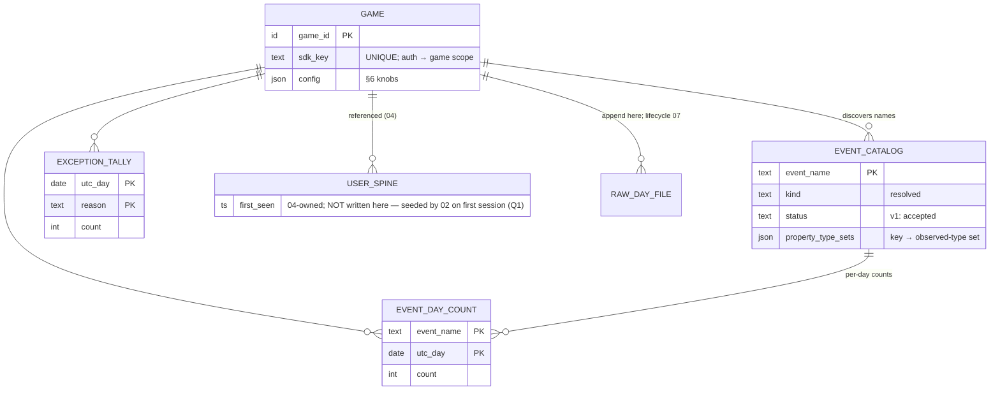

# Ingest + Raw Events / Catalog — Design (US1)

**Story spec:** [spec.md](./spec.md) · **Part of:** [001-analytics-platform](../001-analytics-platform/spec.md)
**Realizes:** the shared platform base [`../001-analytics-platform/foundation.md`](../001-analytics-platform/foundation.md) — this story is the substrate: its worker **is** the canonical front-door (Foundation §3.1 steps 1–6) for every event kind; typed kinds are routed onward at steps 7/8. Nothing below re-derives the backbone, envelope, flush, dedup, or seal machinery — only what this story owns and adds.

---

*Realizes §1–8 of [spec.md](./spec.md) against [Foundation](../001-analytics-platform/foundation.md). This story is the substrate: its worker **is** the canonical front-door (Foundation §3.1 steps 1–6) for every event kind; typed kinds are routed onward at steps 7/8. Nothing below re-derives the backbone, envelope, flush, dedup, or seal machinery — only what this story owns and adds.*

### ER / data model

**Owned durable entities** (Foundation §1.2 names; loose logical types only):

| Entity | Key | Cardinality | Role |
|---|---|---|---|
| `GAME` | `game_id` | one per registered game | **Registry, not a result** — direct-written by the operator-admin API ([011-operator-admin](../011-operator-admin/spec.md), Foundation §5). Holds `name`, `config` (this story's §6 knobs; later stories' knobs live here too), `registered_at`. Its credentials are the 1..N `GAME_SDK_KEY` / `GAME_SERVER_CREDENTIAL` children (Q2, [011-operator-admin](../011-operator-admin/spec.md); Foundation §4.5) — the class of the authenticating credential yields both `game_id` **and** `provenance`, never body-trusted. Ingest is the single pinned path `/v1/events` (Q9), not a per-game URL. |
| `EVENT_CATALOG` | `game_id × event_name` | ≤ `event_name_cap_per_game` rows/game (default 500) | **Result table** (flushed). Adds to Foundation §1.2: `status` (v1 sets every row `accepted` on first sight; `unexpected`/promotion reserved, non-breaking). `kind` stores the **resolved** kind (declared kind, overridden to typed for the three reserved names). Type-drift is **derived at read time** — any `property_type_sets` key whose set holds > 1 type — no stored flag to drift out of sync. |
| `EVENT_DAY_COUNT` | `game_id × event_name × utc_day` | ≤ name-cap rows/game/day | **Result table** (flushed). Accepted-event count per name per corrected UTC day, every kind (Foundation §8.7). **The grand total is not stored**: `live_total(g,day)` = read-time Σ over the day's rows — cap-bounded (≤ 500 terms), drift-free by construction, same read-time stance as top-N (Foundation §3.3). Flagged below as a realization decision against §4's "grand total" line. |
| `EXCEPTION_TALLY` | `game_id × utc_day × reason` | ≤ ~7 reasons/game/day | **Result table** (flushed). Reasons per the Foundation §1.2 enum (amendment landed): `nameless`, `unparseable` (incl. missing `event_id`, see open questions), `capexceeded`, `quarantined_typed`, `sealed_late`, `time_fallback` (event *accepted* but bucketed on `server_received_time` because client times were unusable — Foundation §4.2's "then tallied"), `negative_offset` ([005-retention](../005-retention/spec.md)'s rule, written via [003-sessions](../003-sessions/spec.md)'s path, [bridge 02.5](../001-analytics-platform/bridges/02.5-activeness-spine-contract.md)), `no_spine_row` (Q1 — non-session event with no spine row), `unknown_kind` (Q9 — an SDK newer than the server), [006-monetization](../006-monetization/spec.md)'s FX tallies `fx_stale_rate_used` / `fx_unconverted` (Q8), and `rate_limited` ([ops-envelope](../001-analytics-platform/ops-envelope.md) — per-game ingest cap breach). Lifetime totals = read-time Σ over day rows; no second durable structure. Buckets on **arrival day** (see Worker flow). |

**Spine touch (not owned, and NOT seeded here — Q1, 2026-07-17):** `USER_SPINE.first_seen` is written by **[003-sessions](../003-sessions/spec.md)**, on the first accepted `session` event, on [005-retention](../005-retention/spec.md)'s behalf ([bridge 02.5 §6](../001-analytics-platform/bridges/02.5-activeness-spine-contract.md)) — **not** at this front-door and **not** on generic/economy/purchase events. This story owns **no** per-user write; the catalog stores no `user_id` (§4's "no per-user spine" holds trivially). An accepted **non-session** event whose `user_id` has no spine row tallies `no_spine_row` (advisory — SDK-integration signal; never blocks the event). Events carrying only `anon_id` touch no spine (Foundation §4.6 — no aliasing in v1). Sealed-late events stop at step 5 (Foundation §4.3).

**Raw day file (referenced):** `RAW_DAY_FILE` — this story owns the **append** (write-ahead position, step 4, incl. quarantine-marked entries); [008-cold-storage](../008-cold-storage/spec.md) owns the lifecycle (upload → delete). Never in Postgres.

### Redis structures

Owned domain tags (Foundation §2.1): **`cnt`**, **`cat`**, and the shared front-door **`dedup`**. Types from the §2.2 palette; TTLs per §2.3. Queue keys and per-domain dirty-registries are Foundation §3.1/§3.2 machinery, not restated.

| Key pattern | Type | TTL | Lifecycle |
|---|---|---|---|
| `{game_id}:dedup:{event_id}` | string marker, SETNX-style check-and-set | **24 h fixed** | **Transient-and-losable** — loss risks a ≤ 24 h double-count, accepted for non-money (Foundation §4.1); purchases never rely on it (durable gate, [006-monetization](../006-monetization/spec.md)). Never flushed. |
| `{game_id}:cnt:{utc_day}` | hash — field = `event_name`, value = running **absolute** day count | ~72 h from day end | **Flushes** → `EVENT_DAY_COUNT` (absolute upsert, §3.2); rehydrate-on-miss from Postgres (§2.3). Seals with the day. |
| `{game_id}:cnt:{utc_day}:exc` | hash — field = `reason`, value = running absolute | ~72 h from day end | **Flushes** → `EXCEPTION_TALLY`. |
| `{game_id}:cnt:{utc_day}:rank` | zset — member = `event_name`, score = day count | ~72 h from day end | **Transient-and-losable, display-only** (§2.2: zsets are never the stored truth). Maintained beside the hash for cheap live top-N; never flushed; on miss the dashboard falls back to the hash / last-flushed Postgres (§3.3). |
| `{game_id}:cat:{event_name}` | hash — `kind`, `first_seen`, `last_seen`, `count` (lifetime absolute), `p:{prop_key}` = encoded observed-type set | idle ~72 h, refreshed on write | **Flushes** → `EVENT_CATALOG`. **Day-less domain**: no seal (rows never finalize — `last_seen` advances for the game's life), dirty-marked for the §3.2 sweep, rehydrate-on-miss from `EVENT_CATALOG` seeds min/max/count/type-sets so increments and unions stay absolute. `property_key_cap_per_event` is enforced against this hash's `p:*` field count. |
| `{game_id}:cat:names` | set of registered names | idle ~72 h | **Transient-and-losable** — the name-cap gate + new-name detector; rehydrate-on-miss from `EVENT_CATALOG` (the durable truth for "is this name registered / how many exist"). |

**Split summary + flush classes (Foundation §3.2.1):** `cnt`/`cnt:exc` are **class M** (`+=`-only counts → `GREATEST` + `HSETNX` seed). `cat` is a **mixed day-less hash** flushed per-field: `count` and `last_seen` by `GREATEST` (max), **`first_seen` by `LEAST` (min — an earlier observed first-seen must lower it)**, property-type-sets by **union**; because `cat` never seals, a torn read there always self-heals on the next write, but the `first_seen`=`LEAST` direction is mandatory. `USER_SPINE.first_seen` is durable-immediate (never rides the flush); `dedup` markers, the rank zset, and the names set are transient-and-losable. SDK-key auth reads `GAME` directly (tiny registry; no Redis mirror, no new domain tag).

### Worker / pipeline flow

This story **realizes Foundation §3.1 steps 1–6 for all kinds** and adds its own steps 7/8. Per-step additions only; the backbone is not restated.

**Resolved-kind routing (explicit).** After envelope normalization (`kind` defaults `generic`; the three reserved names force the typed route regardless of declared kind — §H-2):

| Resolved kind | Steps 1–6 | Step 7 (durable-immediate) | Step 8 (hot buckets) |
|---|---|---|---|
| `generic` | front-door (this story) | **none** (no spine seed — Q1; `no_spine_row` tally if no row) | this story: `cat` + `cnt` |
| `session` | front-door (this story) | **`first_seen` seed ([003-sessions](../003-sessions/spec.md), sequence A) then bitmap bit ([003-sessions](../003-sessions/spec.md), sequence B)** — both on [005-retention](../005-retention/spec.md)'s behalf, [bridge 02.5](../001-analytics-platform/bridges/02.5-activeness-spine-contract.md) | this story: `cat` + `cnt`, then [003-sessions](../003-sessions/spec.md): `sess`/`act` |
| `economy` | front-door (this story) | none (`no_spine_row` tally if no row) → route → [004-economy](../004-economy/spec.md) | this story: `cat` + `cnt`, then [004-economy](../004-economy/spec.md): `eco`/`bal` |
| `purchase` | front-door (this story); step 6 **is** [006-monetization](../006-monetization/spec.md)'s durable `transaction_id` gate | [006-monetization](../006-monetization/spec.md) money writes ([bridge 05.5](../001-analytics-platform/bridges/05.5-purchase-accept-contract.md) atomic unit); **no `first_seen` seed** (money is spine-independent — Q1) | this story: `cat` + `cnt`, then [006-monetization](../006-monetization/spec.md): `mon`/`payer`/`rev`/`stage` |

Every accepted event of every kind feeds the catalog + day counts (Foundation §8.7); quarantined typed events feed **nothing** — no catalog row increment, no day count (§2 worked example).

**Step realization:**

- **API-side (pre-queue):** SDK-key auth resolves the game scope; unknown key or key↔URL mismatch → reject, nothing recorded (FR-003). The batch body is enqueued opaque and fast-acked (FR-006); every per-event verdict is worker-side.
- **Step 1:** parse each envelope; empty `name` / unparseable / missing `event_id` → **drop-and-tally**, never raw-appended (Foundation §4.4).
- **Step 2:** skew-correct per §4.2; unusable client times → `server_received_time` bucket + `time_fallback` tally (event still accepted).
- **Step 3 (this story's realization):** reserved-name override → `pii_prop_denylist` / `pii_prop_hash` strip (forward-only, pre-catalog, pre-raw) → **name-cap gate** for new generic names (at cap → drop-and-tally `capexceeded`, decided **before** step 4 — drops are never raw-appended) → typed strict required-payload presence check (invalid → quarantine-mark, proceed to step 4, then stop). Property-key cap: excess *new* keys are ignored at the catalog upsert; the event still counts.
- **Step 4:** the raw append is **owned here** (write position; file format/lifecycle = [008-cold-storage](../008-cold-storage/spec.md)): per-game corrected-day file, quarantine-marked entries included, fsync **before** any counter, spine, or Redis write (§E/SC-008).
- **Step 5:** seal check → quarantine tail + `sealed_late` tally → stop. **Arrival-day tally rule (realization):** `EXCEPTION_TALLY` buckets on the server-received UTC day of the offending arrival — exception subjects have unusable or beyond-seal corrected times, and arrival-day bucketing keeps tallies out of sealed days by construction.
- **Step 6:** windowed `event_id` marker for `generic`/`economy`/`session`; for `purchase` the gate is [006-monetization](../006-monetization/spec.md)'s durable insert-if-absent ([006-monetization](../006-monetization/spec.md)-owned write; this story owns only the **sequencing** — gate before any spine or hot write, conflict → stop).
- **Step 7:** `first_seen` insert-if-absent runs **before** typed routing, so [003-sessions](../003-sessions/spec.md)'s bitmap write (same event, session-start) and all later Day-N offset math always find a spine row. Then the routed story's own step-7 writes run.
- **Step 8:** for every accepted kind: `cat` hash upsert (min/max seen-times, lifetime count +1, type-set union) + `cnt` hash increment + rank zset increment — all rehydrate-on-miss (§2.3); then the routed story's step-8 accumulators.
- **Idempotency:** flushes are no-ops on retry (§3.2). A worker crash between step 6 and ack makes the retried job a dedup no-op → possible undercount bounded by the crash window; accepted under approximate-OK counts (§2). Money is immune: the durable gate and durable-immediate writes are idempotent absolutes.

### API / contract surface

**Registration (one-time, operator).** The operator-admin API ([011-operator-admin](../011-operator-admin/spec.md)) registers a game and auto-issues its public `sdk_key`; server credentials are created on demand (Foundation §4.5, Q2). §6 knobs are read/updated via that admin API onto `GAME.config`; forward-only semantics enforced at ingest time, never retroactively (§6, [011-operator-admin](../011-operator-admin/spec.md) config-effective-time rule).

**Ingest.** `POST /v1/events` (the versioned transport path, Q9 — Foundation §1.1 wire contract), credential in a header, body = the batch object `{v, sdk{name,version}, events:[…canonical envelopes…]}` (Foundation §1.1). `game_id` and `provenance` are **server-derived from the authenticating credential's class** (Foundation §4.5), never from the body. Ack = `2xx {received: n}` after enqueue — a queue-acceptance receipt, **not** a validation promise (verdicts are async; observability via tallies), and version-blind (an old SDK never distinguishes "understood" from "quarantined", Q9). Undecodable batch body / unknown-`v` batch → still `2xx`-acked where the events are recoverable, else `400`, with the appropriate tally (`unparseable`; unknown `kind` → `unknown_kind`). The path is pinned `/v1`; wire v1 is accepted for the life of the platform (Foundation §9.7).

**Per-event verdicts** (realizes Foundation §4.4):

| Condition | Verdict | Raw-appended? | Tally reason |
|---|---|---|---|
| empty / missing `name` | drop | no | `nameless` |
| unparseable envelope / missing `event_id` | drop | no | `unparseable` |
| new generic name while at name cap | drop | no | `capexceeded` |
| resolved typed kind missing required payload | quarantine | yes (marked) | `quarantined_typed` |
| corrected day already sealed | quarantine | yes (tail) | `sealed_late` |
| client times unusable, otherwise valid | **accept** | yes | `time_fallback` |

**Dashboard read-model** (WHAT is read; the live-vs-historical merge is Foundation §3.3, applied once, uniformly):

- **Live counts:** today's `{game_id}:cnt:{utc_day}` hash — per-name counts plus read-time Σ grand total; labeled provisional (≤ flush-cadence drift).
- **Top-N:** live from the `…:rank` zset (ties broken by catalog `last_seen` desc), `top_n_events` display-only; historical = read-time ordering over `EVENT_DAY_COUNT` — rankings are never stored (§3.3).
- **Catalog browser:** `EVENT_CATALOG` — name, resolved kind, first/last-seen, lifetime count (approximate-OK), property keys with observed-type sets + derived drift indicator, `status`.
- **Exception tallies:** `EXCEPTION_TALLY` per-day rows + read-time lifetime Σ; surfaced iff `drop_counter_visible`.
- **Registry:** game list + per-game config.

### Relations with other stories

- **Owns:** `GAME` (registry + config storage); `EVENT_CATALOG`; `EVENT_DAY_COUNT`; `EXCEPTION_TALLY` (including the tally writes for other kinds' quarantines); Redis domains `cnt`, `cat`, and the shared front-door `dedup`; the front-door worker steps 1–6 for **all** kinds (envelope validation, skew, raw-append position, seal verdict, the drop-vs-quarantine decision); the raw day-file **append** (lifecycle is [008-cold-storage](../008-cold-storage/spec.md)'s).
- **Writes (shared):** **none** to the spine — `USER_SPINE.first_seen` is seeded by **[003-sessions](../003-sessions/spec.md)** on the first session (Q1, [bridge 02.5](../001-analytics-platform/bridges/02.5-activeness-spine-contract.md)), no longer at this front-door. This story's only shared writes are the catalog/day-count/tally result tables it owns.
- **Reads:** `GAME.config` (own §6 knobs at ingest); `EVENT_CATALOG` / `EVENT_DAY_COUNT` for rehydrate-on-miss; nothing owned by another story.
- **Feeds:** **[003-sessions](../003-sessions/spec.md) / [004-economy](../004-economy/spec.md) / [006-monetization](../006-monetization/spec.md)** — validated, skew-corrected, deduped, seal-checked typed events routed at steps 7/8 (their inputs never bypass this front-door); **[005-retention](../005-retention/spec.md)** — via [003-sessions](../003-sessions/spec.md)'s session path (`first_seen` is seeded by [003-sessions](../003-sessions/spec.md) on the first session, Q1 — the front-door no longer seeds it); **[008-cold-storage](../008-cold-storage/spec.md)** — the day files + quarantine tails it ships; **all stories** — `EXCEPTION_TALLY` as the shared observability surface; **dashboard** — every read-model surface above.
- **Ordering / lifecycle:** the `GAME` row must exist before any ingest (auth gate). Per event, this story enforces the backbone order for everyone: raw append ≺ seal check ≺ dedup ≺ `first_seen` ≺ routed-story durable writes ≺ hot counters. `first_seen` precedes [003-sessions](../003-sessions/spec.md)'s bitmap write within the same event's step 7. Step 6 for purchases **hosts** [006-monetization](../006-monetization/spec.md)'s durable gate (write and conflict semantics are [006-monetization](../006-monetization/spec.md)'s design; sequencing is this story's). `cnt` buckets follow the §2.3 seal lifecycle; `cat` is day-less (dirty-flush, no seal). Registration precedes everything.
- **Flagged bridges (Stage-3 dispositions):**
  - **Typed-kind handoff contract (this story → [003-sessions](../003-sessions/spec.md)/[004-economy](../004-economy/spec.md)/[006-monetization](../006-monetization/spec.md))** — **folded into Foundation §3.1 ("the routed record")**: the normalized record (envelope + resolved kind + corrected event-time/day + front-door verdicts), single producer, three typed consumers — pinned there, no bridge file.
  - **Raw day-file contract (this story ↔ [008-cold-storage](../008-cold-storage/spec.md))** — **created: [`../001-analytics-platform/bridges/01.5-raw-file-contract.md`](../001-analytics-platform/bridges/01.5-raw-file-contract.md)** — this story executes the append, [008-cold-storage](../008-cold-storage/spec.md) owns file semantics + lifecycle; routing, marker vocabulary, fsync grain, rotation, off-toggle, upload eligibility all normative there.

**Open questions (this design):**

1. **Missing `event_id` on a generic event** — realized as drop-and-tally under `unparseable` (an undedupable event would void the §F 24 h guarantee); the deeper sheet's "name + parseable body is enough" reading would instead accept-without-dedup. Default: drop; flag if accept-undeduped is wanted.
2. **`time_fallback` tally reason** — *resolved*: the Foundation §1.2 reason enum now includes `time_fallback` (amendment landed); this design's accepted-event tally is exactly that value. No semantic change; no longer an open question.
3. **Grand total as read-time Σ** — §4 lists a stored per-game×day grand total; this design derives it read-time from `EVENT_DAY_COUNT` (cap-bounded, drift-free, still raw-re-scan-free). Flag if a stored cell is preferred.
