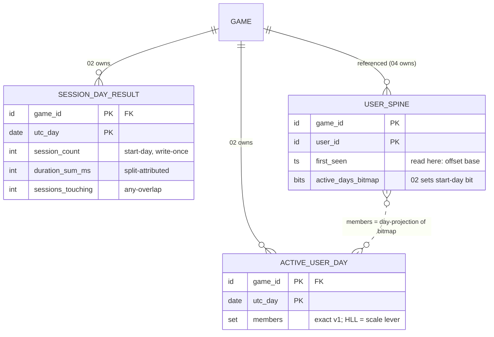

# Sessions — Design

**Story:** [Sessions — the activeness anchor](spec.md) · **Part of:** [001-analytics-platform](../001-analytics-platform/spec.md)
**Realizes:** the shared backbone in [foundation.md](../001-analytics-platform/foundation.md) (cited throughout as "Foundation §N") — this design adds the `session` kind's concrete data model, Redis structures, worker steps, and API/contract surface on top of it.

---

*Realizes §4/§5 of [spec.md](spec.md) on the Foundation backbone (cited as "Foundation §N"). Adds nothing to the envelope, flush, seal, or dedup machinery.*

### ER / data model

**Owned durable entities — both result tables, flushed per Foundation §3.2:**

| Entity | Key | Attributes (logical) | Cardinality | Rebuild path |
|---|---|---|---|---|
| `SESSION_DAY_RESULT` | `game_id` × `utc_day` | `session_count` (start-day keyed, write-once semantics), `duration_sum_ms` (split-attributed), `sessions_touching` (any-overlap denominator) | 1 row per game × corrected UTC day | raw day file only (manual, [008-cold-storage](../008-cold-storage/spec.md)) |
| `ACTIVE_USER_DAY` | `game_id` × `utc_day` | `members` — exact `user_id` set v1; HLL sketch is the named scale lever (§S-3) | 1 row per game × day; `members` ⊆ that game's `USER_SPINE` users | **spine scan** — projection of `active_days_bitmap` (Foundation §1.3), never a raw re-scan |

- **Result vs spine touch.** `SESSION_DAY_RESULT` is a pure result cell. `ACTIVE_USER_DAY` is a result *and* a rebuildable **projection** of the spine (Foundation §1.3, §9.2) — kept for read speed only. The single spine touch is a write into a **foreign** entity: one bit in `USER_SPINE.active_days_bitmap` (owned by [005-retention](../005-retention/spec.md)) at offset `corrected_start_day − first_seen_day`, set-once, durable-immediate (Foundation §5).
- **Deliberate absences.** No `SESSION` entity, no per-session rows, no per-user session history (§4, SC-007). `sessions_before_purchase` is a client-SDK counter (§S-2) — nothing here stores or derives it. Average length is never stored (read-time division, Foundation §3.3).
- Foundation §1.2's attribute lists for both entities are hereby confirmed **complete** — this story adds no further attributes.

### Redis structures

Owned domain tags: **`sess`**, **`act`** (Foundation §2.1).

| Key pattern (§2.1 grammar) | Type (§2.2) | Content | TTL (§2.3) | Fate |
|---|---|---|---|---|
| `{game_id}:sess:{logical_day}` | hash | fields `session_count`, `duration_sum_ms`, `sessions_touching` — running absolutes for that day-bucket | ~72 h from day end | **flushes → class M** (Foundation §3.2.1): `+=`-only, upsert via `GREATEST` + `HSETNX` seed |
| `{game_id}:act:{logical_day}` | set (HLL at the same key under the scale lever) | `user_id`s with a session **start** on that day | ~72 h from day end | **flushes → class S** (Foundation §3.2.1): `ACTIVE_USER_DAY.members` via **set-union** (never blind replace); `PFMERGE` under the sketch lever |

- A midnight-spanning session touches **two** `sess` hashes (start day: all three fields; end day: `duration_sum_ms` + `sessions_touching` only) and exactly **one** `act` set (start day). At most 3 open buckets per domain per game (Foundation §2.3).
- **Rehydrate-on-miss** (Foundation §2.3) applies to both: seed the hash from the `SESSION_DAY_RESULT` row and the set from `ACTIVE_USER_DAY.members` (empty if none) before the first post-crash increment.
- **Nothing in this story is durable-immediate *in Redis*** — the bitmap bit goes straight to Postgres and never lives in Redis. **Transient-and-losable:** un-flushed drift ≤ flush cadence (Foundation §6, accepted). The `{game_id}:dedup:{event_id}` marker is 01's front-door — read, not owned, here.

### Worker / pipeline flow

Additions at Foundation §3.1 steps 3, 7, 8 only; the backbone (steps 1–2, 4–6, 9) is untouched.

**Step 3 — strict `session` validation + trusted-time derivation** (failure → quarantine per Foundation §4.4, tally `quarantined_typed`):

1. **Shape check** of required props: `session_id` (opaque string, never parsed), `session_start_time`, `session_end_time` (parseable timestamps), `duration_ms` (integer ≥ 0). Optional `reason ∈ {timeout, app_close, reconciled}` — an unknown value is treated as absent, never a quarantine cause (informational only, folded into no result).
2. **Skew-correct** both payload timestamps with the step-2 envelope skew (same value, same 60 s dead-band); future-clamp each to server-now (Foundation §4.2).
3. **Server recomputes duration as the trusted value** (§3): `trusted_duration = corrected_end − corrected_start`, clamped to 0 if negative, then to `session_max_duration_cap_min`, then floored by `session_min_duration_ms`. Client `duration_ms` is a sanity signal only — never folded, never a rejection cause. All clamps **accept**, never quarantine: the session still counts (spec §5/§6).
4. **Trusted interval** = `[corrected_start, corrected_start + trusted_duration)`; all split math uses it, never the raw client end. Because the cap range is ≤ 1440 min, the interval overlaps **at most two adjacent UTC days** — §4's "at most two days" holds by construction.
5. **Governing day = corrected START day** — it keys the count, the bit, the `act` membership, and the step-5 seal check below.

**Step 5 refinement — seal gates on the start day, atomically** (the sealed-boundary-spanning treatment, made normative):

- **Lemma (no partial splits).** Day-seal times increase strictly with the day (`D` seals at `D_end + 48 h`), so *an open start day implies every day the trusted interval touches is open*. An accepted session can never straddle a sealed boundary; the split is all-or-nothing. This realizes Foundation §2.3 (each cell governed by its own day's seal) with a single conservative gate on the earliest touched day.
- **Start day sealed ⇒ whole event quarantined** (backbone step 5: quarantine tail + `sealed_late` tally) — *even when the end day is still open*, which is reachable for a `reconciled` spanner arriving in the window between the two days' seals. No tail-only fold: count and bit are start-day write-once, and folding only a tail into the open end day would create duration/touching with no counted session anywhere, silently diverging from any raw rebuild.
- **Near seal = no special case.** The step-5 check is point-in-time; anything gated in before the seal moment lands in the still-open bucket and is captured by that day's final seal flush (Foundation §2.3, §3.2). Organic sessions cannot hit the sealed path at all (cap ≤ 24 h < 48 h grace) — only `reconciled` / offline-retried closes can.

**Step 7 — durable-immediate additions (sequence A seed, then the activeness bit)** — both 04-owned sequences execute here per [bridge 02.5](../001-analytics-platform/bridges/02.5-activeness-spine-contract.md) (`first_seen` ratified first-session, 2026-07-17): first sequence A — `USER_SPINE` insert-if-absent `(game_id, user_id, first_seen = corrected session_start)`, reporting *created?*, with the iff-created `size` increment riding step 8 — then the bit:

- Set bit `offset = corrected_start_day − first_seen_day` in `USER_SPINE.active_days_bitmap` — **set-once idempotent bit-OR**, straight to Postgres, never flush-mediated (Foundation §3.1 step 7, §5). `session` is the *only* kind that reaches this write (Foundation §7, activeness row).
- **Negative offset** (corrected start day earlier than the spine's `first_seen` day — one surviving cause under first-session seeding: an in-grace processing race, a later-day session seeding `first_seen` before an earlier-day session of the same user processes; bounded ≥ −2 by the 48 h window geometry): **skip the bit and the counter; tally `negative_offset`** (Foundation §1.2 enum — amendment landed); **never back-date the write-once `first_seen`**; the session still counts and splits normally in this story's day aggregates. Unified rule normative in [bridge 02.5 §5](../001-analytics-platform/bridges/02.5-activeness-spine-contract.md).
- **Ordering:** the bit (durable-immediate) strictly precedes step 8, so a crash in between leaves `ACTIVE_USER_DAY` / `RETENTION_CELL` at most one flush behind the spine truth — reconcilable by spine re-scan (Foundation §6) — never the reverse.

**Step 8 — hot updates** (all rehydrate-on-miss, Foundation §2.3):

| Bucket | Ops |
|---|---|
| `{game_id}:sess:{start_day}` | `session_count += 1`; `sessions_touching += 1`; `duration_sum_ms += dur_on_day(s, start_day)` |
| `{game_id}:sess:{end_day}` — iff the trusted interval has positive overlap with a second day | `sessions_touching += 1`; `duration_sum_ms += dur_on_day(s, end_day)` — **no count** |
| `{game_id}:act:{start_day}` | `SADD user_id` (`PFADD` under the lever) |

**Idempotency ledger.** Within 24 h a resent close never reaches steps 7–8 (`event_id` dedup, backbone step 6). Beyond 24 h a replay re-ORs the bit (no-op) and re-`SADD`s (no-op) but double-counts count/duration — the accepted non-money residual (Foundation §4.1, spec §5). The flush is retry-safe by construction (Foundation §3.2). `session_id` is never a dedup or storage key.

### API / contract surface

**Ingest — `kind = session`** (rides the canonical envelope, Foundation §1.1; payload inside `props`):

| Prop | Shape | On violation |
|---|---|---|
| `session_id` | opaque string (required) | quarantine (Foundation §4.4) |
| `session_start_time` | timestamp (required) | quarantine |
| `session_end_time` | timestamp (required) | quarantine |
| `duration_ms` | int ≥ 0 (required; untrusted — server recomputes) | quarantine if absent/malformed; value disagreement is never a violation |
| `reason` | `timeout` \| `app_close` \| `reconciled` (optional) | unknown value → treated as absent, event accepted |

Semantic anomalies (negative span, cap breach, zero duration) **clamp and accept**; quarantine is reserved for shape violations and sealed-day arrival (Foundation §4.3–4.4). Exactly one terminal event per session; member events are ordinary `generic` traffic ([002-foundation-ingest](../002-foundation-ingest/spec.md)'s concern, Foundation §8 convention 7).

**Dashboard read-model** — sealed days from Postgres, open days live from `sess`/`act` buckets with last-flushed fallback, merged once by the API layer (Foundation §3.3). What is read:

| Metric | Reads | Read-time computation (never stored) |
|---|---|---|
| Session count / day | `SESSION_DAY_RESULT.session_count` | stored cell |
| Avg session length / day | `duration_sum_ms`, `sessions_touching` | division — the **split form**, labeled as such (§S-4 default) |
| Sessions per user (window W) | `session_count` over W; `ACTIVE_USER_DAY.members` over W | Σ counts ÷ \|union of members\| — exact set union v1 |
| Session frequency (W) | same | Σ counts ÷ Σ per-day \|members\| (active user-days) |

- Windows touching open days are marked **provisional** until seal (§2 immature handling).
- **HLL lever consequence, stated:** under the lever, sealed-day membership degrades to a sketch — window unions become `PFMERGE` approximations, affecting sessions/user and frequency only; retention stays on the exact bitmap (Foundation §2.2: HLL never for money or retention).
- No per-session or per-user-session endpoint exists — nothing stored could serve one (results-only, FR-010).

### Relations with other stories

- **Owns:** `SESSION_DAY_RESULT`, `ACTIVE_USER_DAY` (Postgres, flushed); Redis domains `sess`, `act`; the locked session definition (§1) every other story inherits.
- **Writes (shared):** `USER_SPINE.first_seen` (sequence A — first accepted session, ratified 2026-07-17) and `USER_SPINE.active_days_bitmap` (sequence B, on the session's **start** UTC day, set-once) — both owned by [005-retention](../005-retention/spec.md), written here durable-immediate per [bridge 02.5](../001-analytics-platform/bridges/02.5-activeness-spine-contract.md) (Foundation §5; §7 "activeness = session-start").
- **Reads:** `USER_SPINE.first_seen` (bit-offset base); `GAME.config` (the three §6 knobs); the shared front-door dedup verdict ([002-foundation-ingest](../002-foundation-ingest/spec.md)). `EXCEPTION_TALLY` is fed only via the shared backbone paths (quarantine / sealed-late tallies), never directly.
- **Feeds:** **[005-retention](../005-retention/spec.md)** — the activeness bits + the "active = session start" definition (cohorts/retention popcount them); **[007-derived-kpis](../007-derived-kpis/spec.md)** — `ACTIVE_USER_DAY` (DAU, window unions, stickiness denominator) and `SESSION_DAY_RESULT` (engagement panels); **[006-monetization](../006-monetization/spec.md)** — definition only: `sessions_before_purchase` is a **client-SDK counter** stamped on purchase context (§S-2) — no server data flows from this story's stores to monetization.
- **Ordering / lifecycle:** spine row must exist before offset math — guaranteed inside step 7 (sequence A runs here, immediately before the bit write — bridge 02.5); the bit precedes hot updates (projections may lag the spine by ≤ one flush, never lead it — Foundation §6); the start-day seal gates the whole event atomically (no partial split, above); all three §6 knobs are forward-only (no re-bucketing of emitted sessions). [005-retention](../005-retention/spec.md)/[007-derived-kpis](../007-derived-kpis/spec.md) may observe a set bit before the corresponding `ACTIVE_USER_DAY` flush lands — the spine is the truth (Foundation §1.3).
- **Flagged bridges:** **created — [`02.5-activeness-spine-contract.md`](../001-analytics-platform/bridges/02.5-activeness-spine-contract.md) (01 · 02 → 04)** — the joint contract pinning sequence A/B delegation, offset math, the negative-offset / over-horizon / sealed-day rules, set-once transition semantics, and the shared spine-re-scan rebuild of `ACTIVE_USER_DAY` / `RETENTION_CELL`, so writer and owner cannot drift. No other bridge: the 05 handoff is an SDK-contract note (§S-2, absorbed by monetization's context-dimension design), and 06 is a plain read of owned results.

**Open question (resolved into the bridge):** the **negative bit-offset rule** is now normative in [bridge 02.5 §5](../001-analytics-platform/bridges/02.5-activeness-spine-contract.md) — bit and counter skipped, `negative_offset` tallied (Foundation §1.2 enum, amendment landed), `first_seen` never back-dated, session still counts; the clamp-to-bit-0 alternative is rejected there (fabricates Day-0 activity). No Foundation §7 invariant was at stake; the bridge's `first_seen` ruling (its §6) is now also resolved — first accepted session, seeded in this story's step 7 (2026-07-17).
