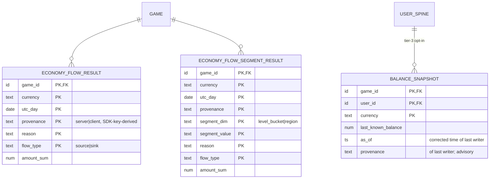

# Economy (Sink / Source) — Design

**Part of:** [001-analytics-platform](../001-analytics-platform/spec.md) · **Story:** [Economy (Sink / Source) — US2](./spec.md)
**Realizes:** the shared backbone in [foundation](../001-analytics-platform/foundation.md) (envelope, skew correction, 48 h seal, write-ahead raw ordering, dedup gates, absolute-value flush, read-merge). This doc is the additions-only design layer over that base; see [spec.md](./spec.md) for the requirement/story/calculation frame.

---

## Design

*Design layer per Foundation §8.3 — additions only. The backbone (envelope, skew correction, 48 h seal, write-ahead raw ordering, dedup gates, absolute-value flush, read-merge) is Foundation §1–4 and is not restated. Day = corrected UTC day everywhere (Foundation §4.2).*

### ER / data model

**Three durable structures, all owned by this story (Foundation §5).** Two result tables + the one tier-3 spine touch (Foundation §1.3).

| Entity | Class | Key (grain) | Non-key attributes | Cardinality bound |
|---|---|---|---|---|
| `ECONOMY_FLOW_RESULT` (Foundation §1.2, grain refined — below) | **Result table** — day cells, seal-governed, rebuildable from the raw floor | `game_id × currency × utc_day × provenance × reason × flow_type` | `amount_sum` (running absolute) | per game×day ≤ #currencies × 2 (provenance) × 2 (flow) × #observed-reasons |
| `ECONOMY_FLOW_SEGMENT_RESULT` (the "(+ segmented)" sibling in Foundation §5) | **Result table**, optional rows | base grain + `segment_dim × segment_value` | `amount_sum` | observed segments only; **independent per-dim axes, never cross-dim combos** (below) |
| `BALANCE_SNAPSHOT` (Foundation §1.2 / §1.3 tier-3 opt-in) | **Spine touch** — per-user state, NOT seal-governed | `game_id × user_id × currency` | `last_known_balance`, `as_of` (corrected event-time of last writer), `provenance` (of last writer) | users × balance-reporting currencies; written only while `economy_depth_capture_mode` on |
| `ECONOMY_SUPPLY_DAY` (Q5, ratified 2026-07-17 — the fourth durable structure) | **Snapshot row** — write-once at day-seal; a third class beside result cells and spine touches | `game_id × currency × utc_day` | `money_supply` (Σ `last_known_balance`), depth percentiles (e.g. `p50`/`p90`), `n_users` (balance-reporting user count — supply rises merely when more users report), optional trusted-only supply (server-provenance slice; advisory) | games × balance-reporting currencies × days; one row each; written only while `economy_depth_capture_mode` on |

**Provenance rides the key (decision).** `provenance ∈ {server, client}` is an extra key dimension on both flow grains, **derived at ingest from the class of the authenticating credential** per Foundation §4.5 (amendment landed: `GAME.sdk_key` = client scope, `GAME.server_credential` = server scope) — same derivation posture as `game_id` (Foundation §1.1); a body-supplied flag is ignored. Trusted-only totals = the `server` slice; headline totals = the provenance-collapsed read (same collapse shape as spec §2's reason-collapse). **Tradeoff:** ×2 worst-case cell fan-out, vs. the rejected separate trusted-only accumulator, which costs a second increment per server event, a second structure that can drift, and a read-time reconciliation anyway. **[OPEN — contingent]** Per Foundation §4.5/§9.5: if the F-3 envelope/key-class decision (metrics sheet §7) leaves server keys indistinguishable, provenance defaults to `client` (conservative: untrusted unless proven).

**Segment axes are independent (decision).** `segment_dim ∈ {level_bucket, region}`; each axis accumulates on its own rows — no (level × region) cross-product. Bounds segmented cardinality to a *sum* of small axes (`level_bucket_boundaries` bucket count + observed regions), not a product; cost: no simultaneous two-dim slice in v1 (consistent with spec §4 "kept bounded"). `level_bucket` is computed at ingest from `player_level` via `level_bucket_boundaries` (bucket label stored, raw level never stored; forward-only per spec §7). An event missing a dim contributes nothing to that axis; `reason` is retained inside segments, with the metrics-sheet fallback (collapse reason within segments) as the scale lever if cardinality bites.

**Result vs spine touch.** The two flow tables are pure results: mutable until seal via absolute-value flush, immutable after, reconstructible from the raw day files. `BALANCE_SNAPSHOT` is tier-3 per-user truth: **day-less**, so its mutability is governed by `as_of` last-writer-wins, not by the day-seal — though sealed-late events can never touch it (they stop at Foundation §3.1 step 5). It is the only per-user draw this story makes; the core flow metrics need zero per-user state (spec §4 ✓).

**Grain-refinement flag — resolved (amendment landed).** Foundation §1.2 now carries the `provenance` key on `ECONOMY_FLOW_RESULT` and `as_of` (the LWW guard) on `BALANCE_SNAPSHOT`, exactly as this design requested. The remaining story-level refinements are the advisory non-key `provenance` on `BALANCE_SNAPSHOT` and the `ECONOMY_FLOW_SEGMENT_RESULT` sibling (both within Foundation's "key attributes only" latitude; assembled in [ER-full.md](../001-analytics-platform/ER-full.md)).

(`GAME`, `USER_SPINE` are referenced Foundation §1.2 entities, attributes omitted.)

### Redis structures

Keys per the Foundation §2.1 grammar; owned domain tags **`eco`** and **`bal`**. Types from the §2.2 palette; TTLs per §2.3.

| Key | Type | Field → value | TTL | Durability class |
|---|---|---|---|---|
| `{game_id}:eco:{logical_day}` | hash | cell tuple `(provenance, flow_type, currency, reason)` → running absolute `amount_sum` | ~72 h from day end | **flushes → class M** (Foundation §3.2.1): amounts are `+=`-only, `GREATEST` + `HSETNX` seed |
| `{game_id}:eco:{logical_day}:seg` | hash | `(provenance, flow_type, currency, segment_dim, segment_value, reason)` → absolute sum | ~72 h from day end | **flushes → class M** → `ECONOMY_FLOW_SEGMENT_RESULT` (same sweep) |
| `{game_id}:bal:{currency}` | hash | `user_id` → `(last_known_balance, as_of, provenance)` | none (rebuildable from durable snapshot) | **flushes → class L** (Foundation §3.2.1): `BALANCE_SNAPSHOT` via `as_of`-guarded upsert-latest; exists only when depth on |
| `{game_id}:bal:dirty` | set | `user_id:currency` entries touched since last flush | cleared by each flush | **transient-and-losable** (worst case: one redundant no-op flush) |
| `{game_id}:eco:cur` | set | observed currency ids (auto-registration; allowlist/cap gate; dashboard picker) | none | **transient-and-losable** — rebuild = distinct currencies in `ECONOMY_FLOW_RESULT` |

- **Field encoding.** `currency` and `reason` are free-form and legitimately contain `:` (`shop_purchase:sword`) — hash fields are tuple-encoded with an escaped separator so the flusher round-trips fields to cell keys unambiguously. (Exact encoding is an implementation detail; unambiguity is the requirement.)
- **Durable-immediate: none.** This story owns no Foundation §3.1 step-7 write — economy is not money; nothing bypasses the flush.
- **`ECONOMY_SUPPLY_DAY`: no new Redis.** The seal-time snapshot is a direct read of the durable `BALANCE_SNAPSHOT` rows (post-flush) at the capture moment → one write-once Postgres row per game×currency×day; the percentile scan reuses the same bucketed-histogram scale lever as the current depth read. No hot key, no open-day bucket (a day acquires its supply row only at seal; "current supply" stays the live `BALANCE_SNAPSHOT` read).
- **No zsets.** Top-faucet/top-drain ranking is display-time only (Foundation §2.2, §3.3); nothing ranked is stored.
- **`bal` loss posture.** An entry lost before flush forfeits ≤ one flush window of balance updates (accepted, Foundation §6; depth is advisory). Per-entry rehydrate-on-miss (next section) guarantees a post-crash write can never regress the durable snapshot.
- **Dedup markers** (`{game_id}:dedup:{event_id}`, 24 h) are the ingest substrate's shared front door (Foundation §4.1) — economy rides them, owns nothing there.

### Worker / pipeline flow

Additions to Foundation §3.1 only; unnamed steps are unchanged.

**Step 3 — strict `economy` payload validation (Foundation §4.4 quarantine rule).** Applies to `kind = economy` and to reserved-name collisions (a free-form event *named* `economy` routes here via the ingest substrate's kind-routing). Any required-field failure ⇒ quarantine-mark + `quarantined_typed` tally + raw append (step 4) + stop:

| Check | Valid | Invalid ⇒ |
|---|---|---|
| `flow_type` | exactly `source` or `sink` | quarantine |
| `currency_type` | non-empty string | quarantine |
| `amount` | finite numeric, strictly > 0 — direction never by sign; negatives are **not** auto-flipped | quarantine |
| `reason` | non-empty string | quarantine |
| allowlist (when `economy_currency_allowlist` non-empty) | currency ∈ list | quarantine (config gate treated as typed validation; forward-only) |
| currency cap (accept-all posture, §H-4 applied to currencies) | currency already registered or under cap | **drop-and-tally `capexceeded`**, not raw-appended — mirrors Foundation §4.4's name-cap class |

Optional fields fail field-level, never event-level: `balance_after` non-numeric or `< 0` ⇒ discard the field (not clamped to zero, not quarantined — the event still accumulates flows); absent player context just skips that segment axis. Provenance is derived here from the credential class (Foundation §4.5; ER decision above), before any counting.

**Step 7 — no additions.** Economy makes zero durable-immediate writes. (No `first_seen` seed runs for an economy event — Q1, 2026-07-17: only the sessions story's first-session path seeds the spine. Consequence for depth, below: a `BALANCE_SNAPSHOT` may be written for a user with **no** `USER_SPINE` row — the association is logical, not an enforced FK; the balance row stands on its own and the `first_seen` (if any) arrives later via a session.)

**Step 8 — hot updates, in order:**
1. `SADD` the currency into `{game_id}:eco:cur` (auto-registration under accept-all).
2. Increment the base cell in `{game_id}:eco:{corrected_day}` — rehydrate-on-miss first (Foundation §2.3: seed the day's bucket from Postgres absolutes).
3. For each **present** segment dim: increment the matching `:seg` cell (observed segments only materialize).
4. If depth on **and** a valid `balance_after`: guarded LWW upsert into `{game_id}:bal:{currency}` field `user_id`; add the entry to `bal:dirty`.

**LWW by corrected time under out-of-order arrival (the depth design).** Three guards make "last writer by corrected event-time" hold across reordering, retries, and Redis loss:
1. **Hot guard** — overwrite the hash entry only if incoming `corrected_time ≥` stored `as_of`. On entry miss, **rehydrate-on-miss per entry**: one durable point-read of `BALANCE_SNAPSHOT` seeds `(balance, as_of, provenance)` before comparing (no row = accept incoming). Without this seed, a stale offline-buffered event arriving after a Redis crash could clobber a newer durable balance.
2. **Flush guard** — the flusher sweeps `bal:dirty` and performs a **guarded absolute upsert-latest**: apply `(last_known_balance, as_of, provenance)` only where incoming `as_of ≥` the durable row's `as_of`. A retried or duplicated flush writes identical absolutes ⇒ no-op by construction, preserving Foundation §3.2 idempotency.
3. **Tie-break** — equal `as_of` ⇒ later `server_received_time` wins, then greatest `event_id`. Deterministic and arrival-order-independent.

The LWW domain is bounded by the seal: a sealed-day event stops at step 5 and never touches `bal`, so only corrected times within open days compete.

**Idempotency & dedup.** Economy dedups by windowed `event_id`, 24 h, at step 6 (Foundation §4.1) — **no `transaction_id` path exists; economy is not money**. Step-8 increments are not idempotent by themselves; the dedup gate is the only per-event guard. Accepted residual (spec §5's bridge note): a retry landing **> 24 h** later re-counts the flow into its (still-open) corrected-day cell; the same duplicate is harmless to `bal` (identical `corrected_time` + balance ⇒ tie-break overwrite with equal values). The flush path itself stays idempotent (absolute values, Foundation §3.2).

**Seal / late.** Nothing beyond the backbone: the final flush at `D_end + 48 h` freezes that day's flow cells; late economy events quarantine at step 5 (`sealed_late` tally); no bucket is ever recreated. `bal` / `BALANCE_SNAPSHOT` has no seal — see LWW above.

### API / contract surface

**Ingest (write side).** Canonical envelope per Foundation §1.1 with `kind = economy`; the `props` payload contract (violations per the step-3 table; drop-vs-quarantine per Foundation §4.4):

| Field | Req | Contract |
|---|---|---|
| `flow_type` | ✔ | `source` \| `sink` — nothing else valid |
| `currency_type` | ✔ | non-empty string; per-game namespace; currencies independent, never cross-currency-summed |
| `amount` | ✔ | numeric > 0; magnitude only — direction is `flow_type`'s |
| `reason` | ✔ | non-empty string; drives the faucet/drain breakdown |
| `balance_after` | – | numeric ≥ 0; feeds depth only; invalid ⇒ field discarded, event still counts |
| `player_level`, `region`, … | – | segmentation context; `player_level` → `level_bucket` at ingest |
| provenance | *(derived)* | `server` \| `client` from the authenticating credential class (Foundation §4.5); any body-supplied value ignored |

**Read model (dashboard API).** All reads per game × currency; sealed days from Postgres, open days live-merged from the `eco` buckets with last-flush fallback and a provisional marker (Foundation §3.3). Every derived figure is a read-time computation — never stored:

| Read | Over | Computation |
|---|---|---|
| source / sink daily series | base cells | collapse `provenance` + `reason` |
| net flow | same | `total_source − total_sink` |
| sink ratio | same | `total_sink / total_source`; **N/A when `total_source = 0`** (and 0/0 → N/A, never 0 or ∞ or NaN). **Low-volume guard (added 2026-07-17):** when either leg is below `economy_ratio_min_events` (default 100), the ratio is annotated "low volume — unreliable" (a 3/1 = 300 % reading off 4 events is noise, not deflation). `net_flow` (always defined) is the **primary** balance metric; sink_ratio is the fragile secondary. An optional symmetric bounded form `(sink − source)/(sink + source)` ∈ [−1, +1] is offered as a stable alternative view. |
| top faucets / top drains | per-reason cells | sort desc per flow_type, take `economy_top_n_reasons` (retroactive knob — pure re-rank) |
| trusted-only variant of all above | `provenance = server` slice | identical computations |
| segment slice | segment cells for one `(segment_dim, segment_value)` | identical computations |
| money_supply / depth pXX (current) | `BALANCE_SNAPSHOT` durable rows | Σ / percentiles over `last_known_balance` |
| money-supply trend (day-over-day) | `ECONOMY_SUPPLY_DAY` rows (Q5) | plain select of `money_supply` / percentiles per day; optionally overlay query-time `SUM(net_flow) OVER (ORDER BY utc_day)` over `ECONOMY_FLOW_RESULT` — divergence between the two lines is diagnostic |

- **Depth caveats (surfaced in the UI):** point-in-time and ≤ one flush window stale — `bal` is day-less, so Foundation §3.3's open-day Redis merge doesn't apply; the durable snapshot is read directly. Covers balance-reporting users only; advisory unless `provenance = server`; trusted-only money supply (Σ over rows whose *last* writer was server) is approximate when client events overwrite server-written balances. Percentiles are a per-currency scan — indie-scale fine; a bucketed histogram is the named scale lever.
- **Dormant-holder undercount (clarified 2026-07-17).** `BALANCE_SNAPSHOT` is **upsert-latest and persistent** (day-less, never pruned) — so `money_supply = Σ last_known_balance` is a Σ over **every user who has *ever* reported a balance**, carried forward from their last balance event — **not** only users active in the snapshot window. This is the correct stock-over-all-known-holders definition; a user who stockpiled currency and went quiet still contributes their last-known balance. The residual undercount is confined to holders who *never once* emitted a `balance_after` (depth-off periods, or currencies a client never reports balances for) — surfaced by **`n_users`** (the balance-reporting holder count) on `ECONOMY_SUPPLY_DAY`, so coverage is visible, and by the **supply-vs-cumulative-flow divergence** diagnostic (Q5): a persistent gap between measured supply and `Σ net_flow` flags untracked/unreported holdings. The dashboard labels supply "over N balance-reporting holders," never as an unqualified total.
- **Money-supply trend — RESOLVED (2026-07-17, Q5): ratify `ECONOMY_SUPPLY_DAY` as a daily balance-derived snapshot.** Spec §2's health read ("rising money supply day-over-day") needs a supply-*level* history, which `BALANCE_SNAPSHOT` (upsert-latest) destroys every day — so it is **capture-it-or-lose-it** and earns its one-row-per-game×currency×day. **Snapshot the balance-derived level** (Σ `last_known_balance` + percentiles + `n_users`) at day-seal, gated on `economy_depth_capture_mode`; it is rebuildable in principle from the raw floor (replay `balance_after` LWW to any day boundary), days-while-depth-off unrecoverable (forward-only, same posture as depth). **Do NOT store cumulative sources−sinks** (the literal Q5 phrasing): that stays a query-time window function (`SUM(net_flow) OVER (ORDER BY utc_day)`) over `ECONOMY_FLOW_RESULT` — trivial at ~1000 day-rows — because cumulated flow is an index of change, not a level (it starts at zero at instrumentation start and absorbs every accepted residual). The read model overlays the two lines: **divergence between measured supply and cumulative-flow-implied supply is itself diagnostic** of untracked/spoofed/client-only flows (the EVE Online MER precedent, where the two diverged 9 % for three months). Capture-moment (at-seal reusing the seal sweep vs at-rollover) is a plan-time detail; at-seal is the lower-machinery option and matches the "as of seal" labeling. *Sources: EVE Online Monthly Economic Report (separate Money-Supply level vs Sinks/Faucets flow charts + `money_supply.csv`) · The Nosy Gamer Nov-2025 MER analysis (9 % flow-vs-level divergence) · Roblox economy dashboard ("Average wallet balance" level trend) · NetEase GDC 2020 inflation-monitoring (tracks stock alongside flows) · Postgres window-function running-total practice.*

### Relations with other stories

- **Owns:** `ECONOMY_FLOW_RESULT` + `ECONOMY_FLOW_SEGMENT_RESULT`, `BALANCE_SNAPSHOT`, `ECONOMY_SUPPLY_DAY` (Q5, snapshot-at-seal), Redis domains `eco` + `bal` (Foundation §5, economy row).
- **Writes (shared):** none. Catalog, day-count, and `EXCEPTION_TALLY` effects of economy events (`quarantined_typed`, `sealed_late`, `capexceeded`) are written by the ingest substrate's shared front-door machinery ([002-foundation-ingest](../002-foundation-ingest/spec.md)); this story's validation only selects the outcome.
- **Reads:** `GAME.config` (spec §7 knobs incl. shared `level_bucket_boundaries`); the ingest substrate's dedup front door (step 6); `USER_SPINE` (existence only — FK parent of `BALANCE_SNAPSHOT`); envelope `session_id` / `user_id` as context — no session semantics, no per-session economy rollup in v1.
- **Feeds:** the dashboard read model only. No story consumes economy results in v1 ([007-derived-kpis](../007-derived-kpis/spec.md) reads monetization, not economy; a premium-purchase ↔ gem-faucet correlation view would be a cross-story read, out of v1 scope).
- **Ordering / lifecycle:** the ingest substrate ([002-foundation-ingest](../002-foundation-ingest/spec.md)) precedes everything (auth → `game_id` + `provenance` from the credential class, write-ahead, dedup). **No spine-parent guarantee (Q1, 2026-07-17):** economy events no longer trigger a `first_seen` seed, so a `BALANCE_SNAPSHOT` write may occur for a user with no `USER_SPINE` row — the parent is a logical association, not an enforced FK; depth is advisory and the balance row stands alone. Flow cells follow the §2.3 open→seal lifecycle; `BALANCE_SNAPSHOT` is LWW-governed with no seal. Forward-only levers: `economy_currency_allowlist`, `level_bucket_boundaries`, depth enablement (no backfill; disabling depth stops writes but keeps rows — staleness visible via `as_of`).
- **Flagged bridges:** **server-provenance / trusted-path (economy ↔ [006-monetization](../006-monetization/spec.md)) — folded into Foundation §4.5** (amendment landed; **F-3 resolved 2026-07-17, Q2**): one credential-class derivation (public `sdk_key` client / secret `server_credential` server; two-class model, [011-operator-admin](../011-operator-admin/spec.md)), never body-trusted. Both stories now cite that section; no bridge file exists or is needed.
