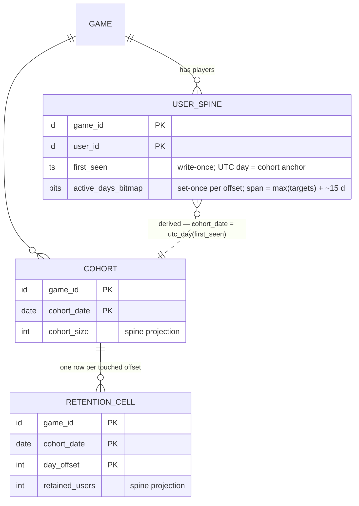

# Retention (Classic Day-N) — Design

**Part of**: [001-analytics-platform](../001-analytics-platform/spec.md) · **Story**: US3 (P2) · **Status**: Draft
**Realizes**: [spec.md](./spec.md) (§4 / §5 data-shape + data-structure requirements).
**Shared base**: [foundation.md](../001-analytics-platform/foundation.md) — the Foundation backbone (envelope, skew, seal, dedup, flush) this design builds on; every "Foundation §N" citation resolves there and is never re-derived.
**Bridge**: [02.5-activeness-spine-contract](../001-analytics-platform/bridges/02.5-activeness-spine-contract.md) — the spine write-delegation contract (jointly flagged with sessions).

---

## Design

*Design-phase realization of §4 / §5 on the Foundation backbone (shape per Foundation §8.3). Everything in [spec.md](./spec.md) is untouched; envelope, skew, seal, dedup, and flush machinery are cited as "Foundation §N", never re-derived.*

### ER / data model

**Three owned entities — one spine touch, two result tables** (UPPER_SNAKE per Foundation §1.2; key attributes live there, full attribute intent here):

| Entity | Nature | Key | Non-key attributes | Cardinality / bound |
|---|---|---|---|---|
| `USER_SPINE` | **Spine touch** — the core tier itself (Foundation §1.3); retention defines it | `(game_id, user_id)` | `first_seen` — write-once (insert-if-absent); its UTC day is the cohort + Day-0 anchor. `active_days_bitmap` — one bit per day-offset from `first_seen`, **set-once**, bit 0 = install day | 1 row per game×user; ~4–46 B/user (Foundation §1.3) |
| `COHORT` | **Result table** — projection of spine `first_seen` days | `(game_id, cohort_date)` | `cohort_size` | ≤ 1 row per game×UTC-day (only days with ≥ 1 new user) |
| `RETENTION_CELL` | **Result table** — projection of spine bits | `(game_id, cohort_date, day_offset)` | `retained_users` | ≤ horizon+1 rows per cohort; sparse — only touched offsets materialize; an absent mature cell reads as 0 |

- **Projections, not truth** (Foundation §1.3): `COHORT.cohort_size` and `RETENTION_CELL.retained_users` are rebuildable from a **spine re-scan** — never a raw re-scan. This is the recovery lever the worker section leans on.
- **Bitmap span:** `max(retention_day_targets) + ~15 days` headroom ([spec.md §6](./spec.md#6-configurations)). Offsets beyond the span are untracked by design; widening past the tracked horizon is **forward-only** — new bits exist only from the change date, and the read model annotates "tracking begins <date>".
- **Cardinality caveat (accepted v1):** anon→identified double-seed (metrics sheet §6, folded into [spec.md §7](./spec.md#7-edge-cases--failure-modes)) can create two spine rows for one human — mild cohort inflation, bundled with the deferred identity merge (Foundation §4.6, §9.3). Documented, not re-litigated here.

(`GAME` referenced for the [§6](./spec.md#6-configurations) knobs. `ACTIVE_USER_DAY` (sessions) is the *by-day* reprojection of the same spine bits — a sibling projection, no relationship owned here.)

### Redis structures

**Domain tag `ret` (owned; Foundation §2.1 grammar, §2.2 palette).** One structure only — retention needs no zsets, no staging, and HLL is **forbidden** for retention counts (Foundation §2.2).

| Key | Type | Content | TTL | Class |
|---|---|---|---|---|
| `{game_id}:ret:{logical_day}` | **hash** | open **activity-day** bucket. Fields: `cell:{cohort_date}:{offset}` → running **absolute** `retained_users` for the cell whose activity day `cohort_date + offset = logical_day`; `size` → running absolute `cohort_size` of the cohort born this day (`cohort_date = logical_day`, the offset-0 day) | ~72 h from day end (Foundation §2.3) | **Flushed — class M** (Foundation §3.2.1): `cell:*`/`size` are transition-fired `+=`-only, upsert via `GREATEST` + `HSETNX` seed |

- **Bucket-day rule (explicit):** a cell lives in the bucket of its **activity day** `d = cohort_date + offset`, not its cohort day — per Foundation §2.3's retention carve-out. Day `d`'s bucket therefore holds `size`, `cell:{d}:0`, `cell:{d−1}:1`, `cell:{d−7}:7`, … At most 3 open `ret` buckets per game (today + 2 grace days).
- **Flusher mapping:** `cell:{c}:{N}` → `RETENTION_CELL(g, c, N)`; `size` → `COHORT(g, utc_day)`. Absolute upserts only; a retried flush is a no-op (Foundation §3.2). Seal of `d` = final flush, then the bucket is left to expire.
- **Rehydrate-on-miss (mandatory, Foundation §2.3):** before the first increment after a bucket miss, seed `cell:…` from `RETENTION_CELL.retained_users` and `size` from `COHORT.cohort_size` (0 if absent) — what makes the absolute flush safe post-crash.
- **Dirty tracking:** touched `ret` buckets register in the shared per-domain dirty-registry (Foundation §3.2); no new mechanism.

**Durability classes for everything retention touches:**

| State | Path | Class |
|---|---|---|
| `first_seen`, bitmap bits | Postgres, step 7 | **Durable-immediate** — never in Redis, never flush-mediated (absolute state; loss would silently corrupt retention) |
| `cell:…` / `size` running values | `ret` hash → flush | **Flushed** — loss window ≤ flush cadence, healed by rehydrate + spine re-scan |
| Un-flushed drift / live open-day view | `ret` hash | **Transient-and-losable** (Foundation §6 accepted loss) |
| `event_id` dedup markers | `{game_id}:dedup:…` | Consumed at step 6 — ingest's `dedup` domain, **not** `ret`-owned |

### Worker / pipeline flow

**Additions only, at Foundation §3.1 steps 7/8** — retention adds no queue, no route, no backbone step. Any event reaching step 7 is already accepted, skew-corrected, deduped, and in an **open** corrected day (steps 1–6).

**Sequence A — first-session seed (first accepted `session` event; executed in the session path on retention's behalf, immediately before sequence B — DD-1 resolved below):**
- **7a.** `USER_SPINE` insert-if-absent of `(game_id, user_id, first_seen = corrected session_start)`. The insert **reports created?** and runs **immediately before 7b** within the same session event's processing (Foundation §8.4 ordering rule: spine row before offset math). Seeding from the corrected **start** time — the same value 7b uses — makes the seeding event's own offset 0 by construction.
- **8a.** *Only if created:* rehydrate-on-miss, then increment `size` in `{game_id}:ret:{c}`, `c = utc_day(first_seen)` = the session's corrected start day. `c` is **open by construction** — the session step-5 gate governs on the start day — so a fresh `first_seen` can never target a sealed `COHORT` row.

**Sequence B — set-once bit + conditional increment (`session` kind only; executed in the session-start path on retention's behalf):**
- **7b — offset math:** `offset = logical_day(corrected session_start) − logical_day(first_seen)` (Foundation §4.7; the `reporting_offset` shifts both operands equally, so the difference — and the `≥ −2` negative bound below — is translation-invariant); the spine row is guaranteed by 7a for this same event. Guards: `offset < 0` (the one surviving cause under first-session seeding — an in-grace processing race, a later-day session seeding `first_seen` before an earlier-day session of the same user processes; the late-`reconciled`-first-touch cause is structurally eliminated, [bridge 02.5 §5](../001-analytics-platform/bridges/02.5-activeness-spine-contract.md); bounded ≥ −2 by the 48 h window geometry) → skip bit + counter, tally **`negative_offset`** (Foundation §1.2 enum — amendment landed; unified rule in [bridge 02.5 §5](../001-analytics-platform/bridges/02.5-activeness-spine-contract.md)); `offset > tracked horizon` → silent no-op by design (untracked). `first_seen` is write-once — no backdating; backdating would mean cross-cohort moves and sealed-cell rewrites, both forbidden.
- **7b′ — set-once bit (durable-immediate):** one atomic conditional durable write — "set bit `offset` iff unset, report the **transition**". Bit already set → **full no-op**: 8b is skipped entirely. This single guard is what makes dedup misses beyond 24 h, reprocessing, and midnight-span splits safe ([spec.md §2](./spec.md#2-how-it-is-calculated), FR-016).
- **8b.** *Only on a 0→1 transition:* rehydrate-on-miss, then increment `cell:{c}:{offset}` in `{game_id}:ret:{d}`, `d = c + offset` = this event's own corrected start day — open, because this very event passed step 5 for day `d`.

**Exactly-once coupling (crash between 7 and 8).** The order **durable bit first, counter second** is deliberate. If the process dies between them, the unacked job is redelivered but stops at step 6 (its `event_id` marker is already set) — the increment is lost, so the projection runs **behind** the spine truth, never ahead. Every interleaving fails conservative: phantom retention is impossible (the inverse order could overcount undetectably); the cost is a detectable undercount. Healing is the Foundation §1.3 lever: **re-project the affected cells from a spine re-scan** (popcount-by-offset over `first_seen` + bitmap for the game×day range) — a spine scan, never a raw re-scan. The same lever covers Redis loss ≤ one flush window (Foundation §6 cross-check).

**Idempotency ledger:**

| Operation | Mechanism | Duplicate / retry outcome |
|---|---|---|
| `first_seen` | insert-if-absent (write-once) | no-op |
| bitmap bit | set-once conditional, transition-reported | full no-op; suppresses 8b |
| `cell` / `size` increments | fired only on a reported transition; each `(user, cohort, offset)` transitions at most once ever | overcount impossible; undercount only via crash-between, healed by spine re-scan |
| flush | absolute-value upsert (Foundation §3.2) | retried/duplicated flush is a no-op |

**Day-seal / late handling (explicit).**
- A cell `(c, N)` is **mutable only while activity day `d = c + N` is open** (`d_end + 48 h`, Foundation §2.3). At seal: final flush, Postgres cell final, bucket expires.
- **Sealed-day quarantine:** a late `session` event whose corrected start day is sealed stops at step 5 — quarantine tail + `sealed_late` tally — and per Foundation §4.3 is **never folded into any aggregate, spine bit, or catalog count**: no bit, no counter, no `first_seen`. Consequence for a user whose *genuinely first* session arrives sealed-late: their cohort anchors at their next in-grace **session** event (OQ-2).
- `cohort_size(c)` freezes when day `c` itself seals (it lives in bucket `c`); the cohort's cells keep maturing one activity day at a time afterwards.
- Midnight-spanning session: start-day bit only ([spec.md §2](./spec.md#2-how-it-is-calculated)); the sessions duration split never re-enters retention.

**DD-1 — `first_seen` determination — RESOLVED (2026-07-17, research-ratified).** FR-015's session-only reading is confirmed: `first_seen` = the user's **first accepted `session` event**, seeded from the corrected session start, with sequence A relocated to the session path immediately before 7b — exactly the localized fix DD-1 anticipated (no entity, key, or formula changes). The decision record with rationale + sources is [bridge 02.5 §6](../001-analytics-platform/bridges/02.5-activeness-spine-contract.md) (Foundation §9.4/§5/§3.1 updated). Net effects here: **D0 = 100 % by construction** (the seeding session sets bit 0 within the same event), `COHORT.cohort_size ≡ RETENTION_CELL(c, 0)` becomes a free cross-counter integrity check, cohort denominators are benchmark-comparable (GameAnalytics/Adjust install ≡ first-session semantics), and never-sessioned users never enter denominators — they have no spine row (`no_spine_row` advisory tally at the front-door; monetization/derived-kpis read their install dims as `unknown`).

**Open questions raised by this design:**
- **OQ-1** — *resolved (2026-07-17)*: `first_seen` = first accepted **session** event (DD-1 above; decision record in [bridge 02.5 §6](../001-analytics-platform/bridges/02.5-activeness-spine-contract.md)). Spine shape and formulas survived unchanged, as predicted.
- **OQ-2** — sealed-late *first* session: the metrics sheet suggests `first_seen` "still records the corrected day" (spine rows not day-sealed); Foundation §3.1 step 5 + §4.3 stop sealed-day events before step 7 and explicitly protect spine bits. **Adopted: Foundation wins — full stop at step 5**; the metrics sheet itself invites this flag. Revisit only if operators want first-session lateness special-cased.
- **OQ-3** — *resolved*: the Foundation §1.2 reason enum now includes **`negative_offset`** (amendment landed); the `offset < 0` skip is tallied under it (written via the session executing path per [bridge 02.5 §5](../001-analytics-platform/bridges/02.5-activeness-spine-contract.md)), no longer silent.

### API / contract surface

**No owned ingest kind.** Retention registers no route, no payload schema, no validation table. It **requires of the session flow** ([003-sessions](../003-sessions/spec.md), its only input, [spec.md §3](./spec.md#3-data-needed-input)):

1. Every accepted, deduped, in-grace `session` event reaches sequence B **exactly once per processing attempt**, after skew-correction (Foundation §4.2) and the seal check (step 5), with the corrected UTC start day attached.
2. The spine row exists before 7b (sequence A runs immediately before 7b in the same event — DD-1 resolved).
3. Midnight-spanning sessions are presented **once, as their start day**; the sessions pro-rata duration split never re-enters retention.
4. Session *qualification* (`session_inactivity_timeout_min`, `session_id` semantics) is wholly the sessions story's; retention inherits and never re-qualifies ([spec.md §6](./spec.md#6-configurations)).

And a fifth requirement, also of **the session flow** (DD-1 resolved, 2026-07-17): execute sequence A — the coupled `first_seen` insert-if-absent + conditional `size` increment — immediately before 7b, for the same session event. The [002-foundation-ingest](../002-foundation-ingest/spec.md) front-door executes **no** spine sequence; it only tallies `no_spine_row` (advisory) for accepted non-session events whose `user_id` has no spine row.

**Dashboard read-model** (shapes only; live-vs-historical is Foundation §3.3's uniform merge — sealed days Postgres-only, open days from the `ret` bucket with fall-back to last flush):

| Surface | Reads | Computation (read-time, never stored) | Masking |
|---|---|---|---|
| **Headline D1/D7/D30** | `COHORT`, `RETENTION_CELL` at `N ∈ retention_day_targets` | `Σ_c retained(c,N) / Σ_c size(c)` over **mature cohorts only** (`today_utc − c ≥ N`) | immature cohorts excluded from both sums |
| **Cohort × offset heatmap triangle** | all window cells + `cohort_size` per row | per-cell `retained/size`; absent mature cell = 0 % | cell rendered **N/A** + greyed where `today_utc − c < N` ("day N not yet elapsed" tooltip) |
| **Per-cohort curve** | one triangle row | same cells | same rule |

- **Per-cell liveness:** a cell `(c, N)` is live (Redis-merged) iff its **activity day** `c + N` is still open — one cohort row can mix sealed historical cells with 1–3 live tail cells; the merge is per-cell by activity day, exactly Foundation §3.3.
- **Nothing masked is stored** — maturity and masking are pure read-time predicates; sealed cells are immutable regardless.
- **Labelling:** the UI labels the figure **"classic Day-N retention"** with the contrast tooltip ([spec.md §B-3 / §1](./spec.md#1-story-understanding)); offsets beyond a widened horizon carry the "tracking begins <date>" annotation (forward-only, [spec.md §6](./spec.md#6-configurations)).
- **Timezone:** the platform **logical day** (Foundation §4.7) governs cohort assignment, offset math, maturity, and masking — `today_logical` is the maturity reference. No separate display-time offset is applied (it is already baked into the logical day; a single platform timezone, [spec.md §6](./spec.md#6-configurations)). **Invariant test (added):** assert `bitmap bit 0 == 1 for every user with a first_seen` (D0 = 100 % by construction — the seeding session sets bit 0 in the same event that establishes `first_seen`, same timestamp, same logical-day floor; [bridge 02.5 §2](../001-analytics-platform/bridges/02.5-activeness-spine-contract.md) binds them) and `COHORT.cohort_size ≡ RETENTION_CELL(c, 0)`; a pipeline guard alarms if either ever fails (catches a flooring/desync regression, e.g. a stray separate pass re-deriving the D0 bit).

### Relations with other stories

- **Owns:** `USER_SPINE` (entity definition; `first_seen` + bitmap semantics; the set-once rule), `COHORT`, `RETENTION_CELL`; Redis domain tag `ret`.
- **Writes (shared):** **none** — retention writes no structure owned elsewhere. (The inverse holds: [003-sessions](../003-sessions/spec.md) executes both sequences A and B **on retention's behalf** per Foundation §5 and [bridge 02.5](../001-analytics-platform/bridges/02.5-activeness-spine-contract.md) — retention owns the semantics and sequences, sessions owns the surrounding path. OQ-3 added one `EXCEPTION_TALLY` reason via ingest's shared tally machinery, not a direct write.)
- **Reads:** `GAME.config` (`retention_day_targets` + inherited globals, [spec.md §6](./spec.md#6-configurations)); its own spine (`first_seen` for offset math); backbone services (skew, seal, dedup outcomes) as machinery, not structures.
- **Feeds:** **[003-sessions](../003-sessions/spec.md)** — bitmap popcounts for active-user-days; **[006-monetization](../006-monetization/spec.md) / [007-derived-kpis](../007-derived-kpis/spec.md)** — `first_seen` as conversion / new-vs-returning anchor; **[007-derived-kpis](../007-derived-kpis/spec.md)** — `COHORT` + `RETENTION_CELL` for new/returning splits; **dashboard** — the headline + triangle above.
- **Ordering / lifecycle:** spine row before offset math (7a → 7b, same event); durable bit transition before counter increment (7b′ → 8b — the crash-safe direction); cell `(c, N)` mutable only while day `c + N` is open; `cohort_size` freezes at day `c`'s seal; horizon widening forward-only; sealed-late events never reach steps 7/8 (full stop at step 5).
- **Flagged bridges:** **created — [`02.5-activeness-spine-contract.md`](../001-analytics-platform/bridges/02.5-activeness-spine-contract.md)** (the spine write-delegation contract; numbered 02.5, jointly flagged with sessions) — two other stories execute retention-owned durable-immediate + conditional-increment sequences whose transition-reporting, ordering, and crash semantics are pinned identical in both paths there; it is also the home of the OQ-1 ruling (its §6) and the unified negative-offset rule (its §5).
