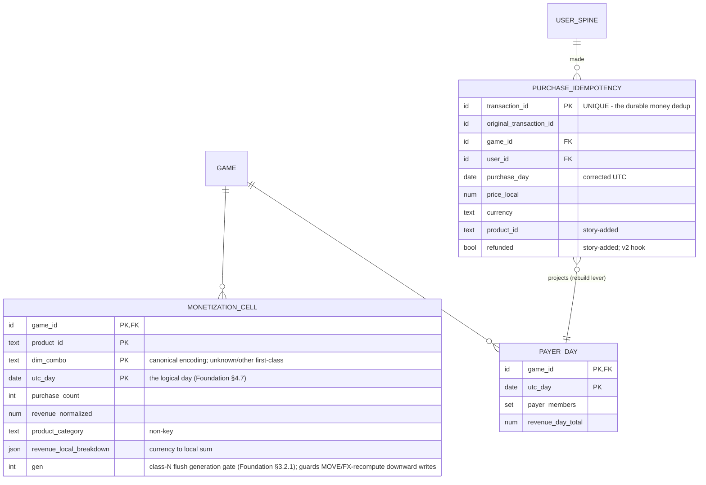

# Segmented Monetization (US4) — Design

**Part of:** [001-analytics-platform](../001-analytics-platform/spec.md) · **Story spec:** [spec.md](./spec.md)
**Realizes:** the shared Foundation backbone — [../001-analytics-platform/foundation.md](../001-analytics-platform/foundation.md) — with the Phase-05 additions below.
**Money seam:** bridge [05.5-purchase-accept-contract.md](../001-analytics-platform/bridges/05.5-purchase-accept-contract.md).

---

## Design

**Base**: the Foundation backbone applies verbatim — envelope (Foundation §1.1), op-ordering (Foundation §3.1), flush (Foundation §3.2), seal/quarantine (Foundation §4.3), two dedup regimes (Foundation §4.1). This section states only Phase-05 **additions**. Every day below is the skew-corrected UTC day (Foundation §4.2).

### ER / data model

**Owned entities — three, one per role:**

| Entity | Role | Grain (key) | Non-key attributes | Write path |
|---|---|---|---|---|
| `PURCHASE_IDEMPOTENCY` | **idempotency-key table** (money uniqueness keys — not spine, not result; Foundation §1.3) | one row per accepted purchase; `transaction_id` **Postgres UNIQUE** | Foundation §1.2 set: `original_transaction_id`, `game_id`, `user_id`, `purchase_day`, `price_local`, `currency` — plus story-added `product_id` (audit + day-total re-derivation) and `refunded` (default false; gross-only v1, the v2 net-revenue hook) | **durable-immediate** — insert-if-absent, `ON CONFLICT DO NOTHING` (op-order step 6) |
| `MONETIZATION_CELL` | **result table** | game × `product_id` × `dim_combo` × UTC-day | `purchase_count`, `revenue_normalized`; `product_category` (non-key, enables read-time category marginalization); `revenue_local_breakdown` (currency → local-amount sum — the unsealed re-normalization source, realizing §4's "raw local + currency retained separately" at cell grain) | **flushed** (Foundation §3.2) |
| `PAYER_DAY` | **result / projection** (rebuildable from `PURCHASE_IDEMPOTENCY` by a key-table scan — Foundation §1.3) | game × UTC-day | `payer_members` (exact set v1; HLL is the scale lever, Foundation §9.2), `revenue_day_total` | **flushed** |

- **Spine touches: none owned.** A purchase **never** creates `USER_SPINE.first_seen` (Q1 ratified 2026-07-17: only 02's first-session path seeds it — bridge [02.5](../001-analytics-platform/bridges/02.5-activeness-spine-contract.md) §6) and **never** sets `active_days_bitmap` (activeness = session-start only, Foundation §7). A purchase-before-first-session (or never-sessioned payer) therefore has **no spine row** — money is spine-independent; `days_since_install` / `install_cohort` resolve to `unknown` (first-class) until/unless a session arrives. `PAYER_SPINE_EXT` (`first_purchase_day` + `lifetime_spend_normalized` — Q3) / `PAYER_PERIOD_SPEND` are [007-derived-kpis](../007-derived-kpis/spec.md)-owned, written by 06 on this story's purchase-accept signal (see Worker flow); they key `(game_id, user_id)` as a logical association, not an enforced spine-parent FK.
- **Cardinality.** `PURCHASE_IDEMPOTENCY` grows with purchases, permanently (payer-scale, ≪ event-scale). `MONETIZATION_CELL` is bounded by products × active-dim-value combos × days — the per-value cardinality guardrail on free-form dims (`in_game_state`, metric sheet) is the sprawl brake. `PAYER_DAY` is one row per game-day.
- **Rebuild floors.** `PAYER_DAY` rebuilds exactly from the idempotency table (spend, payer set, day totals are all per-txn durable). `MONETIZATION_CELL` does **not** — dimension resolution is join-time-only, so its sole recovery floor is the raw day file; this is precisely why every dimension knob is forward-only (§6).

**`dim_combo` — canonical encoding (stable cell keys).** For the game's active dimension set at count time: every active dimension appears **exactly once**, in **fixed lexicographic order of dimension name** (never config-declaration order — reordering the config must not re-key cells), rendered `name=value`, `|`-joined; an unresolvable value is the literal `unknown`, never omitted; a client value over the per-dimension cardinality budget collapses to the literal `other` (cardinality guard, Design §; `other` ≠ `unknown`). Values are sanitized (`|`/`=` escaped) and cardinality-capped. Example: `in_game_state=out_of_energy|region=EU`. On a `monetization_dimensions` change (**rebuild-forward**, §6): cells written after the change carry the new set's encoding; sealed cells keep their old keys; a read for dimension `D` simply matches cells whose encoding contains a `D=` component — pre-change cells fall out of that slice and are surfaced as a coverage caveat, not an error.

### Redis structures

All per Foundation §2.1 grammar / §2.2 palette / §2.3 lifecycle (incl. rehydrate-on-miss). Cell key inside hashes = `{product_id}#{dim_combo}` (`#` separator because `dim_combo` uses `|` internally; product ids sanitized).

| Key | Type | Content | TTL | Fate |
|---|---|---|---|---|
| `{game_id}:mon:{logical_day}:cnt` | hash | field = cell key, value = running `purchase_count` | ~72 h from day end | **flushes → class N** (Foundation §3.2.1 — the enrichment MOVE decrements it): generation-gated Lua-snapshot upsert → `MONETIZATION_CELL.purchase_count`; **never `GREATEST`** |
| `{game_id}:mon:{logical_day}:rev` | hash | field = cell key, value = running normalized-revenue sum | ~72 h | **flushes → class N** (MOVE + FX recompute both mutate it) → `revenue_normalized` |
| `{game_id}:mon:{logical_day}:loc` | hash | field = `{cell key}#{currency}`, value = running local-amount sum | ~72 h | **flushes → class N** (MOVE moves it) → `revenue_local_breakdown` |
| `{game_id}:payer:{logical_day}` | set | distinct payer `user_id`s that day | ~72 h | **flushes → class S** (Foundation §3.2.1): `PAYER_DAY.payer_members` via **set-union** (never blind replace) |
| `{game_id}:rev:{logical_day}` | hash | `total` = running normalized day sum; `loc:{currency}` = per-currency day local sums | ~72 h | **flushes → class N** (FX recompute mutates) → `PAYER_DAY.revenue_day_total` |
| `{game_id}:mon:{logical_day}:meta` | hash | `gen` = per-bucket monotonic generation, `INCR`'d inside every enrichment-MOVE and FX-recompute atomic block; seeded from the durable row's generation on rehydrate; read atomically with the cells in the class-N flush snapshot | ~72 h | not flushed as data — carries the `gen` gate (Foundation §3.2.1 class N) |
| `{game_id}:stage:{purchase_attempt_id}` | hash per pending key (Foundation §2.2, "05 only") — keyed by the SDK-minted **`purchase_attempt_id`** (the context-join key), not `transaction_id`, since a companion arrives without the store id | `srv:*` fields — product, counted `dim_combo`, normalized amount, `purchase_day` (doubles as the **applied-marker**); `cmp:*` fields — companion dims held pre-join | **48 h**, capped at the purchase day's seal | **transient-and-losable** — loss forfeits late enrichment and crash-resume detection only, never money |

- **Rehydrate-on-miss** (Foundation §2.3) seeds `cnt`/`rev`/`loc` from `MONETIZATION_CELL` (incl. `revenue_local_breakdown`) and `payer`/`rev` from `PAYER_DAY` — mandatory for FX recompute and absolute flush to stay safe post-crash.
- **Money truth is never here** (§5): a total Redis loss costs ≤ flush-cadence display drift plus staged enrichment; `PURCHASE_IDEMPOTENCY` + the write-ahead raw file guarantee no purchase is lost or double-counted.
- **Dedup markers:** companions use 01's `{game_id}:dedup:{event_id}` windowed marker (non-money); the durable gate is server-rows-only. No ranking zsets are stored — top-N is read-time (Foundation §3.3).

### Worker / pipeline flow

Additions to Foundation §3.1 at steps 3, 6, 7, 8 (steps 1–2, 4–5, 9 unchanged; both sides feed 01's catalog/day counts like any accepted event, Foundation §8.7).

**Step 3 — strict `purchase` validation (→ quarantine, Foundation §4.3–4.4).** The reserved name always routes strict, even malformed. `source` selects the sub-contract:
- `source=server` (revenue row): required per §3 — `transaction_id`, `original_transaction_id`, `product_id`, `product_category`, `price_local`, `currency`, `verified`, `environment`, `user_id`. Any missing / type-invalid → quarantine + `quarantined_typed` tally.
- `source=client` (companion): required — `purchase_attempt_id` only (the SDK-minted join key; the client often lacks the store `transaction_id` at purchase-context time). Money-shaped fields on a companion are **ignored, never summed** (zero-money invariant). The client sends raw `player_level`; the worker buckets it against `level_bucket_boundaries` at join time (the config lives server-side).
- `source` missing/invalid → quarantine — the trust-boundary field cannot default.

**Step 6 — two gates, in this order (server rows only).**
- **6a — eligibility filter:** `verified=true` AND `environment=prod` (per `sandbox_excluded`). Ineligible → **stop**: zero revenue, no idempotency insert, no steps 7–8 — but *not* an exception (the row was raw-appended at step 4 and counted by 01's catalog; the raw file is the audit floor for `verified=false` rows). Running 6a **before** 6b is deliberate: an unverified/sandbox row must never consume a `transaction_id` slot, or a later *verified* retry of the same transaction would be conflict-dropped and money silently lost.
- **6b — durable gate:** insert `PURCHASE_IDEMPOTENCY` if absent. On conflict, consult `stage:{purchase_attempt_id}` `srv:*`: marker **present** → true duplicate → **stop** (worked-example row 8). Marker **absent on an unsealed day** → crash-retry resume — the prior attempt died between the durable insert and its Redis writes; proceed to steps 7–8 (safe to re-run: step-7 consumers are idempotent per `transaction_id`, step 8 executes atomically with the marker).
- Companions skip both gates; they pass only 01's windowed `event_id` gate (Foundation §4.1).

**Step 7 — durable-immediate + the [007-derived-kpis](../007-derived-kpis/spec.md) handoff.**
- **`payer_tier` is stamped pre-purchase:** read 06's payer state *as of before this purchase* (`PAYER_SPINE_EXT` existence; **`lifetime_spend_normalized`** vs `payer_tier_rule` fixed thresholds — Q3 ratified 2026-07-17, lifetime not period) → `first`/`repeat`/`whale`. Tiering happens at count time and is never retro-applied (§6); the spine stores spend, never the tier label, so threshold edits re-tier all future reads at zero migration cost.
- **FX-parked spend → ABSTAIN, never deflate (added 2026-07-17 — the whale-mis-tier fix).** `lifetime_spend_normalized` is a Σ over *converted* rows; a purchase parked unconverted (`fx_unconverted`, missing/over-cap FX rate) contributes **0** to it. Reading a fixed-dollar tier off that undercount would classify a real whale as a minnow — and it hits hardest exactly in thin-FX/exotic-currency markets (the operator's own market under sanctions). So the payer carries a **`has_unconverted_spend`** flag on `PAYER_SPINE_EXT` (set true whenever a parked purchase commits for that payer, cleared when the parked amount later converts pre-seal — the existing unsealed FX recompute already revisits it). While the flag is true, the payer's tier reads **`indeterminate`** (a first-class tier value, never silently `minnow`), because their true lifetime spend is a lower bound, not a known value. When the parked amounts convert (rate lands, or operator adds the currency to `fx_table`), the recompute adds them to `lifetime_spend_normalized`, clears the flag, and the tier resolves normally on the next read. This is the same "abstain on unknown, never collapse unknown→0" posture the `unknown` dimension slice and the parked-revenue handling already use. Downstream (06 whale-share, payer-tier segmentation) treats `indeterminate` as its own bucket, never folded into `minnow`.
- **Purchase-accept signal — the handoff point (normative contract: [bridge 05.5](../001-analytics-platform/bridges/05.5-purchase-accept-contract.md)):** emitted after 6b success (or resume), carrying `(game_id, user_id, transaction_id, purchase_day, price_local, currency, normalized_amount, product_id)` — `original_transaction_id` rides the idempotency row (consumers read it there); `is_first_purchase` is **derived by 06's own write-once insert**, never signal-trusted. 06's step-7 code consumes it in-worker; its two writes (`PAYER_SPINE_EXT.first_purchase_day` write-once; `PAYER_PERIOD_SPEND` increment) are **bound into the same atomic unit as the 6b gate insert**. Delivery is at-least-once (crash-resume may re-emit) but application is **exactly-once**: duplicates die at the gate and a crashed unit fully re-runs or fully no-ops (05.5 §1).

**Step 8 — the `transaction_id` join + rollup (one atomic Redis block per event).**
- *Server row (companion may already be staged):* resolve each active dimension — **client-only dims** (`level_bucket`, `region`, `in_game_state`, `sessions_before_purchase`) from staged `cmp:*` if present, else `unknown`; **server dims** (`payer_tier`, `install_cohort`) derived from spine/06 state, never client-supplied; **`days_since_install` server-wins** from `first_seen` **when a spine row exists**, else `unknown` (Q1: never-sessioned payer). All client-only dimension values pass the **cardinality guard** (below) before keying. Stamp FX at purchase date under **as-of lookup** (Q8): `rate = fx_rate(currency, purchase_day)` = the most recent `FX_RATE` row with `rate_date ≤ purchase_day`, valid iff `purchase_day − rate_date ≤ fx_staleness_max_days`. Three-way normalization:
  - **fresh/valid rate** → `normalized = price_local × rate`.
  - **within-cap stale rate** (a carried-forward weekend/holiday rate) → normalize + tally `fx_stale_rate_used`.
  - **missing / over-cap rate** → **park unconverted**: contribute **0** to `rev`, tally `fx_unconverted`; the amount still increments `cnt`, `loc` (per-currency local), the `payer` set, and day `loc:*` totals. Revenue count-vs-normalization degrade independently — nothing is dropped, money is never blocked (the same never-block posture as the `unknown` dimension slice).

  Then atomically: increment cell `cnt`/`rev`/`loc`, add payer to `payer` set, add to `rev` day totals, write `srv:*` staging, clear consumed `cmp:*`.
- *Companion — three cases (both arrival orders + never-arrives):*
  - `srv:*` staged **and the purchase's day unsealed** → **enrichment move**: recompute `dim_combo` replacing only client-sourced components (server-derived components are frozen at count time); if changed, atomically decrement the old cell's `cnt`/`rev`/`loc` and increment the new cell's, update `srv:dim_combo`. A move conserves count and revenue — enrichment never changes money.
  - no staging but `transaction_id` exists in `PURCHASE_IDEMPOTENCY` → enrichment window missed (seal, staging TTL, or Redis loss) → tally + stop; revenue was already correctly counted, reduced dims stand.
  - neither → **orphan**: write `cmp:*` staging, TTL 48 h; expiry leaves it inert (worked-example row 10 — zero money, never creates a cell).
  - *Never-arrives:* nothing to do — the server row was counted with `unknown` client dims at accept time and stands into seal (worked-example row 7).
- **Seal governance:** a cell's mutability follows the **purchase's** corrected day (Foundation §2.3), not the companion's own day — the step-5 check on the companion's own envelope is necessary but not sufficient; the join path re-checks the purchase day and quarantines post-seal companions (`sealed_late`).
- **FX correction (unsealed days only):** on an `fx_table` edit **or when a previously-missing rate lands**, recompute each open cell's `rev` from its `loc` per-currency sums × corrected as-of-day rates — this **converts previously-parked (`fx_unconverted`) amounts** automatically, since `revenue_local_breakdown` retained the local amount; the seal-window recompute IS the "retry until a rate appears" behavior, bounded by seal and never delaying counts/payer-sets/the 06 signal. Day totals likewise recompute from `rev` `loc:*` (cross-checkable against the idempotency table); the next flush carries the absolutes. Sealed days keep whatever was applied at seal (a carried-forward rate, or parked-unconverted) and are never re-normalized (§6).

**Residual display drift — RESOLVED (2026-07-17, Q6): accept-with-reconciliation, promoted to normative.** The 6b resume rule closes the common crash-retry gap, but worker crash + flush + Redis loss inside one flush window can still leave `MONETIZATION_CELL` off by that in-flight purchase — **display cells only**; the idempotency truth and `PAYER_DAY`'s rebuild floor are unaffected. This residual is **accepted**: live open-day cells may lag durable truth by at most the in-flight purchases of one flush window, only under that compound failure; sealed days are exact. This is the standard analytics contract, not a defect — GA4 openly marks intraday/live data mutable for 24–48 h (revenue included, "not an SLA"); Stripe's own money pipeline reconciles its immutable ledger over a multi-day window; Lambda-architecture doctrine names the speed layer approximate and the batch layer corrective. Our worst case (~5 min of one game's purchases, corrected within 48 h) sits comfortably inside every surveyed norm.

**The reconciliation check is now a required job, not an optional default** (was parenthetical): (a) periodically on open days and (b) **mandatorily at seal**, compare Σ `MONETIZATION_CELL.revenue_normalized` per game-day against the sum re-derived from `PURCHASE_IDEMPOTENCY` (`price_local` × as-of-day FX, excluding/segregating `fx_unconverted`-parked amounts — the invariant that always holds is on the **local** sums, `loc` vs idempotency `price_local` per currency; the normalized comparison must account parked amounts separately). On mismatch: rebuild `PAYER_DAY` exactly (its stated rebuild floor); for `MONETIZATION_CELL` (whose only exact floor is the raw day file) repair by pre-seal raw-day-file replay or by booking the delta into the all-`unknown` `dim_combo` cell (money exact, dimensions degraded — consistent with "revenue never blocked on context / `unknown` is first-class"). **A day seals only after the check passes or the repair is applied**, making "sealed = exact" a checked invariant. Drift is surfaced as an ops metric (per-game-day absolute + relative delta; "reconciliation repaired N cells" counter). *Rejected — with precedent: a transactional outbox (protects only a display cache whose truth is already durable upstream at 6b + the write-ahead raw file; adds a relay component + outbox-table growth + per-purchase write amplification for ≤ one flush window of exactness on an already-provisional surface — the textbook "when not to use it"); and Postgres-computed live views (moves per-request aggregation onto the durable store, defeating the hot-path Redis layer no surveyed product computes its live dashboard from its ledger of record). Sources: GA4 data-freshness docs · Stripe Ledger engineering blog · Lambda-architecture doctrine · microservices.io/AWS transactional-outbox guidance.*

### Cardinality guard (per-dimension observed-value cap)

Client-supplied dimension values — `region`, `in_game_state`, and any free-form slicing dim on the companion — are an **attack/sprawl surface**: a buggy or hostile client can emit unbounded distinct values, exploding `MONETIZATION_CELL`'s `dim_combo` key-space. The guard mirrors the catalog's drop-and-count posture (Foundation §4.4 name-cap; the economy currency cap):

- **Per game × dimension**, the first `monetization_dimension_value_cap` (default **50**, per-dimension-overridable) distinct observed values for that dimension are kept as first-class `dim_combo` components; every value beyond the cap collapses to the literal **`other`** in that dimension's slot (distinct from `unknown`, which means "not supplied" — `other` means "supplied but over the cardinality budget"). An `{game_id}:mon:dimcard:{dim}` registry set (or HLL under the scale lever) tracks observed values per dimension for the cap decision; the `other` overflow is counted so operators see how much traffic it absorbs.
- **Server dims are exempt** (`payer_tier`, `install_cohort`, `days_since_install` — platform-derived, bounded by construction). The guard applies only to client-supplied values.
- **Knob + effective-time:** `monetization_dimension_value_cap` is **forward-only** (rebuild-forward, §6) — like every dimension knob, a change affects cells written after it; sealed cells keep their old encoding, and a value that was first-class before a cap decrease is not retro-collapsed. Raising the cap admits new distinct values going forward; it never recovers values already folded into `other`.
- One-line shared-convention note lives in Foundation §2/§9 (the observed-value-cap-with-`other`-overflow pattern, mirroring the name/currency caps).

### API / contract surface

**Ingest — both sides ride the one batch front door** (Foundation §3): canonical envelope (Foundation §1.1), `kind=purchase`, payload in `props`, fast-ack unchanged (acceptance is decided in the worker, never the API).

| Side | Contract | Contributes | Failure modes |
|---|---|---|---|
| **Server SDK** — authoritative revenue row | required fields per §3 (step-3 list); optional `refunded`, server-derivable dims | money, server dims, the `PURCHASE_IDEMPOTENCY` row, the 06 signal | missing required → **quarantine**; `verified=false` / `sandbox` → accepted-but-ineligible (zero revenue, raw-audit only); duplicate `transaction_id` → durable no-op |
| **Client SDK** — zero-money companion | `transaction_id` (join key, required) + optional `player_level` (→ `level_bucket`), `region`, `in_game_state`, `sessions_before_purchase` (client counter — low-trust, slicing only, never money), `days_since_install` (server wins) | dimension enrichment only — **never creates a cell alone, contributes zero money** | missing `transaction_id` → quarantine; orphan → inert after 48 h; post-seal → quarantine |

**`source=server` trust — resolved into Foundation §4.5 (amendment landed).** The trust boundary is never a body field: provenance derives from the **credential class** — `GAME.sdk_key` (client scope) vs `GAME.server_credential` (server scope, now in Foundation §1.2) — mirroring "`game_id` is server-derived from SDK-key auth" (Foundation §1.1). The body `source` still selects which payload sub-contract applies, but `source=server` is **honored only under the server credential**; a mismatch is a validation failure. [004-economy](../004-economy/spec.md) cites the same section. Remaining contingency: the F-3 key-class decision (Foundation §9.5) — until settled the fallback classification is `client`, under which no purchase row is revenue-eligible.

**Dashboard read-model** (reads, never stored; live-vs-historical per Foundation §3.3 — sealed days from Postgres, open days merged from `mon`/`payer`/`rev` buckets with last-flush fallback):
- **Top package by `<D>`** (measure ∈ {revenue, count}; period): over `MONETIZATION_CELL` rows in period whose `dim_combo` contains a `D=` component — group by (value of `D`, product), sum measure, rank within each value. The marginalize-and-rank read of §2; rankings are display-time only. **Simpson's-paradox guard (added 2026-07-17):** a cross-dimension "which package/segment wins" readout can **reverse** under aggregation when dimension combos carry unequal weight — and the `unknown` slice (missing companion) is a **non-random** confounder (companion delivery correlates with connectivity → region/device). So the UI (a) **never auto-declares a "winning" package** from aggregated segmented data — it surfaces the per-value ranking and lets the operator compare within a fixed combo; (b) shows the **`unknown` share** alongside every segmented comparison (a large share = comparison untrustworthy); (c) labels cross-combo comparisons as subject to composition effects. Genuine comparisons hold confounders fixed (compare within one `dim_combo`) rather than trusting a raw aggregate.
- **`unknown` / `other` — first-class slices:** `D=unknown` (not supplied) and `D=other` (supplied, over the cardinality budget — Design §) both rank like any other value and are never filtered by default; the two are distinct signals (missing-context vs value-sprawl).
- **Unconverted revenue by currency (Q8):** `Σ loc` for `fx_unconverted`-parked amounts, per currency — the sibling of context-coverage health; a day sealing with parked revenue is an operator-actionable signal (FX fetcher down / currency absent from the table), not an error.
- **Context-coverage health:** per client-only dim `D`: `1 − measure(D=unknown) / measure(total)`; plus overall full-context share (revenue in cells with no `unknown` among active client-only dims). Direct read — the companion-delivery health signal (metric sheet).
- **Revenue & payers by day:** `PAYER_DAY` → `revenue_day_total`, `|payer_members|`.
- **Dimension-era caveat:** after a `monetization_dimensions` change, pre-change cells lack the new dim's component and drop out of its slices; the read reports per-period dimension coverage rather than pretending continuity (rebuild-forward, §6).

### Relations with other stories

- **Owns:** `PURCHASE_IDEMPOTENCY` (durable-immediate), `MONETIZATION_CELL` + `PAYER_DAY` (flushed); Redis domains `mon`, `payer`, `rev`, `stage`; the strict `purchase`-kind validation contract; the purchase-accept signal.
- **Writes (shared):** none directly — `EXCEPTION_TALLY` reasons (`quarantined_typed`, `sealed_late`) are written by the shared backbone machinery (01's path) on this story's verdicts; 06's payer structures are written by 06's own step-7 code on the accept signal, never by 05.
- **Reads:** `USER_SPINE.first_seen` ([005-retention](../005-retention/spec.md)) — `days_since_install` / `install_cohort` **when a spine row exists**, else `unknown` (Q1); `PAYER_SPINE_EXT.lifetime_spend_normalized` ([007-derived-kpis](../007-derived-kpis/spec.md)) — pre-purchase `payer_tier` against `payer_tier_rule` fixed thresholds (Q3); `GAME.config` ([002-foundation-ingest](../002-foundation-ingest/spec.md)) — every §6 knob incl. `fx_table` (as-of lookup), `fx_staleness_max_days`, `monetization_dimension_value_cap`; its own idempotency table (gate, re-derivations, `PAYER_DAY` rebuild, reconciliation). From [003-sessions](../003-sessions/spec.md): **nothing server-side** — `sessions_before_purchase` arrives pre-computed on the companion (client counter, sessions decision); no session history is consulted.
- **Feeds:** **[007-derived-kpis](../007-derived-kpis/spec.md)** — the purchase-accept signal (trigger for `PAYER_SPINE_EXT` / `PAYER_PERIOD_SPEND`, incl. the first-purchase signal), `PAYER_DAY` + `MONETIZATION_CELL` (ARPU/ARPPU/ARPDAU/whale numerators), `PURCHASE_IDEMPOTENCY` as the payer-set source (Foundation §5); **dashboard** — the read-model above; **[008-cold-storage](../008-cold-storage/spec.md)** — nothing beyond backbone raw appends (incl. this story's quarantine tail).
- **Ordering / lifecycle:** (1) `first_seen` insert (backbone step 7 first-touch) precedes dimension resolution — a first-ever-event purchase yields `days_since_install=0`, cohort = purchase day. (2) The `payer_tier` read precedes the accept signal (pre-purchase state), which precedes 06's spend update — normative, or `first` tiers misclassify. (3) Purchases never set `active_days_bitmap` (Foundation §7). (4) Enrichment lifecycle: count-time reduced dims → companion may re-key until the purchase day's seal → seal freezes; staging TTL is aligned to the seal. (5) All dimension/FX knobs are rebuild-forward (§6); sealed cells keep old keys and old FX.
- **Flagged bridges (Stage-3 dispositions):**
  - **purchase-accept ↔ payer-state (05↔06)** — **created: [`05.5-purchase-accept-contract.md`](../001-analytics-platform/bridges/05.5-purchase-accept-contract.md)** — the atomic-unit/exactly-once statement, signal payload, `payer_tier` read-before-write ordering, and the payer-tier cumulative-spend decision (Q3 — **lifetime** `lifetime_spend_normalized`, resolved 2026-07-17) all live there.
  - **server-credential trust (01↔03↔05)** — **folded into Foundation §4.5** (amendment landed; **F-3 resolved 2026-07-17, Q2**): credential-class-derived provenance via the secret `GAME_SERVER_CREDENTIAL` (two-class model, phase 10); no bridge file needed.
  - *Not flagged as a bridge:* refund/chargeback ingestion (store server notifications → `refunded`, net revenue) is a v2 ingest surface, carried only as the `refunded` hook on `PURCHASE_IDEMPOTENCY` (§D-1).
