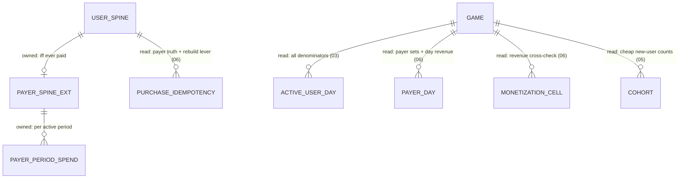

# Derived KPIs (DAU/ARPU/whale) — Design

**Spec:** [spec.md](./spec.md) · **Part of:** [001-analytics-platform](../001-analytics-platform/spec.md)
**Realizes:** the shared [foundation](../001-analytics-platform/foundation.md) backbone (§1.2 names, §1.3 spine tiers, §2 Redis, §3 pipeline, §4 seal, §5 durability, §9 retention).
**Normative bridge:** [bridge 05.5 — purchase-accept contract](../001-analytics-platform/bridges/05.5-purchase-accept-contract.md).

---

*Realizes §4/§5 (of [spec.md](./spec.md)) on the Foundation backbone. Posture: **pure consumer** — this story owns no event kind, no Redis domain, no SDK field, and stores no KPI value. Its entire durable footprint is the two payer-bounded structures below; everything else is read-only references to other stories' structures by their [foundation](../001-analytics-platform/foundation.md) §1.2 names.*

## ER / data model

**Owned entities (the whole footprint — [foundation](../001-analytics-platform/foundation.md) §1.3 tier 2, payer-bounded):**

| Entity | Key | Attributes (logical) | Cardinality / bound | Nature |
|---|---|---|---|---|
| `PAYER_SPINE_EXT` | (`game_id`, `user_id`) | `first_purchase_day` — **write-once** logical day of the payer's first-ever verified prod purchase; `lifetime_spend_normalized` — monotonic cumulative converted spend (Q3); `has_unconverted_spend` — **bool** flag set when a parked (`fx_unconverted`) purchase commits, cleared when it later converts pre-seal (06 step 7 — the whale-mis-tier abstention: while true, `payer_tier` reads `indeterminate`, never a deflated `minnow`) | ≤ 1 row per user, exists **iff ever paid** (payers ≪ users) | **Spine touch** — the tier-2 payer extension ([foundation](../001-analytics-platform/foundation.md) §1.3); mirrors the retention set-once bit |
| `PAYER_PERIOD_SPEND` | (`game_id`, `period`, `user_id`) | `spend_normalized` — cumulative verified-prod spend, normalized under 06's FX rule ([foundation](../001-analytics-platform/foundation.md) §D-2, stamped at purchase date) | one row per payer × period **with ≥ 1 purchase in that period** ≈ payers × active periods (thousands/period at indie scale, never user-bounded) | Formally tier-2 spine; **in kind a result** — a rebuildable **projection of `PURCHASE_IDEMPOTENCY`** (+ dated FX config), exactly as `PAYER_DAY` is ([foundation](../001-analytics-platform/foundation.md) §1.3) |

**`period` semantics (v1, locked here):** `period` = **UTC calendar month** (`YYYY-MM`). Chosen over a trailing window because trailing whale windows would force payer×**day** spend grain (~30× the rows — the WC-1 containment this story rejects); calendar month is the coarsest grain that preserves the full distribution. A period's rows are **mutable while any of its days is unsealed** and freeze at `period_end + 48 h` — purely a consequence of the day-seal ([foundation](../001-analytics-platform/foundation.md) §4.3) sitting upstream of every write; **no period-level seal machinery exists**. The current month is provisional by construction; sealed months are immutable.

**WC-1 posture (consistent with §6):** v1 retains the **full per-payer distribution** — every payer's row, never a top-k prefix. That is precisely what makes `whale_top_percents` **retroactive** (a read-time re-rank of stored rows, no re-scan) for every retained period; adopting a top-k prefix later would flip the knob forward-only (§6 rule).

**Everything else is read-only.** Active denominators from `ACTIVE_USER_DAY` ([003-sessions](../003-sessions/spec.md)); money numerators, payer sets, and the money-truth spine from `PAYER_DAY` / `MONETIZATION_CELL` / `PURCHASE_IDEMPOTENCY` ([006-monetization](../006-monetization/spec.md)); new-vs-returning from `USER_SPINE.first_seen` + `COHORT` ([005-retention](../005-retention/spec.md)). Every §2 formula is a read-time computation over these cells — never a stored value ([foundation](../001-analytics-platform/foundation.md) §3.3).



**Recovery / re-normalization lever:** both owned structures re-derive from `PURCHASE_IDEMPOTENCY` (`user_id`, `purchase_day`, `price_local`, `currency` + the dated FX table) — a spine-family re-scan, never a raw re-scan. The same lever refreshes affected `PAYER_PERIOD_SPEND` rows if 06 re-normalizes an **unsealed** day under a corrected FX table; sealed periods are never re-normalized (§6 `revenue_currency`).

## Redis structures

**This story owns no Redis keys.** No domain tag under [foundation](../001-analytics-platform/foundation.md) §2.1, no dedup markers of its own (it rides monetization's durable `transaction_id` gate), no hot accumulators. Rationale (§5): the whale distribution is money-derived period state whose correctness must not depend on Redis — both durable writes go straight to Postgres at step 7 — and a period-cumulative cell cannot legally live in an open-day bucket anyway (a period spans ~30 days; [foundation](../001-analytics-platform/foundation.md) §2.3 binds every incremental cell to exactly one corrected-UTC-day bucket).

What it **reads** (owners' keys, open days only; [foundation](../001-analytics-platform/foundation.md) §3.3 does the live-vs-flushed merge once):

| Key (owner's pattern, §2.1) | Type | Owner | Used for |
|---|---|---|---|
| `{game_id}:act:{utc_day}` | set | [003-sessions](../003-sessions/spec.md) | live DAU; today's tail of WAU/MAU unions; live denominators (ARPDAU, conversion, stickiness) |
| `{game_id}:payer:{utc_day}` | set | [006-monetization](../006-monetization/spec.md) | live distinct-payer count (today's conversion / ARPPU) |
| `{game_id}:rev:{utc_day}` | counter | [006-monetization](../006-monetization/spec.md) | live revenue numerator (today's ARPDAU / ARPU) |

Layouts, TTLs, and rehydrate-on-miss for these are their owners' concerns; this story treats them as opaque day-scoped read surfaces.

## Worker / pipeline flow

**No new backbone, no new kind route, nothing at steps 1–6, zero step-8 additions.** This story's entire pipeline presence is one **step-7 addition on the purchase-accept signal** ([foundation](../001-analytics-platform/foundation.md) §3.1).

**The coupling point (explicit).** "Purchase accept" = monetization's durable `transaction_id` insert-if-absent at step 6 **succeeding**. This story's writes execute **in-band, in the same worker step 7** — not via a downstream consumer. *Rejected:* a BullMQ fan-out consumer — it would need its own delivery guarantee and dedup for money-derived state, re-opening exactly the problem the gate just closed; in-band keeps a single atomic unit possible (normative contract: [bridge 05.5](../001-analytics-platform/bridges/05.5-purchase-accept-contract.md)). [foundation](../001-analytics-platform/foundation.md) §5 now records these two structures as **durable-immediate (both), gate-coupled on monetization's purchase-accept signal** — the resolution this design requested (amendment landed; a flush-mediated period accumulator would violate §2.3's one-cell-one-day-bucket rule).

On each accepted purchase (corrected day `d`, month `M(d)`), appended to step 7:

1. **`PAYER_SPINE_EXT.first_purchase_day` write-once** — insert-if-absent with `d` (idempotent absolute, mirrors the §B set-once bit). Never backdated: a purchase for a sealed day was quarantined at step 5 and never reaches this write.
2. **`PAYER_SPINE_EXT.lifetime_spend_normalized += normalized_amount`** (Q3, ratified 2026-07-17) — the payer-tier source read pre-purchase by monetization against `payer_tier_rule` fixed thresholds; monotonic non-decreasing; a 0/parked `normalized_amount` (missing FX rate, Q8) adds nothing **and sets `has_unconverted_spend = true`** (the whale-mis-tier abstention, 06 step 7) — so the tier reads `indeterminate` rather than a deflated value until the parked amount converts (the unsealed FX recompute then adds it and clears the flag). Never let a parked (unknown-value) purchase read as $0 through the fixed-dollar tier gate.
3. **`PAYER_PERIOD_SPEND[game, M(d), user] += normalized_amount`** — the three writes above are bound into the **same atomic unit as the step-6 gate insert**: gate row + first-purchase write + lifetime-spend add + period-spend add commit together or not at all.

**Idempotency argument.** Duplicate purchases cannot double-add spend because the `transaction_id` gate sits **upstream**: a duplicate stops at step 6 and step 7 never runs. A worker crash mid-purchase either re-runs the whole atomic unit (nothing committed) or no-ops at the gate (everything committed) — so the spend add is **exactly-once**, deliberately stronger than step 7's "idempotent absolute" letter, which a cumulative money distribution requires (an increment is not intrinsically idempotent; the gate makes it so). **Spine-independence (Q1, 2026-07-17):** the payer family keys `(game_id, user_id)` as a logical association — it does **not** require a `USER_SPINE` row to exist first (a purchase-before-first-session, or a never-sessioned payer, is valid; `first_seen` is seeded only by [003-sessions](../003-sessions/spec.md)'s session path, so it may be absent or later than `first_purchase_day`). The old "front-door `first_seen` precedes" ordering claim is retired; only `PAYER_SPINE_EXT → PAYER_PERIOD_SPEND` existence order matters, and it holds within the atomic unit.

**Read-time / window computation (the story's other half — computed at read, never stored):**

```
DAU(d)         = |ACTIVE_USER_DAY(d).members|                (open d: 03's act set, live)
WAU/MAU(d)     = |∪ ACTIVE_USER_DAY[d−6..d] / [d−29..d]|     (set-union across days, exact v1)
PayingUsers(P) = |∪ PAYER_DAY[P].payer_members|              (window-union, exact v1)
Revenue(P)     = Σ PAYER_DAY[P].revenue_day_total            (≡ Σ MONETIZATION_CELL — read-time cross-check)
WhaleShare(X,M)= rank PAYER_PERIOD_SPEND[M] desc → Σ top ⌈X%·payers⌉ ÷ Revenue(M)
New(d)         = |ACTIVE_USER_DAY(d).members ∩ {first_seen = d}|   (cheap variant: Σ COHORT.cohort_size)
FirstConv(P)   = |{first_purchase_day ∈ P}| ÷ configured denominator
```

**HLL lever (named, never default):** if exact daily membership outgrows retention, per-day HLL sketches replace member sets and window unions become **HLL merges** — approximate WAU/MAU/period-payers, exact DAU counts kept, **money never approximated** ([foundation](../001-analytics-platform/foundation.md) §2.2, §9.2). Flipping it also degrades New/Returning to the `COHORT.cohort_size` variant. Whale ranking is a read-time sort of durable rows; zsets, if used at all, are display-time only ([foundation](../001-analytics-platform/foundation.md) §2.2).

## API / contract surface

**No new SDK event, no new envelope field, no reserved kind — the ingest contract is untouched by this story.** Its entire surface is the dashboard read-model (NestJS dashboard API → NestJS Panel); live-vs-historical follows [foundation](../001-analytics-platform/foundation.md) §3.3 uniformly (sealed days from Postgres, open days live from the owners' Redis keys with last-flush fallback, today marked provisional).

| KPI | Reads (stored structures) | Window | Masking / flags |
|---|---|---|---|
| DAU(d) | `ACTIVE_USER_DAY(d)` (live: 03's `act`) | 1 UTC day | today provisional |
| WAU(d) / MAU(d) | ∪ `ACTIVE_USER_DAY` trailing 7 / 30 | trailing, ends on report day | **masked N/A** until window fully elapsed (`partial_window_mask`); exact v1, HLL lever |
| Stickiness(d) | DAU(d) ÷ MAU(d), same day | — | masked with MAU; N/A when MAU = 0 |
| ARPU(P) | Σ `PAYER_DAY.revenue_day_total` ÷ active-union | revenue period **pairs** with same-length active window (DK-5) | gross-labeled (§D-1) |
| ARPPU(P) | same numerator ÷ ∪ `PAYER_DAY.payer_members` | paired | N/A when 0 payers |
| ARPDAU(d) | day revenue ÷ DAU(d) | 1 UTC day | the only sanctioned day-numerator ratio; today provisional |
| Conversion(P) | payer-union ÷ active-union | paired | N/A when DAU = 0 |
| First-purchase conv(P) | count `PAYER_SPINE_EXT.first_purchase_day ∈ P` ÷ denominator | paired | denominator = `arppu_first_purchase_denominator` |
| WhaleShare(X, M) | `PAYER_PERIOD_SPEND[M]` rank + top-X% sum ÷ Revenue(M) | **calendar month** (current month provisional) | **`low_confidence` flag** when `PayingUsers(M) < whale_min_payers` (default 20) — still computed, never hidden; N/A at 0 payers; X retroactive (full distribution retained). Payers with `has_unconverted_spend` (tier `indeterminate`) are surfaced as their own line and **never folded into `minnow`** — their rank position uses their lower-bound spend, flagged as a floor (06 whale-mis-tier fix). |
| New / Returning(d) | `ACTIVE_USER_DAY(d)` ∩ `USER_SPINE.first_seen` (= d / < d) | 1 UTC day | disjoint, sums to DAU |

Calendar-month MAU is a **display-only reprojection** of the same daily sets (DK-1) — never the internal grain. Division-by-zero anywhere renders **N/A, never 0** (§2). Every money figure in this table is server-sourced verified prod only; every active denominator is client-session-sourced (§3 trust boundary) — the read-model has no path that mixes them differently.

## Relations with other stories

- **Owns:** `PAYER_SPINE_EXT`, `PAYER_PERIOD_SPEND` (Postgres, durable-immediate path, written on monetization's purchase-accept signal). No Redis domain, no event kind, no SDK contract surface.
- **Writes (shared):** none — this story writes no structure owned elsewhere.
- **Reads:** `ACTIVE_USER_DAY` + 03's `act` set (all active denominators); `PAYER_DAY`, `MONETIZATION_CELL` (cross-check), `PURCHASE_IDEMPOTENCY` + 06's `payer`/`rev` keys (money numerators, payer truth, rebuild lever); `USER_SPINE.first_seen` + `COHORT` ([005-retention](../005-retention/spec.md), new-vs-returning); `USER_SPINE.active_days_bitmap` only as the reconciliation source behind `ACTIVE_USER_DAY` ([foundation](../001-analytics-platform/foundation.md) §1.3), never on the read path; `GAME.config` (§6 knobs).
- **Feeds:** the dashboard KPI endpoints only — no other story consumes this story's structures in v1 (but see flagged bridge 2, where 06 may need to).
- **Ordering / lifecycle:** this story's step-7 writes fire strictly after (and atomically with) monetization's step-6 `transaction_id` gate success; the payer family is **spine-independent** (Q1) — no `USER_SPINE` row is required, only `PAYER_SPINE_EXT → PAYER_PERIOD_SPEND` existence order (held within the atomic unit). Window KPIs require `ACTIVE_USER_DAY` / `PAYER_DAY` day rows retained across the longest window (≥ 30 days of membership — this story is the stakeholder in [foundation](../001-analytics-platform/foundation.md) §9.2's membership-retention flag). Period rows freeze at `period_end + 48 h` via the upstream day-seal alone.
- **Flagged bridges** — **created: [bridge 05.5 — purchase-accept contract](../001-analytics-platform/bridges/05.5-purchase-accept-contract.md)** (the 05↔06 money seam), covering both flagged concerns:
  1. **purchase-accept contract** — the cross-ownership atomic unit (gate row + this story's two writes commit together or not at all) is the bridge's §1 normative statement, with the signal payload (§2) and failure ledger (§4).
  2. **payer-tier spend lookup** — **RESOLVED 2026-07-17 (Q3)**: `payer_tier` reads **lifetime** `PAYER_SPINE_EXT.lifetime_spend_normalized` (written above) against `payer_tier_rule` fixed thresholds, not the period row; the spine stores spend, never the tier label. Decision record + rationale in [bridge 05.5 §6](../001-analytics-platform/bridges/05.5-purchase-accept-contract.md); spine ledger amended (the [monetization metrics README](../006-monetization/spec.md)).
