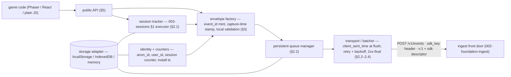

# Client SDK (Browser / Game) — Design

**Part of:** [001-analytics-platform](../001-analytics-platform/spec.md) · **Story spec:** [spec.md](spec.md)
**Realizes:** the shared base defined in [Foundation](../001-analytics-platform/foundation.md) (§1.1 canonical envelope + Q9 wire contract, §4.5 credential classes, §4.6 identity) — this design is the client-side realization of that substrate.
**Status:** Draft (2026-07-17)

---

## Design

*Design altitude per Foundation §8 conventions, adapted for a shipped client: logical modules, packaging design, conformance surface, relations. No code.*

### Module / architecture (logical)

Responsibilities are single-owner: only the **session tracker** touches session state and emits `session` events; only the **envelope factory** mints `event_id`s and assembles envelopes; only the **transport** stamps `client_sent_time` and talks HTTP; only the **queue manager** decides persistence and eviction. Lifecycle listeners (browser `pagehide`-class events) are a thin edge that calls `appClose`/`flush` — replaceable per runtime without touching the core.

### Packaging & distribution (Q10, concrete)

- **Workspace layout.** The SDK lives at `packages/sdk-client` inside this monorepo — its own manifest, its own README, **independently versioned** from the platform and from the sibling server SDK ([010-server-sdk](../010-server-sdk/spec.md)). Dev-time consumers (dashboard e2e, ingest conformance tests) consume it via workspace link; the world consumes it via `npm install`.
- **Name.** Scoped public package, placeholder **`@<org>/analytics-sdk`** — **`<org>` is operator input** (the project's npm organization is not yet chosen; every occurrence of `<org>` in specs and manifests is flagged for that decision).
- **Build targets.** ESM + CJS entry points, a browser global bundle (script-tag / Phaser embed path), and TypeScript declaration files. Zero runtime dependencies is a design goal — an embeddable SDK earns its keep by what it *doesn't* add to a game build.
- **License: MIT** (per Q10; the platform is Apache-2.0). Why the split: the SDK is embedded in shipped, possibly-GPL-2.0 game code, and MIT is GPL-2.0-compatible where Apache-2.0 is not; MIT is the adoption norm for embeddable trackers — no surveyed peer (Sentry, Plausible, Matomo, Aptabase) puts copyleft or Apache-2.0 on the embeddable half.
- **Release flow.** Semver via **changesets** (each behavioral PR carries a changeset; release PRs aggregate); **CI publishes on tag via npm trusted publishing (OIDC) — no `NPM_TOKEN` exists anywhere** — with **automatic provenance attestations**. Manifest requirements: `publishConfig.access = public` (scoped package), `repository.directory = packages/sdk-client` (provenance links the attestation to the exact source directory), license file in-package.
- **Versioning relation to the wire (Q9).** The package semver moves freely — breaking *API* changes bump the SDK major — while the **wire stays `v: 1` additive-only forever**. The `sdk {name, version}` descriptor is what lets the server correlate behavior with a shipped release years later (it is stamped into the raw floor); the SDK version is provenance, never protocol.

### Conformance / test surface

- **Golden-event fixtures.** Canonical JSON fixtures for each emission (generic, economy, terminal session incl. `reconciled`, companion) with byte-for-byte Foundation §1.1 field names, checked into the repo. The SDK's unit tests assert its output matches them; **[002-foundation-ingest](../002-foundation-ingest/spec.md)'s ingest tests consume the same files** — one fixture set, two ends of the wire, drift impossible by construction.
- **Reference event stream.** A scripted multi-day scenario (the [003-sessions §2](../003-sessions/spec.md) worked example extended with an economy day and the [006-monetization](../006-monetization/spec.md) worked-example purchases) that the SDK, driven by a fake clock, must reproduce as a batch sequence; ingest integration tests replay it and assert the resulting result cells. This is the executable form of the cross-spec examples.
- **Bridge-checklist replay (SDK-side halves).** From [02.5's conformance scenarios](../001-analytics-platform/bridges/02.5-activeness-spine-contract.md): exactly one terminal event per session; the reconciled close carries the original start time; `session_id` is opaque and never reused. From [01.5's posture](../001-analytics-platform/bridges/01.5-raw-file-contract.md): a conforming SDK never originates drop-class events (no empty `name`, no missing `event_id`) — asserted as "the local validation layer makes them unconstructible".
- **At-least-once tests.** Kill the transport between send and ack → the retry carries identical `event_id`s and the mock server's windowed dedup absorbs it; queue survives a simulated restart; `client_sent_time` differs across attempts while `client_event_time` does not (§2.3's contract, asserted directly).
- **Wire conformance.** Every batch carries `v: 1` + the `sdk` descriptor; no top-level field outside the spec; a mock server answering 2xx-with-quarantine and 2xx-with-count produces identical SDK behavior (the Q9 indistinguishability, tested).

### Relations with other stories

- **Owns:** the client-side execution of the session lifecycle (state machine §2.1, incl. reconcile); minting of `session_id`, `event_id`, `anon_id`; the `sessions_before_purchase` counter and client `days_since_install`; the persistent offline queue + transport/backoff behavior; the `packages/sdk-client` package and its release flow. Owns **no** server-side entity, Redis domain, or tally.
- **Emits — consumed by:** **[002-foundation-ingest](../002-foundation-ingest/spec.md)** — every batch, through the `/v1/events` front door (catalog + day counts for all kinds); **[003-sessions](../003-sessions/spec.md)** — the terminal `session` event (the sole activeness signal; Foundation §7); **[004-economy](../004-economy/spec.md)** — `economy` events landing in the `provenance = client` slice; **[006-monetization](../006-monetization/spec.md)** — the `purchase` companion (context enrichment keyed by `purchase_attempt_id`, zero money).
- **Reads:** nothing server-side at runtime — the SDK has no read API and no remote config in v1; its only inputs are the operator-supplied `sdk_key` + `endpoint` and its own persisted state. (Provenance, `game_id`, skew, dedup verdicts are all server-derived; the SDK ships raw material.)
- **Ordering / lifecycle:** `init` precedes every capture; reconcile precedes the first new session; `identify` affects captures from that point forward only; per event, `event_id` mint ≺ persistent enqueue ≺ flush-time `client_sent_time` stamp ≺ 2xx ≺ queue removal. The companion should be emitted in the purchase's own session (context truthfulness), but [006-monetization](../006-monetization/spec.md)'s staging/join tolerates either arrival order and a 48 h lag.
- **Flagged:**
  1. **Ingest-path inconsistency ([002-foundation-ingest](../002-foundation-ingest/spec.md) vs Q9) — RESOLVED (2026-07-17).** [002-foundation-ingest](../002-foundation-ingest/spec.md)'s Design body already uses the pinned `POST /v1/events` (Foundation §1.1/§9.7); the residual stale phrasing was in [002-foundation-ingest](../002-foundation-ingest/spec.md)'s *story prose* and `spec.md` US1/FR-001 ("game-scoped ingest URL"), now reconciled to "a fixed `/v1/events` endpoint; `game_id` derived from the key." This flag is closed.
  2. **Timeout-knob drift ([003-sessions](../003-sessions/spec.md) ↔ this story).** `session_inactivity_timeout_min` lives in `GAME.config` ([003-sessions §6](../003-sessions/spec.md)) *and* as an SDK init value, with no v1 sync channel. A remote-config pull (SDK fetches per-game knobs at init) is the named future option; until then, keeping the two aligned is documented operator responsibility.
  3. **Aliasing.** Full anon→identified *merge* stays out of scope (Foundation §4.6/§9.3), but the SDK now **emits the `identify` alias edge** on the anon→user transition (§5) so the linkage is captured for a future stitch — the "identity landmine" (shipping with no edge) is closed.
  4. **Purchase-context join** now keys on the SDK-minted **`purchase_attempt_id`** threaded through the store call (§3.2), not the store `transaction_id` — closes the silent-join-failure that would have emptied segmented-monetization dimensions in production. Games must relay `purchase_attempt_id` via `appAccountToken`/`obfuscatedAccountId`; the server SDK ([010-server-sdk](../010-server-sdk/spec.md)) sends it on the revenue row.
  5. **No bridge files needed:** the SDK-facing contracts it implements are already normative elsewhere ([003-sessions §1](../003-sessions/spec.md) sessions, [006-monetization §3](../006-monetization/spec.md) companion, [004-economy §3](../004-economy/spec.md) economy, Foundation §1.1/Q9 wire) — this spec adds the client-side halves without creating new cross-story seams.
