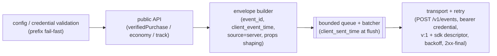

# Server SDK (Node) — Design

**Story spec:** [spec.md](./spec.md)
**Realizes shared base:** [../001-analytics-platform/foundation.md](../001-analytics-platform/foundation.md) (§1.1 envelope, §4.5 provenance/credential classes, §8.3 design layer)

---

*Design layer per Foundation §8.3, adapted to an SDK (no server-side structures — this package owns no Postgres/Redis; its "ER" is the wire contract cited in [spec.md](./spec.md)).*

### Module / architecture (logical)

Four logical modules — no session tracker, no identity module, no persistence layer (the deliberate contrast with [009-client-sdk](../009-client-sdk/spec.md)):

- **Envelope builder** is the conformance chokepoint: one place constructs every envelope, so "never a top-level field outside Foundation §1.1" is enforced structurally, not by review.
- **Transport** is plain bearer over TLS (Foundation §4.5 — no HMAC on the client `sdk_key` path in v1; optional HMAC on this server-credential path is a documented hardening option, [ops-envelope §8](../001-analytics-platform/ops-envelope.md) / [011-operator-admin](../011-operator-admin/spec.md)) against `{endpoint}/v1/events`. *Consistency note (RESOLVED 2026-07-17):* [002-foundation-ingest](../002-foundation-ingest/spec.md)'s Design body uses the Q9-pinned `/v1/events` with game scope derived from the credential; the earlier `/ingest/{game_id}` phrasing survived only in [002-foundation-ingest](../002-foundation-ingest/spec.md)'s story prose and [umbrella spec.md](../001-analytics-platform/spec.md), now reconciled. This spec and [002-foundation-ingest](../002-foundation-ingest/spec.md) agree.
- **Runtime posture:** minimal dependency surface (a money-path package is a supply-chain target); no native modules; no global state — multiple clients (e.g. two games' credentials in one backend) coexist.

### Packaging & distribution (Q10, locked)

| Decision | Value |
|---|---|
| Location | `packages/sdk-server` in the platform monorepo; own manifest; **independently versioned** from the platform and from `packages/sdk-client` ([009-client-sdk](../009-client-sdk/spec.md)) |
| npm name | `@<org>/analytics-sdk-server` — **`<org>` is operator/maintainer input, not decided here**; the wire `sdk.name` (`analytics-sdk-server`) stays stable regardless of scope |
| Build targets | Node ≥ current LTS at release (v1: Node ≥ 20); dual **ESM + CJS** entry points + bundled **type declarations** |
| License | **MIT** (per-package override; the platform is Apache-2.0). Why split: the SDK is embedded in and consumed by third-party codebases — MIT maximizes adoption and stays GPL-2.0-compatible; no surveyed peer puts copyleft or Apache-2.0 on an embeddable SDK (Sentry, Plausible, Matomo, Aptabase all split exactly this way — Q10) |
| Versioning | **semver via changesets** (changeset per PR; release PR aggregates; tag per publish). SDK semver is **decoupled from wire `v`** (Q9): breaking API changes bump the SDK major; the wire stays v1 |
| Publishing | **CI publish on tag via npm trusted publishing (OIDC) — no `NPM_TOKEN` secret anywhere** — with automatic **provenance attestations**; `publishConfig.access = public`; `repository.directory` pointing at `packages/sdk-server` for provenance linkage |
| Docs | per-package README with a quickstart (init from env var → `verifiedPurchase` after receipt validation → `shutdown` on exit) + the credential-handling posture (Q2: env/secret-manager, never inline, rotation-aware) |
| Dev vs prod consumption | inside the monorepo: workspace-linked (the platform's conformance suite imports it); consumers: plain `npm install` from the registry |

### Conformance / test surface

- **Golden verified-purchase fixtures** — canonical `verifiedPurchase` inputs → expected wire envelopes, asserting byte-for-byte the [006-monetization §3](../006-monetization/spec.md) required-field names, `source=server` stamping, and absence of any normalized amount or extra top-level field.
- **05.5 checklist replay (SDK side)** — drive the reference ingest with SDK-emitted batches and verify [bridge 05.5 §8](../001-analytics-platform/bridges/05.5-purchase-accept-contract.md) holds end-to-end: a duplicate emission (same `transaction_id`, any lateness, including a crash-simulated re-emit) produces zero durable effect; a `verified=false` / `sandbox` row consumes no `transaction_id` slot; a parked-FX purchase still counts.
- **Shared reference event stream** — the same fixture stream [009-client-sdk](../009-client-sdk/spec.md) and the platform ingest tests consume, so SDK and server conformance never drift.
- **Wire-contract tests (Q9)** — every batch carries `v:1` + `sdk` descriptor; 2xx (including quarantine-acks) is terminal; non-2xx retries with backoff; retries reuse identical `event_id`s.
- **Credential-class test (Q2)** — an `sdk_key`-prefixed string fails `init` before any network call.

### Relations with other stories

- **Owns:** the trusted emission contract only — no server-side structure, no Redis domain, no `GAME.config` knob. Everything durable it touches is owned elsewhere and reached only through the wire.
- **Emits → consumed by:** **[006-monetization](../006-monetization/spec.md)** — the authoritative verified revenue row (`kind=purchase`, `source=server`): passes gate 6a (verified ∧ prod ∧ server-credential) → durable 6b gate → triggers the [05.5](../001-analytics-platform/bridges/05.5-purchase-accept-contract.md) atomic unit (payer spine + period spend, [007-derived-kpis](../007-derived-kpis/spec.md)'s writes) and the monetization rollups; **[004-economy](../004-economy/spec.md)** — server-provenance economy rows → the trusted (`provenance=server`) slice of flow cells; **[002-foundation-ingest](../002-foundation-ingest/spec.md)** — every named emission feeds the catalog + day counts (Foundation §8.7).
- **Reads:** nothing server-side. The SDK holds no platform state; its only inputs are init config and per-call arguments.
- **Ordering / lifecycle:** (1) a `server_credential` must exist before init — issuance/rotation is [011-operator-admin](../011-operator-admin/spec.md)'s admin surface; rotation is dual-active, so a backend can migrate credentials with zero downtime (Foundation §4.5). (2) The game's receipt validation strictly precedes `verifiedPurchase` — the SDK ships outcomes, never performs validation. (3) The SDK supplies `price_local` + `currency`; the platform normalizes under as-of FX (Q8) — `normalized_amount` may be 0/parked downstream ([bridge 05.5](../001-analytics-platform/bridges/05.5-purchase-accept-contract.md) §2) with zero SDK involvement. (4) Companion enrichment ([009-client-sdk](../009-client-sdk/spec.md)) joins on the same store `transaction_id` within the purchase day's seal window; the server row never waits for it.
- **Sibling boundary ([009-client-sdk](../009-client-sdk/spec.md)):** sessions, activeness, the purchase companion, and `sessions_before_purchase` are exclusively [009-client-sdk](../009-client-sdk/spec.md)'s; money, verified rows, and trusted economy are exclusively [010-server-sdk](./spec.md)'s. A field on the wrong side of this line is a spec bug, not a convenience.
