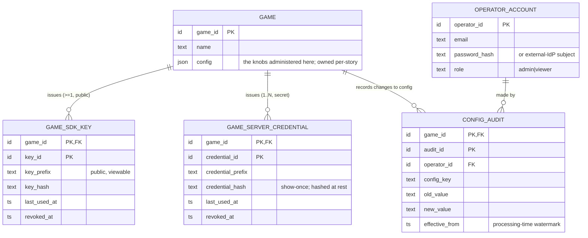

# Operator / Admin Control Plane — Design

**Story spec:** [spec.md](./spec.md) · **Part of:** [001-analytics-platform](../001-analytics-platform/spec.md)
**Realizes shared base:** [foundation.md](../001-analytics-platform/foundation.md) (§1.2 `GAME` registry, §4.5 credential classes, §5 ownership, §6 durability, §8.3 design conventions).

---

## Design

*Per Foundation §8.3. Adds three operational entities + the config-effective-time rule; touches no spine tier and no metric result. Cites "Foundation §N".*

### ER / data model

**Owned operational entities (all Postgres, direct-write, registry-scope):**

| Entity | Key | Non-key attributes | Cardinality | Notes |
|---|---|---|---|---|
| `OPERATOR_ACCOUNT` | `operator_id` | `email`, `password_hash` (or external-IdP subject), `mfa_totp_secret` (encrypted, if MFA on), `failed_login_count` + `locked_until` (lockout), `role` (`admin` \| `viewer` v1, **enforced** — viewer cannot write config/credentials), `created_at`, `disabled_at` | operator-staff count (tiny) | self-hosted single-tenant: these are the studio's staff, not players. One over-privileged account guards all games + infra secrets, so it is hardened (§ Account security) |
| `GAME_SDK_KEY` | `game_id` FK, `key_id` | `key_prefix` (public, viewable), `key_hash`, `created_at`, `last_used_at`, `revoked_at` | ≥ 1 active per game (rotation of shipped builds needs ≥ 2 briefly) | the public client key (Q2); auto-issued at registration; **viewable in admin** because it is public by design |
| `GAME_SERVER_CREDENTIAL` | `game_id` FK, `credential_id` | `credential_prefix`, `credential_hash`, `created_at`, `last_used_at`, `revoked_at` | **1..N** active per game | the secret server credential (Q2); **created on demand, shown once, stored hashed**; realizes Foundation §1.2's `GAME.server_credential` as a 1..N child |
| `CONFIG_AUDIT` | `game_id` FK, `audit_id` | `operator_id` FK, `config_key`, `old_value`, `new_value`, `changed_at`, `effective_from` (processing-time watermark) | one row per config change (append-only) | the forward-only change trail; `effective_from` is what the read model uses to explain a dimension-era boundary |

The `sdk_key` / `server_credential` scalars in Foundation §1.2's `GAME` sketch are **read as these 1..N children** (the F-3 resolution flagged exactly this). Ownership is unchanged — [002-foundation-ingest](../002-foundation-ingest/spec.md) owns the `GAME` registry (Foundation §5); this story's admin API is the write path into it and its credential/audit children.

### Credential lifecycle (Q2 made operational)

Realizes Foundation §4.5's two credential classes as concrete admin flows. **Prefix-typed strings** (class recognizable on sight and by secret scanners); an SDK fails fast on a wrong-class key at init.

| Flow | Behavior |
|---|---|
| **Registration** | create `GAME` → **auto-issue one `GAME_SDK_KEY`** (public; shown and thereafter viewable). A `server_credential` is **not** auto-issued — server-scope is created explicitly on demand (matches the "optional" §1.2 note). |
| **Create server credential** | generate → **display exactly once** → persist only `credential_hash` + `credential_prefix` + `created_at`. Never retrievable again; lost ⇒ create a new one and revoke the old. |
| **Rotation (server)** | **dual-active**: create new → deploy to the game's backend → watch `last_used_at` on the old credential drain → revoke (immediate) or schedule a Stripe-style grace expiry. Multiple credentials live simultaneously by design. |
| **Rotation (client `sdk_key`)** | also supports ≥ 2 active, because **shipped builds can never be updated** — a new key ships in the next build while the old stays valid for existing installs. Revoking an `sdk_key` is an **emergency action**: all shipped builds using it go dark at ingest (their events become drop-and-tally, Foundation §4.4). **The admin UI must state this explicitly** before allowing revoke. |
| **Auth resolution** | at ingest, the front door resolves the presented credential → its class → `provenance` stamp (Foundation §4.5). Unrecognized or revoked ⇒ **auth fails outright**; the fallback-`client` rule (Foundation §9.5) applies only to a valid-but-unclassifiable legacy edge, never to a bad credential. |
| **Retire a game** | disable ingest (all keys revoked) while keeping results + raw lifecycle intact; the game's data is not deleted by retirement (erasure is the separate per-user Q7 flow, [ops-envelope.md](../001-analytics-platform/ops-envelope.md)). |

Out of v1 (flagged, precedented): per-environment (sandbox/live) key pairs, per-platform client keys, Stripe-style restricted server scopes, IP allowlists, optional HMAC body-signing as anti-abuse hardening — none alter the two-class model.

### Account security (hardening — 2026-07-17)

One operator account gates read of every game's data **and** write of every game's config + credentials **and** (via config) the infra secrets. Session-timeout alone is far below baseline for that privilege, so v1 adds: **login rate-limit + lockout** (`operator_login_max_attempts` / `operator_lockout_min`); **optional TOTP MFA** (`operator_mfa_required` — self-hostable, no external dependency, works under sanctions); **failed-login auditing** (a distinct audit stream from `CONFIG_AUDIT`); and an **enforced `viewer`/`admin` split** (the roles existed in the ER but enforcement was unspecified — a `viewer` session can read results but cannot write config or touch credentials). The admin panel is served behind the reverse proxy and may be IP-allowlisted for the solo operator.

### Infra-secret storage + rotation (hardening — 2026-07-17)

Reversible infra secrets — `cold_storage_credentials` (S3 write keys), `fx_table` API material, the per-game `ERASURE_LEDGER` hash key, and any `mfa_totp_secret` — are **never stored plaintext in `GAME.config`**. They are envelope-encrypted with a **master key held outside Postgres** (env var / Docker secret / file mount), decrypted only in-worker (Foundation §1.2, [ops-envelope.md](../001-analytics-platform/ops-envelope.md) §9). A DB dump then yields ciphertext, not the operator's object-store keys — and the erasure-ledger key living outside the DB is what keeps the keyed hash lawful pseudonymization ([ops-envelope.md](../001-analytics-platform/ops-envelope.md) §7.5 / §9). The admin surface adds an **infra-secret rotation path** (the existing credential-rotation flow covers game keys, not S3/FX secrets): re-encrypt under a new master key, or replace an S3 key and re-encrypt.

### Right-of-access (DSAR / GDPR Art. 15 + Art. 20) — the symmetric surface

The erasure trigger has a **read-only sibling**: an operator-verified **DSAR-access request** (same verification path as erasure) invokes the [ops-envelope.md](../001-analytics-platform/ops-envelope.md) §9 access job, which assembles a machine-readable export of the subject's spine family (`active_days_bitmap`, `PAYER_SPINE_EXT`, `PAYER_PERIOD_SPEND`, `PURCHASE_IDEMPOTENCY`, `IDENTITY_EDGE` if any) with the Art. 11 boundary documented (aggregate cells that no longer identify the subject are out of scope, and the export says so). Hosted here beside the erasure request surface; no new per-user durable state.

### Config administration + the effective-time rule

**The admin API/UI covers every `§6` knob across the system.** Inventory (owner story in parens — this story surfaces, never redefines):

| Knob | Owner | Effect timing |
|---|---|---|
| `event_name_cap_per_game`, `property_key_cap_per_event`, `top_n_events`, `pii_prop_denylist` (default-DENY), `pii_prop_value_scrubber`, `pii_prop_hash` | [002-foundation-ingest](../002-foundation-ingest/spec.md) | caps forward-only; `top_n_events` retroactive; PII denylist ships a **non-empty default** + value scrubber ([ops-envelope.md](../001-analytics-platform/ops-envelope.md) §9) |
| `economy_ratio_min_events` | [004-economy](../004-economy/spec.md) | display-only sink-ratio low-volume guard |
| `operator_login_max_attempts`, `operator_lockout_min`, `operator_mfa_required`, `operator_session_timeout_min` | 011-operator-admin | account hardening (§ Account security); platform-level |
| `session_inactivity_timeout_min`, `session_max_duration_cap_min`, `session_min_duration_ms` | [003-sessions](../003-sessions/spec.md) | forward-only (never re-buckets emitted sessions) |
| `economy_currency_allowlist`, `economy_depth_capture_mode`, `economy_top_n_reasons`, `level_bucket_boundaries` | [004-economy](../004-economy/spec.md) | allowlist/boundaries/depth forward-only; `economy_top_n_reasons` retroactive |
| `retention_day_targets`, `retention_min_cohort_size` | [005-retention](../005-retention/spec.md) | targets forward-only (bitmap-horizon widening annotated "tracking begins …"); min-cohort-size is a display-only sample-size mask |
| `reporting_offset` (**platform-level**, Foundation §4.7) | foundation/platform | **correctness-bearing, set-once at install** — defines the platform logical day for **all** metrics + seals (single timezone; no per-game/multi-timezone in v1). Changing it after data exists is a forward-rebuild, out of v1 scope. Set to the operator's zone (e.g. Asia/Tehran +3:30) at install. |
| `monetization_dimensions`, `payer_tier_rule`, `fx_table`, `fx_staleness_max_days`, `monetization_dimension_value_cap` | [006-monetization](../006-monetization/spec.md) | `monetization_dimensions` + `…_value_cap` rebuild-forward; `fx_table`/`fx_staleness_max_days` affect unsealed re-normalization only; `payer_tier_rule` re-tiers **future reads** at zero migration (spine stores spend, not tier — Q3) |
| `mau_window_days`, `whale_min_payers` | [007-derived-kpis](../007-derived-kpis/spec.md) | read-time windows — retroactive (recomputed at read) |
| `cold_storage_enabled`, `cold_storage_bucket`, `cold_storage_credentials`, `cold_storage_local_retention_days`, `cold_storage_upload_schedule`, `raw_file_compression` | [008-cold-storage](../008-cold-storage/spec.md) | all forward-only (toggle/codec never rewrite existing files) |
| `raw_retention_days`, `erasure_purchase_mode`, `strict_raw_rewrite` | [ops-envelope.md](../001-analytics-platform/ops-envelope.md) (Q7) | retention forward-only; erasure-mode governs future erasure jobs |
| `ingest_events_per_sec_cap` | [ops-envelope.md](../001-analytics-platform/ops-envelope.md) | forward-only per-game ingest cap (protects tenants from a flooding neighbor; breach → 429 + `rate_limited` tally) |
| `operator_session_timeout_min`, `worker_config_cache_refresh_sec` | 011-operator-admin | platform-level; take effect on next session / next cache refresh |

**Config-effective-time semantics — "forward-only, pinned to processing time" (normative).** A config change applies to events **processed after the change is visible to the workers** — never retroactively to already-processed events, and never to sealed results.

- The change is written to `GAME.config` + a `CONFIG_AUDIT` row stamped `effective_from` = the processing-time watermark at which workers begin honoring it.
- **Worker config-cache refresh:** ingest/flush workers read a per-game config snapshot from Redis (the worker config cache), refreshed every `worker_config_cache_refresh_sec` (default 30). So the realized effective-time is "within one refresh interval of the admin write" — a bounded, documented lag, not instantaneous. The audit row's `effective_from` records the watermark, so a later dimension-era or FX-era boundary is explainable from the trail ([006-monetization](../006-monetization/spec.md)'s "dimension-era caveat" reads this).
- **This rule is why every rebuild-forward knob is safe:** a `monetization_dimensions` change re-keys only cells written after `effective_from`; sealed cells keep their old encoding; the read model reports per-period coverage rather than faking continuity. `payer_tier_rule` is the one knob whose *thresholds* re-tier future reads immediately (the spine stores raw spend), but even it never restamps a sealed display cell's `payer_tier` dimension.
- **Display-only knobs are exempt from re-bucketing** by construction: `per_game_reporting_timezone_offset` shifts presentation, never stored aggregates (research §G-2/§G-3); internal math stays UTC.

### API / contract surface

- **No SDK contract** — this story adds no envelope field, endpoint, or `kind`; the SDKs never see the admin surface.
- **Admin API (dashboard API, PG-direct), operator-authenticated:** operator login/logout; game register/list/retire; `sdk_key` view + rotate + revoke; `server_credential` create(show-once) + rotate + revoke + `last_used_at` read; config get/set per `(game_id, key)` with server-side validation of the value against the knob's contract; `CONFIG_AUDIT` list per game. Every write emits a `CONFIG_AUDIT` (config) or credential-lifecycle audit row.
- **Read model:** the admin dashboard reads registry + audit tables directly; config-era boundaries surfaced from `CONFIG_AUDIT.effective_from` feed the metric read-models' dimension/FX-era caveats. No Redis merge (operational metadata, not open-day results — Foundation §3.3).

### Relations with other stories

- **Owns:** `OPERATOR_ACCOUNT`, `GAME_SDK_KEY`, `GAME_SERVER_CREDENTIAL`, `CONFIG_AUDIT`; the admin API; the config-effective-time rule; the worker config-cache contract (workers *read* it).
- **Writes (shared):** `GAME` + `GAME.config` (owned by [002-foundation-ingest](../002-foundation-ingest/spec.md)'s registry, Foundation §5) — this story is the human write-path into them; the credential children realize Foundation §1.2's `server_credential` scalar.
- **Reads:** every story's `§6` knob contract (to validate values); `last_used_at` telemetry the ingest front door stamps on each credential use.
- **Feeds:** the **ingest front door** (Foundation §4.5) resolves the credentials this story issues → `provenance`; **every worker** reads the config this story writes (via the cache); **[006-monetization](../006-monetization/spec.md)/[004-economy](../004-economy/spec.md)** read the config-era boundaries for their coverage caveats; the **erasure job ([ops-envelope.md](../001-analytics-platform/ops-envelope.md), Q7)** is triggered through this admin API (operator-verified request — identity verification is the studio's duty, mirroring Matomo).
- **Ordering / lifecycle:** a game must be registered (keys issued) before any event authenticates; a config change is durable + audited before it reaches workers (bounded by the cache refresh); credential revocation takes effect at the next auth resolution; retiring a game stops ingest without deleting data (erasure is the separate per-user flow).
- **Flagged bridges:** none — this is a self-contained control plane. Its one cross-cutting dependency (credential-class → provenance) is already folded into Foundation §4.5; its erasure trigger is specified in [`ops-envelope.md`](../001-analytics-platform/ops-envelope.md).

### New entities acknowledged in the foundation model

`OPERATOR_ACCOUNT`, `GAME_SDK_KEY`, `GAME_SERVER_CREDENTIAL`, `CONFIG_AUDIT` are **operational registry entities**, not per-user spine draws — they attach to `GAME` (or stand alone for `OPERATOR_ACCOUNT`) and cost nothing against the SC-007 spine budget. [`ER-full.md`](../001-analytics-platform/ER-full.md) and Foundation §1.2/§5 are updated to acknowledge them (Stage 4 reconciliation).
